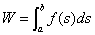
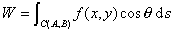
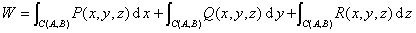

<h3 style='text-align:justify;text-justify:inter-ideograph'>七、求变力所做的功</h3>

&nbsp;&nbsp;&nbsp;&nbsp;&nbsp;&nbsp; 1°若<i>s</i>为路程，<i>f</i>(<i>s</i>)为变力，则

&nbsp;&nbsp;&nbsp;&nbsp;&nbsp;&nbsp;&nbsp;&nbsp;&nbsp;&nbsp;&nbsp;&nbsp;&nbsp;&nbsp;&nbsp;&nbsp;&nbsp;&nbsp;&nbsp;&nbsp;

&nbsp;&nbsp;&nbsp;&nbsp;&nbsp;&nbsp; 2°若<i>s</i>为路程，运动路线为<i>C</i>，<i>f</i>(<i>x</i>,<i>y</i>)为变力，<i>θ</i>为变力<i>f</i>与路线<i>C</i>切线的夹角，则

&nbsp;&nbsp;&nbsp;&nbsp;&nbsp;&nbsp;&nbsp;&nbsp;&nbsp;&nbsp;&nbsp;&nbsp;&nbsp;

&nbsp;&nbsp;&nbsp;&nbsp;&nbsp;&nbsp; 3°若变力沿坐标轴的三个分力分别为<i>P</i>(<i>x,y,z</i>),<i>Q</i>(<i>x,y,z</i>),<i>R</i>(<i>x,y,z</i>)，<i>C</i>为空间运动路线，则

&nbsp;&nbsp;&nbsp;&nbsp;&nbsp;&nbsp;&nbsp; 

