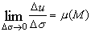
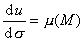
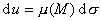

<h2 align=center style='text-align:center'>§4 区域函数</h2>
<h3 style='text-align:justify;text-justify:inter-ideograph'>一、&nbsp;&nbsp;&nbsp;&nbsp;&nbsp;&nbsp;&nbsp; 区域函数与密度函数</h3>

&nbsp; 设<i>σ</i>是空间<i>Ω</i>的区域，当变量<i>u</i>随区域<i>σ</i>的变化而变化时，称<i>u</i>是区域<i>σ</i>的函数，记作<i>u</i>=<i>u</i>(<i>σ</i>).把区域的度量（长度、面积或体积）仍记作<i>σ</i>，把<i>σ</i>无限细分，使包含<i>M</i>（区域中的一点）的小区域的度量→0，如果<i>u</i>的改变量为Δ<i>u</i>,并且极限

&nbsp;&nbsp;&nbsp;&nbsp;&nbsp;&nbsp;&nbsp;&nbsp;&nbsp;&nbsp;&nbsp;&nbsp;&nbsp;&nbsp;&nbsp;&nbsp;&nbsp;&nbsp;&nbsp;&nbsp;

存在，则称<i>u</i>(<i>M</i>)为区域函数<i>u</i>(<i>σ</i>)的密度，记作

&nbsp;&nbsp;&nbsp;&nbsp;&nbsp;&nbsp;&nbsp;&nbsp;&nbsp;&nbsp;&nbsp;&nbsp;&nbsp;&nbsp;&nbsp;&nbsp;&nbsp;&nbsp;&nbsp;&nbsp;

它是点<i>M</i>的函数，称为密度函数，它的微分形式是

&nbsp;&nbsp;&nbsp;&nbsp;&nbsp;&nbsp;&nbsp;&nbsp;&nbsp;&nbsp;&nbsp;&nbsp;&nbsp;&nbsp;&nbsp;&nbsp;&nbsp;&nbsp;&nbsp;&nbsp;
&nbsp;&nbsp;&nbsp;&nbsp;&nbsp;&nbsp;&nbsp;&nbsp;
&nbsp;&nbsp;&nbsp;&nbsp;&nbsp;&nbsp;&nbsp;&nbsp;&nbsp;&nbsp;&nbsp;&nbsp;&nbsp;&nbsp;&nbsp;&nbsp;&nbsp;&nbsp;&nbsp;&nbsp;&nbsp;&nbsp;&nbsp;&nbsp;&nbsp;&nbsp;&nbsp;&nbsp;&nbsp;&nbsp;&nbsp;&nbsp;&nbsp;&nbsp;&nbsp;&nbsp;&nbsp;&nbsp;&nbsp;&nbsp;&nbsp;&nbsp;&nbsp;&nbsp;&nbsp;
(1)

&nbsp;&nbsp;&nbsp;&nbsp;&nbsp;&nbsp; 例如，当σ是三维空间的曲面时，(<i>M</i>)就是曲面的面密度，当<i>σ</i>是三维空间的物体时，<i></i>(<i>M</i>)就是体密度.实际上，(<i>M</i>)都是<i>x,y,z</i>的三变量函数.

