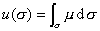
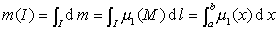
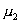
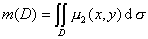
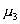
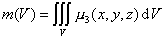
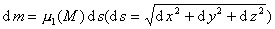
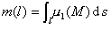
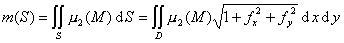

二、密度函数的积分

由 (1)得到

&nbsp;&nbsp;&nbsp;&nbsp;&nbsp;&nbsp;&nbsp;&nbsp;&nbsp;&nbsp;&nbsp;&nbsp;&nbsp;&nbsp;&nbsp;&nbsp;&nbsp;&nbsp;&nbsp;&nbsp;

由于积分区域的变化，这些积分又是各种形式的区域函数，例如

[直线上的线密度与单积分] &nbsp;令<i>σ</i>=<i>I</i>=[<i>a,b</i>],则非均匀细杆的质量

&nbsp;&nbsp;&nbsp;&nbsp;&nbsp;&nbsp;&nbsp;&nbsp;&nbsp;&nbsp;&nbsp;&nbsp;&nbsp;

式中为线密度.

[平面上的面密度与二重积分]&nbsp; 设薄片的密度为（<i>x,y</i>）,则薄片质量为

&nbsp;&nbsp;&nbsp;&nbsp;&nbsp;&nbsp;&nbsp;&nbsp;&nbsp;&nbsp;&nbsp;&nbsp;&nbsp;&nbsp;&nbsp;&nbsp;&nbsp;&nbsp;&nbsp;&nbsp;

式中D表示薄片在平面上的区域.

[体密度与三重积分]&nbsp; 设物体的密度为（<i>x,y,z</i>）,则物体的质量为

&nbsp;&nbsp;&nbsp;&nbsp;&nbsp;&nbsp;&nbsp;&nbsp;&nbsp;&nbsp;&nbsp;&nbsp;&nbsp;&nbsp;&nbsp;&nbsp;&nbsp;&nbsp;&nbsp;&nbsp;

式中<i>V</i>表示物体在空间中的区域.

[线密度关于弧长元素的积分]&nbsp; 由于曲线段<i>l</i>的质量元素是

&nbsp;&nbsp;&nbsp;&nbsp;&nbsp;&nbsp;&nbsp;&nbsp;&nbsp;&nbsp;&nbsp;&nbsp;&nbsp;&nbsp;&nbsp;&nbsp;&nbsp;&nbsp;&nbsp;&nbsp;

所以曲线段的质量为

&nbsp;&nbsp;&nbsp;&nbsp;&nbsp;&nbsp;&nbsp;&nbsp;&nbsp;&nbsp;&nbsp;&nbsp;&nbsp;&nbsp;&nbsp;&nbsp;&nbsp;&nbsp;&nbsp;&nbsp;

[曲面上的面密度与关于曲面元素的积分]&nbsp; 分布在曲面<i>S</i>上的质量为

&nbsp;&nbsp;&nbsp;&nbsp;&nbsp;&nbsp;&nbsp;&nbsp;&nbsp;&nbsp;&nbsp;&nbsp;&nbsp;&nbsp;&nbsp;&nbsp;&nbsp;&nbsp;&nbsp;&nbsp;

式中<i>D</i>为<i>S</i>在<i>Oxy</i>平面上的投影区域，<i>S</i>的方程为<i>z</i>=<i>f</i>(<i>x,y</i>),<i>x,y</i>∈<i>D</i>.这种形式的积分称为函数<i></i>(<i>M</i>)关于曲面元素d<i>S</i>的积分.

