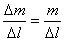
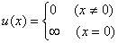
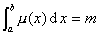
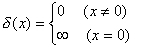
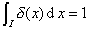
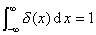
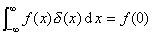

<h3 style='text-align:justify;text-justify:inter-ideograph'>三、<i>δ</i>-函数的概念</h3>

&nbsp;&nbsp; 在讨论直线上有集中质量分布时，例如只在原点<i>x</i>=0处有集中质量<i>m</i>,而在其他各点都没有质量，这时，对直线上坐标不等于零的点，总可以取包含这个点的充分小的区间Δ<i>l</i>,使Δ<i>l</i>不包含点<i>x</i>=0，则区间Δ<i>l</i>上的平均密度为零，所以在点x(≠0)的密度也是零；而在点<i>x</i>=0处，若Δ<i>l</i>包含这个点，由于

&nbsp;&nbsp;&nbsp;&nbsp;&nbsp;&nbsp;&nbsp;&nbsp;&nbsp;&nbsp;&nbsp;&nbsp;&nbsp;&nbsp;&nbsp;

当Δ<i>l</i>→0时，平均密度趋于无穷大.在包含点<i>x</i>=0的任何区间[<i>a,b</i>]内,质量总等于<i>m</i>,这时仍认为存在密度函数<i>u</i>(x),

&nbsp;&nbsp;&nbsp;&nbsp;&nbsp;&nbsp;&nbsp;&nbsp;&nbsp;&nbsp;&nbsp;&nbsp;&nbsp;&nbsp;&nbsp;&nbsp;&nbsp;&nbsp;&nbsp;&nbsp;

&nbsp;&nbsp;&nbsp;&nbsp;&nbsp;&nbsp;&nbsp;&nbsp;&nbsp;&nbsp;&nbsp;&nbsp;&nbsp;&nbsp;&nbsp;&nbsp;&nbsp;&nbsp;&nbsp;&nbsp;

特别，当<i>m</i>=1时，记这种密度函数为<i>δ</i>（<i>x</i>）,即

&nbsp;&nbsp;&nbsp;&nbsp;&nbsp;&nbsp;&nbsp;&nbsp;&nbsp;&nbsp;&nbsp;&nbsp;&nbsp;&nbsp;&nbsp;&nbsp;&nbsp;&nbsp;&nbsp;&nbsp;

对包含点<i>x</i>=0的任何区间<i>I</i>，有

&nbsp;&nbsp;&nbsp;&nbsp;&nbsp;&nbsp;&nbsp;&nbsp;&nbsp;&nbsp;&nbsp;&nbsp;&nbsp;
&nbsp; 或&nbsp; 

称这个函数<i>δ</i>（<i>x</i>）为<i>δ</i>-函数(也称为狄拉克函数或脉冲函数).

&nbsp;&nbsp;&nbsp;&nbsp;&nbsp;&nbsp; <i>δ</i>-函数具有一个重要性质： 对任一连续函数<i>f</i>(<i>x</i>),有

&nbsp;&nbsp;&nbsp;&nbsp;&nbsp;&nbsp;&nbsp;&nbsp;&nbsp;&nbsp;&nbsp;&nbsp;&nbsp;

这个性质表明，<i>δ</i>-函数虽然不符合古典的“一点对应一点”的函数定义，但它和任意连续函数的乘积在（-∞，∞）内的积分却有明确的定义.因此<i>δ</i>-函数在近代物理和工程技术中有着比较广泛的应用.

