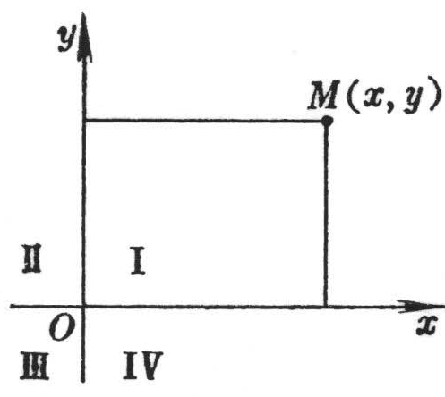

<b>　</b>

<b>第七章</b><b> </b><b>解析几何与微分几何</b>

解析几何是运用代数方法研究几何图形的性质，它的主要研究对象是直线、平面、二次曲线与二次曲面.微分几何是运用无穷小分析方法研究几何图形的性质，它的主要研究对象是曲线与曲面.

本章的所有内容都只在欧氏(没有包括仿射和射影)空间中讨论.

全章有十一节.前六节属于解析几何，叙述了平面及空间的坐标系、坐标变换与基本计算公式；平面上和空间中直线与平面方程的各种形式以及它们之间的相互关系，较详细地列出了各种类型的二次曲线和二次曲面的基本元素、标准方程、主要性质和各量的计算公式.最后还从一般的二次方程出发研究了二次曲线与二次曲面的一般性质，并利用不变量写出标准方程和形状的判定.

后五节的内容属于微分几何，关于曲线论这里给出了：平面曲线和空间曲线的雪列-弗莱纳公式和基本定理，以及它们的曲率、挠率的概念和计算公式；等距线、渐开线、渐屈线和包络线的定义和方程，较详细地收集了重要平面曲线和一些特殊空间曲线的方程、图形及其各种特征.关于曲面论这里只叙述了几个特殊曲面的方程、图形和性质，并且给出曲面的基本元素(弧长、面积、夹角、切面、法面等方程和公式)、基本形式、基本方程、基本定理、曲率线、渐近曲线、共轭曲线、测地线与法曲率、测地曲率、总曲率、平均曲率、波恩涅公式等.

本章中凡是有关矢量的概念、运算和公式，请查阅第八章.

<b>§ 1 </b><b>坐标系与坐标变换</b>

1.&nbsp;&nbsp; 平面坐标系及其变换表

<table class=MsoNormalTable border=1 cellspacing=1 cellpadding=0 width=592
 style='width:444.0pt'>
 <tr style='height:24.75pt'>
  <td width="30%" valign=top style='width:30.0%;padding:5.25pt 5.25pt 5.25pt 5.25pt;
  height:24.75pt'>
  
坐 标 系 与 图 形 

  </td>
  <td width="70%" colspan=4 valign=top style='width:70.0%;padding:5.25pt 5.25pt 5.25pt 5.25pt;
  height:24.75pt'><pre style='text-align:center' ALIGN=CENTER>公 式 与 说 明&nbsp;&nbsp;&nbsp;&nbsp;&nbsp;&nbsp; </pre></td>
 </tr>
 <tr style='height:81.0pt'>
  <td width="30%" rowspan=3 valign=top style='width:30.0%;padding:5.25pt 5.25pt 5.25pt 5.25pt;
  height:81.0pt'>
  
[笛卡儿直角坐标系]

  </td>
  <td width="70%" colspan=4 valign=top style='width:70.0%;padding:5.25pt 5.25pt 5.25pt 5.25pt;
  height:81.0pt'>
  <blockquote style='margin-top:5.0pt;margin-bottom:5.0pt'>
  
<i>Ox</i>为横轴，<i>Oy</i>为纵轴

  
<i>M(x</i>, <i>y)&nbsp;&nbsp;&nbsp;&nbsp;&nbsp;&nbsp;&nbsp; x</i>为横坐标

  </blockquote>
  
<i>y</i>为纵坐标

  <blockquote style='margin-top:5.0pt;margin-bottom:5.0pt'>
  
为四个象限，在各个象限里点的坐标<i>x</i>和<i>y</i>的符号为

  </blockquote>
  </td>
 </tr>
 <tr style='height:17.25pt'>
  <td width="16%" rowspan=2 valign=top style='width:16.0%;padding:5.25pt 5.25pt 5.25pt 5.25pt;
  height:17.25pt'>
  
&nbsp;

  </td>
  <td width="12%" valign=top style='width:12.0%;padding:5.25pt 5.25pt 5.25pt 5.25pt;
  height:17.25pt'>
  
象限 

  </td>
  <td width="21%" valign=top style='width:21.0%;padding:5.25pt 5.25pt 5.25pt 5.25pt;
  height:17.25pt'>
  

  </td>
  <td width="21%" rowspan=2 valign=top style='width:21.0%;padding:5.25pt 5.25pt 5.25pt 5.25pt;
  height:17.25pt'>
  
<i>　</i>

  
<i>　</i>

  
<i>　 </i>

  </td>
 </tr>
 <tr style='height:3.75pt'>
  <td width="12%" valign=top style='width:12.0%;padding:5.25pt 5.25pt 5.25pt 5.25pt;
  height:3.75pt'>
  
<i>x</i>

  
<i>y</i> 

  </td>
  <td width="21%" valign=top style='width:21.0%;padding:5.25pt 5.25pt 5.25pt 5.25pt;
  height:3.75pt'><pre>+&nbsp;&nbsp; -&nbsp;&nbsp;&nbsp; -&nbsp;&nbsp;&nbsp; +&nbsp;&nbsp;&nbsp;&nbsp;&nbsp;&nbsp;&nbsp;&nbsp;&nbsp; </pre><pre>&nbsp;</pre><pre>+&nbsp;&nbsp; +&nbsp;&nbsp;&nbsp; -&nbsp;&nbsp;&nbsp; -</pre></td>
 </tr>
 <tr style='height:72.75pt'>
  <td width="30%" valign=top style='width:30.0%;padding:5.25pt 5.25pt 5.25pt 5.25pt;
  height:72.75pt'>
  
[极坐标系]

  

  </td>
  <td width="70%" colspan=4 valign=top style='width:70.0%;padding:5.25pt 5.25pt 5.25pt 5.25pt;
  height:72.75pt'>
  <blockquote style='margin-top:5.0pt;margin-bottom:5.0pt'>
  
<i>O</i>为极点，<i>Ox</i>为极轴

  
<i>M</i>(r ,j )<i>&nbsp;&nbsp;&nbsp;&nbsp;&nbsp;&nbsp;  &nbsp;&nbsp;&nbsp;&nbsp;&nbsp; </i><i>&nbsp;r</i> 为矢径(0 &pound; r <i>&lt; </i>&yen; )

  </blockquote>
  
&nbsp;&nbsp;&nbsp;&nbsp;&nbsp;&nbsp; &nbsp;

  <pre>&nbsp;&nbsp;&nbsp;&nbsp;&nbsp;&nbsp;&nbsp;&nbsp;&nbsp;&nbsp;&nbsp;&nbsp;&nbsp;&nbsp;&nbsp;&nbsp;&nbsp;&nbsp;&nbsp;&nbsp;&nbsp;&nbsp;&nbsp;&nbsp;&nbsp;&nbsp;&nbsp;&nbsp;&nbsp;&nbsp;&nbsp;&nbsp;&nbsp;&nbsp;&nbsp;&nbsp;&nbsp;&nbsp;&nbsp;j 为极角(- &yen; &lt; j<i> </i><i>&lt;</i> &yen; )&nbsp;&nbsp;&nbsp;&nbsp;&nbsp;&nbsp;&nbsp;&nbsp;&nbsp; </pre>
  
<i>j</i><i> </i>从极轴开始，逆时针转动为正，顺时针转动为负

  
　

  
　

  
　

  
　

  
<i>　</i>

  
<i>　 </i>

  </td>
 </tr>
 <tr style='height:12.0pt'>
  <td width="30%" valign=top style='width:30.0%;padding:5.25pt 5.25pt 5.25pt 5.25pt;
  height:12.0pt'>
  
坐 标 系 与 图 形 

  </td>
  <td width="70%" colspan=4 valign=top style='width:70.0%;padding:5.25pt 5.25pt 5.25pt 5.25pt;
  height:12.0pt'>
  
公 式 与 说 明 

  </td>
 </tr>
 <tr style='height:147.75pt'>
  <td width="30%" valign=top style='width:30.0%;padding:5.25pt 5.25pt 5.25pt 5.25pt;
  height:147.75pt'>
  
[直角坐标系与极坐标系的互换]

  

  </td>
  <td width="70%" colspan=4 valign=top style='width:70.0%;padding:5.25pt 5.25pt 5.25pt 5.25pt;
  height:147.75pt'>
  

  </td>
 </tr>
 <tr style='height:74.25pt'>
  <td width="30%" valign=top style='width:30.0%;padding:5.25pt 5.25pt 5.25pt 5.25pt;
  height:74.25pt'>
  
[坐标轴的平移]

  
<b></b>

  </td>
  <td width="70%" colspan=4 valign=top style='width:70.0%;padding:5.25pt 5.25pt 5.25pt 5.25pt;
  height:74.25pt'>
  

  
这里<i>x</i>, <i>y</i>表示旧坐标，<i>X</i>, <i>Y</i>表示新坐标，<i>g</i>, <i>h</i>是新坐标系原点<i>O</i><i>&cent; </i>在旧坐标系内的坐标

  </td>
 </tr>
 <tr style='height:20.25pt'>
  <td width="30%" valign=top style='width:30.0%;padding:5.25pt 5.25pt 5.25pt 5.25pt;
  height:20.25pt'>
  
[坐标轴的旋转]

  
<b></b>

  </td>
  <td width="70%" colspan=4 valign=top style='width:70.0%;padding:5.25pt 5.25pt 5.25pt 5.25pt;
  height:20.25pt'>
  

  
<i>a</i>为坐标轴绕原点转动的角

  
任一坐标变换都可以分解为坐标轴的平移与坐标轴的旋转两部分

  

  </td>
 </tr>
</table>

　

