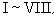

二、空间坐标系及其变换表 

<table class=MsoNormalTable border=1 cellspacing=1 cellpadding=0 width=592
 style='width:444.0pt'>
 <tr style='height:27.0pt'>
  <td width="35%" valign=top style='width:35.0%;padding:5.25pt 5.25pt 5.25pt 5.25pt;
  height:27.0pt'>
  
坐 标 系 与 图 形

  </td>
  <td width="65%" colspan=6 valign=top style='width:65.0%;padding:5.25pt 5.25pt 5.25pt 5.25pt;
  height:27.0pt'>
  
公 式 与 说 明

  </td>
 </tr>
 <tr style='height:66.0pt'>
  <td width="35%" rowspan=4 valign=top style='width:35.0%;padding:5.25pt 5.25pt 5.25pt 5.25pt;
  height:66.0pt'>
  
[笛卡儿直角坐标系]

  
<b></b>

  <ol start=1 type=a>
   <li class=MsoNormal>右手系 （<i>b</i>）左手系</li>
  </ol>
  

  
(<i>c</i>)

  </td>
  <td width="65%" colspan=6 style='width:65.0%;padding:5.25pt 5.25pt 5.25pt 5.25pt;
  height:66.0pt'>
  
<i>Ox</i>为横轴，<i>Oy</i>为纵轴，<i>Oz</i>为竖轴

  <pre ALIGN=left><i>M</i>(<i>x</i>, <i>y</i>, <i>z</i>) <i>&nbsp;&nbsp;</i></pre>
  <blockquote style='margin-top:5.0pt;margin-bottom:5.0pt'><pre><i>&nbsp;&nbsp;&nbsp;&nbsp;&nbsp;&nbsp; </i></pre>
  

  
<i>x</i>为横坐标

  
<i>y</i>为纵坐标

  
<i>z</i>为竖坐标

  

  <pre>&nbsp;</pre><pre align=left> <i>&nbsp;&nbsp;&nbsp;&nbsp;&nbsp;&nbsp;</i></pre></blockquote>
  
为八个卦限，在各个卦限里点的坐标<i>x</i>, <i>y</i>, <i>z</i>的符号为 

  </td>
 </tr>
 <tr style='height:26.25pt'>
  <td width="7%" rowspan=3 valign=top style='width:7.0%;padding:5.25pt 5.25pt 5.25pt 5.25pt;
  height:26.25pt'>
  
&nbsp;

  </td>
  <td width="9%" colspan=2 valign=top style='width:9.0%;padding:5.25pt 5.25pt 5.25pt 5.25pt;
  height:26.25pt'>
  
卦限

  </td>
  <td width="49%" colspan=3 valign=top style='width:49.0%;padding:5.25pt 5.25pt 5.25pt 5.25pt;
  height:26.25pt'>
  

  </td>
 </tr>
 <tr style='height:33.0pt'>
  <td width="9%" colspan=2 valign=top style='width:9.0%;padding:5.25pt 5.25pt 5.25pt 5.25pt;
  height:33.0pt'><pre ALIGN=JUSTIFY>&nbsp; x</pre><pre
  ALIGN=JUSTIFY>&nbsp; y</pre><pre ALIGN=JUSTIFY>&nbsp; z </pre></td>
  <td width="49%" colspan=3 valign=top style='width:49.0%;padding:5.25pt 5.25pt 5.25pt 5.25pt;
  height:33.0pt'><pre></pre></td>
 </tr>
 <tr style='height:49.5pt'>
  <td width="58%" colspan=5 valign=top style='width:58.0%;padding:5.25pt 5.25pt 5.25pt 5.25pt;
  height:49.5pt'>
  
　

  
　

  
　

  
　 

  
　

  
　

  
　

  </td>
 </tr>
 <tr style='height:11.25pt'>
  <td width="35%" valign=top style='width:35.0%;padding:5.25pt 5.25pt 5.25pt 5.25pt;
  height:11.25pt'>
  
坐 标 系 与 图 形

  </td>
  <td width="65%" colspan=6 valign=top style='width:65.0%;padding:5.25pt 5.25pt 5.25pt 5.25pt;
  height:11.25pt'>
  
公 式 与 说 明

  </td>
 </tr>
 <tr style='height:133.5pt'>
  <td width="35%" valign=top style='width:35.0%;padding:5.25pt 5.25pt 5.25pt 5.25pt;
  height:133.5pt'>
  
[圆柱面坐标系]

  
<b></b>

  </td>
  <td width="65%" colspan=6 valign=top style='width:65.0%;padding:5.25pt 5.25pt 5.25pt 5.25pt;
  height:133.5pt'>
  
<i>r</i><i> </i>,j 为点<i>M</i>在<i>Oxy</i>平面上投影的极坐标，<i>z</i>为点<i>M</i>到<i>Oxy</i>平面的距离.这里 

  
0 &pound; r <i>&lt; </i>&yen; 

  
-&yen; &lt; j <i>&lt; </i>&yen; 

  
-&yen; &lt; <i>z </i><i>&lt; </i>&yen; 

  </td>
 </tr>
 <tr style='height:57.0pt'>
  <td width="35%" valign=top style='width:35.0%;padding:5.25pt 5.25pt 5.25pt 5.25pt;
  height:57.0pt'>
  
[球面坐标系(极坐标系)]

  

  </td>
  <td width="65%" colspan=6 valign=top style='width:65.0%;padding:5.25pt 5.25pt 5.25pt 5.25pt;
  height:57.0pt'>
  
<i>r</i>为矢径长(<i>OM</i>)，j 为经度，q 为纬度(或极距角)

  
这里

  
0 &pound; <i>r</i> &lt; &yen; 

  
- &yen; &lt; j &lt; &yen; 

  
0 &pound; q &pound; p 

  </td>
 </tr>
 <tr style='height:15.75pt'>
  <td width="35%" valign=top style='width:35.0%;padding:5.25pt 5.25pt 5.25pt 5.25pt;
  height:15.75pt'>
  
[圆柱面坐标与直角坐标的互换]

  </td>
  <td width="65%" colspan=6 valign=top style='width:65.0%;padding:5.25pt 5.25pt 5.25pt 5.25pt;
  height:15.75pt'>
  

  </td>
 </tr>
 <tr style='height:15.75pt'>
  <td width="35%" valign=top style='width:35.0%;padding:5.25pt 5.25pt 5.25pt 5.25pt;
  height:15.75pt'>
  
[球面坐标与直角坐标的互换]

  </td>
  <td width="65%" colspan=6 valign=top style='width:65.0%;padding:5.25pt 5.25pt 5.25pt 5.25pt;
  height:15.75pt'>
  

  </td>
 </tr>
 <tr style='height:15.75pt'>
  <td width="35%" valign=top style='width:35.0%;padding:5.25pt 5.25pt 5.25pt 5.25pt;
  height:15.75pt'>
  
[坐标轴的平移]

  
<b></b>

  </td>
  <td width="65%" colspan=6 valign=top style='width:65.0%;padding:5.25pt 5.25pt 5.25pt 5.25pt;
  height:15.75pt'>
  

  
式中<i>x</i>, <i>y</i>, <i>z</i>为旧坐标；<i>X</i>, <i>Y</i>, <i>Z</i>为新坐标；<i>g</i>, <i>h</i>,
  k为新坐标系原点<i>O</i><i>&cent; </i>在旧坐标系内的坐标

  </td>
 </tr>
 <tr style='height:18.75pt'>
  <td width="35%" rowspan=4 valign=top style='width:35.0%;padding:5.25pt 5.25pt 5.25pt 5.25pt;
  height:18.75pt'>
  
[坐标轴的旋转]

  
<b></b>

  </td>
  <td width="65%" colspan=6 valign=top style='width:65.0%;padding:5.25pt 5.25pt 5.25pt 5.25pt;
  height:18.75pt'>
  
按下表给出新坐标轴<i>OX</i>，<i>OY</i>，<i>OZ</i>的方向余弦时

  </td>
 </tr>
 <tr style='height:17.25pt'>
  <td width="10%" colspan=2 rowspan=2 valign=top style='width:10.0%;padding:
  5.25pt 5.25pt 5.25pt 5.25pt;height:17.25pt'>
  
　

  </td>
  <td width="14%" colspan=2 valign=top style='width:14.0%;padding:5.25pt 5.25pt 5.25pt 5.25pt;
  height:17.25pt'>
  
新坐标轴

  </td>
  <td width="26%" valign=top style='width:26.0%;padding:5.25pt 5.25pt 5.25pt 5.25pt;
  height:17.25pt'>
  
方向余弦 (见§ 4)

  </td>
  <td width="14%" rowspan=2 valign=top style='width:14.0%;padding:5.25pt 5.25pt 5.25pt 5.25pt;
  height:17.25pt'>
  
　

  
　

  
　

  </td>
 </tr>
 <tr style='height:50.25pt'>
  <td width="14%" colspan=2 valign=top style='width:14.0%;padding:5.25pt 5.25pt 5.25pt 5.25pt;
  height:50.25pt'>
  
<i>OX</i>

  
<i>OY</i>

  
OZ

  </td>
  <td width="26%" valign=top style='width:26.0%;padding:5.25pt 5.25pt 5.25pt 5.25pt;
  height:50.25pt'>
  
<i>l</i>1 <i>m</i>1 <i>n</i>1

  
<i>l</i>2 <i>m</i>2 <i>n</i>2

  
<i>l</i>3 <i>m</i>3 <i>n</i>3

  </td>
 </tr>
 <tr style='height:54.0pt'>
  <td width="65%" colspan=6 valign=top style='width:65.0%;padding:5.25pt 5.25pt 5.25pt 5.25pt;
  height:54.0pt'>
  
则有

  

  </td>
 </tr>
 <tr height=0>
  <td width=204 style='border:none'></td>
  <td width=40 style='border:none'></td>
  <td width=16 style='border:none'></td>
  <td width=34 style='border:none'></td>
  <td width=49 style='border:none'></td>
  <td width=158 style='border:none'></td>
  <td width=92 style='border:none'></td>
 </tr>
</table>

[欧拉角] 新坐标轴的位置也可以用三个所谓欧拉角来确定(见上图)：

<ol start=1 type=i>
 <li class=MsoNormal>章动角q 为<i>OZ</i>与<i>Oz</i>两轴正向夹角(0&pound; q &lt; p ).</li>
 <li class=MsoNormal>进动角y 为<i>OA</i>与<i>Ox</i>的夹角(0&pound; y &lt; 2p )，<i>OA</i>为<i>OXY</i>与<i>Oxy</i>两平面的交线，面对<i>Oz</i>轴的正向，y 按逆时针方向从<i>Ox</i>轴开始计算.</li>
 <li class=MsoNormal>自转角j 为<i>OA</i>与<i>OX</i>的夹角(0&pound; j &lt; 2p )，面对<i>OZ</i>轴正向，j 按逆时针方向从<i>OX</i>轴开始计算</li>
</ol>
<pre ALIGN=JUSTIFY>若设</pre><pre ALIGN=JUSTIFY>&nbsp;&nbsp;&nbsp;&nbsp;&nbsp;&nbsp;&nbsp;&nbsp;&nbsp;&nbsp;&nbsp;&nbsp;&nbsp; <i>c</i>1=<i>c</i>os<i>θ</i>，&nbsp;&nbsp;&nbsp;&nbsp;&nbsp;&nbsp;&nbsp;&nbsp;&nbsp;&nbsp;&nbsp;&nbsp;&nbsp;&nbsp; <i>c</i>2=<i>c</i>osy ，&nbsp;&nbsp;&nbsp;&nbsp;&nbsp;&nbsp;&nbsp;&nbsp;&nbsp;&nbsp;&nbsp; <i>c</i>3=<i>c</i>osj </pre><pre ALIGN=JUSTIFY>&nbsp;&nbsp;&nbsp;&nbsp;&nbsp;&nbsp;&nbsp;&nbsp;&nbsp;&nbsp;&nbsp;&nbsp;&nbsp;&nbsp;&nbsp;&nbsp;&nbsp;&nbsp;&nbsp;&nbsp;&nbsp;<i>s</i>1=sin<i>θ</i>，&nbsp;&nbsp;&nbsp;&nbsp;&nbsp;&nbsp;&nbsp;&nbsp;&nbsp;&nbsp;&nbsp;&nbsp;&nbsp;&nbsp; <i>s</i>2=siny ，&nbsp;&nbsp;&nbsp;&nbsp;&nbsp;&nbsp;&nbsp;&nbsp;&nbsp;&nbsp;&nbsp;&nbsp;&nbsp; <i>s</i>3=sinj </pre><pre> </pre><pre
ALIGN=JUSTIFY>则</pre><pre ALIGN=JUSTIFY><i>&nbsp;&nbsp;&nbsp; </i>&nbsp;&nbsp;&nbsp;&nbsp;&nbsp;&nbsp;&nbsp;&nbsp;&nbsp;&nbsp; </pre><pre
ALIGN=JUSTIFY> &nbsp;&nbsp;&nbsp;&nbsp;&nbsp;&nbsp;&nbsp;&nbsp;&nbsp;&nbsp;&nbsp;&nbsp; </pre><pre> 变换行列式 Δ=&nbsp;&nbsp;&nbsp; </pre><pre
ALIGN=CENTER> 当右手系变为右手系(或左手系变为左手系)时，Δ=1.当右手系变为左手系(或左手系变</pre><pre
ALIGN=JUSTIFY> 为右手系)时，Δ= -1 .</pre><pre
ALIGN=CENTER>　</pre>
