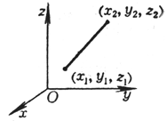

<b>§2 </b><b>解析几何中的基本计算</b>

<table class=MsoNormalTable border=1 cellspacing=1 cellpadding=0 width=632
 style='width:474.0pt'>
 <tr style='height:25.5pt'>
  <td width="31%" valign=top style='width:31.0%;padding:5.25pt 5.25pt 5.25pt 5.25pt;
  height:25.5pt'>
  
图 形

  </td>
  <td width="69%" valign=top style='width:69.0%;padding:5.25pt 5.25pt 5.25pt 5.25pt;
  height:25.5pt'>
  
计 算 公 式

  </td>
 </tr>
 <tr style='height:57.0pt'>
  <td width="31%" valign=top style='width:31.0%;padding:5.25pt 5.25pt 5.25pt 5.25pt;
  height:57.0pt'>
  
[两点间的距离]

  
<b></b>

  </td>
  <td width="69%" valign=top style='width:69.0%;padding:5.25pt 5.25pt 5.25pt 5.25pt;
  height:57.0pt'>
  
　

  
平面上 

  
空间中 

  </td>
 </tr>
 <tr style='height:53.25pt'>
  <td width="31%" valign=top style='width:31.0%;padding:5.25pt 5.25pt 5.25pt 5.25pt;
  height:53.25pt'>
  
[分线段为定比的分点坐标]

  
(<i>a</i>)

  
(<i>b</i>)

  
<i>M</i>(<i>x</i>, <i>y</i>, <i>z</i>)为<i>A</i>1<i>A</i>2的分点，分割比例
  

  </td>
  <td width="69%" valign=top style='width:69.0%;padding:5.25pt 5.25pt 5.25pt 5.25pt;
  height:53.25pt'>
  
平面上 

  
　

  
　

  
　

  
空间中 

  
<i>λ</i>&gt;0称为内分，称为外分.<i>λ</i>=1时，<i>M</i>为<i>A</i>1<i>A</i>2的中点：

  
&nbsp;&nbsp;&nbsp;&nbsp;&nbsp;&nbsp; ，，

  </td>
 </tr>
 <tr style='height:14.25pt'>
  <td width="31%" valign=top style='width:31.0%;padding:5.25pt 5.25pt 5.25pt 5.25pt;
  height:14.25pt'>
  
图 形 

  </td>
  <td width="69%" valign=top style='width:69.0%;padding:5.25pt 5.25pt 5.25pt 5.25pt;
  height:14.25pt'>
  
计 算 公 式 

  </td>
 </tr>
 <tr style='height:156.0pt'>
  <td width="31%" valign=top style='width:31.0%;padding:5.25pt 5.25pt 5.25pt 5.25pt;
  height:156.0pt'>
  
[平面上三角形的面积]

  
<i>A</i>1, <i>A</i>2, <i>A</i>3构成逆时针回路

  </td>
  <td width="69%" valign=top style='width:69.0%;padding:5.25pt 5.25pt 5.25pt 5.25pt;
  height:156.0pt'>
  
S△=

  
当<i>S</i>△=0时，<i>A</i>1, <i>A</i>2, <i>A</i>3三点共线 

  </td>
 </tr>
 <tr style='height:53.25pt'>
  <td width="31%" valign=top style='width:31.0%;padding:5.25pt 5.25pt 5.25pt 5.25pt;
  height:53.25pt'>
  
[平面上多角形的面积]

  
<i></i>

  
<i>A</i>1, <i>A</i>2,…,<i>An</i>构成逆时针回路 

  </td>
  <td width="69%" valign=top style='width:69.0%;padding:5.25pt 5.25pt 5.25pt 5.25pt;
  height:53.25pt'>
  
　

  
<i>S</i>=

  
当<i>S</i> =0时，<i>A</i>1, <i>A</i>2,…,<i>An</i>
  <i>n</i>个点共线

  </td>
 </tr>
 <tr style='height:53.25pt'>
  <td width="31%" valign=top style='width:31.0%;padding:5.25pt 5.25pt 5.25pt 5.25pt;
  height:53.25pt'>
  
[空间中四面体的体积]

  

  
这里构成右手系 

  </td>
  <td width="69%" valign=top style='width:69.0%;padding:5.25pt 5.25pt 5.25pt 5.25pt;
  height:53.25pt'>
  
<i>V</i>==

  
当<i>V</i> =0时，<i>M</i>, <i>A</i>1, <i>A</i>2, <i>A</i>3四个点共面

  </td>
 </tr>
 <tr style='height:53.25pt'>
  <td width="31%" valign=top style='width:31.0%;padding:5.25pt 5.25pt 5.25pt 5.25pt;
  height:53.25pt'>
  
[二面角的角度]

  
<i></i>

  
<i>M</i>0, <i>M</i>1, <i>A</i>1, <i>A</i>2为空间中不共面的四点，q
  为二面角<i>A</i>1-<i>M</i>0<i>M</i>1-<i>A</i>2
  (0&pound;q&pound;180°)

  
　

  
<b>　</b>

  </td>
  <td width="69%" valign=top style='width:69.0%;padding:5.25pt 5.25pt 5.25pt 5.25pt;
  height:53.25pt'>
  
　

  
　

  

  
当<i>M</i>0为原点，为<i>x</i>轴的正向，为<i>y</i>轴的正向时，则

  

  
当<i>M</i>0为原点时，为<i>x</i>轴的正向时，则

  

  
　

  </td>
 </tr>
 <tr style='height:12.0pt'>
  <td width="31%" valign=top style='width:31.0%;padding:5.25pt 5.25pt 5.25pt 5.25pt;
  height:12.0pt'>
  
图 形 

  </td>
  <td width="69%" valign=top style='width:69.0%;padding:5.25pt 5.25pt 5.25pt 5.25pt;
  height:12.0pt'>
  
计 算 公 式 

  </td>
 </tr>
 <tr style='height:170.25pt'>
  <td width="31%" valign=top style='width:31.0%;padding:5.25pt 5.25pt 5.25pt 5.25pt;
  height:170.25pt'>
  
[质点系的重心坐标]

  
空间中各质点的质量为<i> </i><i>m</i>i,坐标为(<i>xi</i>,<i>yi</i>,<i>zi</i>)<i>i</i>=1,2,
  …,
  <i>n</i> 

  </td>
  <td width="69%" valign=top style='width:69.0%;padding:5.25pt 5.25pt 5.25pt 5.25pt;
  height:170.25pt'>
  
重心<i>G</i>的坐标为

  

  
式中∑表示对<i>i</i>从1到<i>n</i>求和 

  </td>
 </tr>
</table>

　

