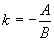

<b>§3 </b><b>平面上的直线</b>

<h3 style='margin-left:36.0pt'>一、平面上直线的方程与图形
</h3>

<table class=MsoNormalTable border=1 cellspacing=1 cellpadding=0 width=632
 style='width:474.0pt'>
 <tr style='height:15.0pt'>
  <td width="48%" colspan=7 valign=top style='width:48.0%;padding:5.25pt 5.25pt 5.25pt 5.25pt;
  height:15.0pt'>
  
方 程 与 图 形 

  </td>
  <td width="52%" valign=top style='width:52.0%;padding:5.25pt 5.25pt 5.25pt 5.25pt;
  height:15.0pt'>
  
说 明 

  </td>
 </tr>
 <tr style='height:81.0pt'>
  <td width="26%" colspan=6 valign=top style='width:26.0%;padding:5.25pt 5.25pt 5.25pt 5.25pt;
  height:81.0pt'>
  
[斜截式]

  

  </td>
  <td width="22%" valign=top style='width:22.0%;padding:5.25pt 5.25pt 5.25pt 5.25pt;
  height:81.0pt'>
  

  </td>
  <td width="52%" rowspan=2 valign=top style='width:52.0%;padding:5.25pt 5.25pt 5.25pt 5.25pt;
  height:81.0pt'>
  
　

  
　

  
　

  
　

  
　

  
<i>k</i>为斜率.若直线与<i>x</i>轴的交角为a ，则，这里0&pound; a &lt; p .

  
<i>b</i>为纵截距

  </td>
 </tr>
 <tr style='height:184.5pt'>
  <td width="48%" colspan=7 valign=top style='width:48.0%;padding:5.25pt 5.25pt 5.25pt 5.25pt;
  height:184.5pt'>
  
<b></b>

  
<b></b>

  </td>
 </tr>
 <tr style='height:99.0pt'>
  <td width="25%" colspan=5 valign=top style='width:25.0%;padding:5.25pt 5.25pt 5.25pt 5.25pt;
  height:99.0pt'>
  
[截距式] 

  
<b></b>

  </td>
  <td width="23%" colspan=2 valign=top style='width:23.0%;padding:5.25pt 5.25pt 5.25pt 5.25pt;
  height:99.0pt'>
  

  </td>
  <td width="52%" valign=top style='width:52.0%;padding:5.25pt 5.25pt 5.25pt 5.25pt;
  height:99.0pt'>
  
<i>a</i>,<i>b</i>分别为<i>x</i>轴，<i>y</i>轴上的截距.

  
该直线通过<i>A</i>(<i>a</i>, 0)和<i>B</i>(0, <i>b</i>)两点.

  
与<i>x</i>轴的交角  

  <blockquote style='margin-top:5.0pt;margin-bottom:5.0pt'>
  
或 

  <table class=MsoNormalTable border=0 cellpadding=0 width="75%"
   style='width:75.0%'>
   <tr>
    <td style='padding:.75pt .75pt .75pt .75pt'>
    

    </td>
   </tr>
  </table>
  </blockquote>
  

  </td>
 </tr>
 <tr style='height:63.0pt'>
  <td width="48%" colspan=7 valign=top style='width:48.0%;padding:5.25pt 5.25pt 5.25pt 5.25pt;
  height:63.0pt'>
  
[点斜式] 

  

  </td>
  <td width="52%" valign=top style='width:52.0%;padding:5.25pt 5.25pt 5.25pt 5.25pt;
  height:63.0pt'>
  
<i>　</i>

  
<i>k</i>为斜率&nbsp;&nbsp;&nbsp;&nbsp;&nbsp;&nbsp;  

  
该直线通过点<i>M</i>(<i>x</i>0, <i>y</i>0)，与<i>x</i>轴的交角

  

  </td>
 </tr>
 <tr style='height:9.75pt'>
  <td width="23%" colspan=3 valign=top style='width:23.0%;padding:5.25pt 5.25pt 5.25pt 5.25pt;
  height:9.75pt'>
  
方 程 

  </td>
  <td width="26%" colspan=4 valign=top style='width:26.0%;padding:5.25pt 5.25pt 5.25pt 5.25pt;
  height:9.75pt'>
  
与 图 形 

  </td>
  <td width="52%" valign=top style='width:52.0%;padding:5.25pt 5.25pt 5.25pt 5.25pt;
  height:9.75pt'>
  
说 明 

  </td>
 </tr>
 <tr style='height:137.25pt'>
  <td width="23%" colspan=3 valign=top style='width:23.0%;padding:5.25pt 5.25pt 5.25pt 5.25pt;
  height:137.25pt'>
  
[两点式]

  
&nbsp;&nbsp;&nbsp;&nbsp;&nbsp;&nbsp; 

  
或

  </td>
  <td width="26%" colspan=4 valign=top style='width:26.0%;padding:5.25pt 5.25pt 5.25pt 5.25pt;
  height:137.25pt'>
  

  </td>
  <td width="52%" valign=top style='width:52.0%;padding:5.25pt 5.25pt 5.25pt 5.25pt;
  height:137.25pt'>
  
该直线通过<i>M</i>1(<i>x</i>1, <i>y</i>1)与<i>M</i>2(<i>x</i>2, <i>y</i>2)两点， 

  
与<i>x</i>轴的交角

  

  </td>
 </tr>
 <tr style='height:63.0pt'>
  <td width="22%" colspan=2 valign=top style='width:22.0%;padding:5.25pt 5.25pt 5.25pt 5.25pt;
  height:63.0pt'>
  
[一般式]

  
(<i>A</i>, <i>B</i>, <i>C</i>为常数，<i>A, B</i>不同时为零) 

  </td>
  <td width="27%" colspan=5 valign=top style='width:27.0%;padding:5.25pt 5.25pt 5.25pt 5.25pt;
  height:63.0pt'>
  
　

  

  </td>
  <td width="52%" valign=top style='width:52.0%;padding:5.25pt 5.25pt 5.25pt 5.25pt;
  height:63.0pt'>
  
斜率&nbsp;&nbsp; 

  
纵截距 

  
[注]一般方程可根据需要化成上面四种形式

  </td>
 </tr>
 <tr style='height:63.0pt'>
  <td width="24%" colspan=4 valign=top style='width:24.0%;padding:5.25pt 5.25pt 5.25pt 5.25pt;
  height:63.0pt'>
  
[参数式]

  
 

  
或&nbsp;&nbsp;&nbsp;&nbsp;&nbsp;&nbsp; 

  
(-∞&lt; <i>t</i>
  &lt;∞) 

  </td>
  <td width="24%" colspan=3 valign=top style='width:24.0%;padding:5.25pt 5.25pt 5.25pt 5.25pt;
  height:63.0pt'>
  

  </td>
  <td width="52%" valign=top style='width:52.0%;padding:5.25pt 5.25pt 5.25pt 5.25pt;
  height:63.0pt'>
  
斜率

  
该直线通过点<i>M</i>(<i>x</i>0, <i>y</i>0)与<i>x</i>轴的交角为a 

  </td>
 </tr>
 <tr style='height:63.0pt'>
  <td width="21%" valign=top style='width:21.0%;padding:5.25pt 5.25pt 5.25pt 5.25pt;
  height:63.0pt'>
  
[极坐标式]

  

  </td>
  <td width="27%" colspan=6 valign=top style='width:27.0%;padding:5.25pt 5.25pt 5.25pt 5.25pt;
  height:63.0pt'>
  

  </td>
  <td width="52%" valign=top style='width:52.0%;padding:5.25pt 5.25pt 5.25pt 5.25pt;
  height:63.0pt'>
  
<i>O</i>为极点，<i>Ox</i>为极轴，<i>p</i>为极点到该直线的距离.a 为极轴与从极点引到直线的垂线之间的夹角(逆时针方向为正)，j 为该直线上任一点<i>M</i>的极角，r
  为<i>M</i>点的矢径

  </td>
 </tr>
 <tr style='height:63.0pt'>
  <td width="48%" colspan=7 valign=top style='width:48.0%;padding:5.25pt 5.25pt 5.25pt 5.25pt;
  height:63.0pt'>
  
[法线式]

  

  

  </td>
  <td width="52%" valign=top style='width:52.0%;padding:5.25pt 5.25pt 5.25pt 5.25pt;
  height:63.0pt'>
  
<i>p</i>为法线长(原点<i>O</i>到直线的垂线长)，b
  为法线与<i>x</i>轴的交角，<i>p</i>, b 称为直线的位置参数.

  
[注]直线一般式可化为法线式&nbsp;&nbsp;&nbsp;&nbsp;&nbsp;&nbsp; &nbsp;&nbsp;&nbsp;&nbsp;&nbsp;&nbsp; 

  
式中称为直线的法化因子，当<i>C&lt; </i>0 (或<i>C</i>=0而<i>B&gt; </i>0)时，取正号；当<i>C&gt; </i>0 (或<i>C</i>=0而<i>B&lt; </i>0)时，取负号 

  </td>
 </tr>
 <tr style='height:63.0pt'>
  <td width="48%" colspan=7 valign=top style='width:48.0%;padding:5.25pt 5.25pt 5.25pt 5.25pt;
  height:63.0pt'>
  
[矢量式]

  
&nbsp;&nbsp;&nbsp;&nbsp;&nbsp;&nbsp; 

  

  </td>
  <td width="52%" valign=top style='width:52.0%;padding:5.25pt 5.25pt 5.25pt 5.25pt;
  height:63.0pt'>
  
　

  
该直线通过矢径<b><i>r</i>0</b>的终点，且与已知矢量<b><i>a</i></b>平行

  </td>
 </tr>
 <tr style='height:15.0pt'>
  <td width="24%" colspan=4 valign=top style='width:24.0%;padding:5.25pt 5.25pt 5.25pt 5.25pt;
  height:15.0pt'>
  
方 程 

  </td>
  <td width="24%" colspan=3 valign=top style='width:24.0%;padding:5.25pt 5.25pt 5.25pt 5.25pt;
  height:15.0pt'>
  
与 图 形 

  </td>
  <td width="52%" valign=top style='width:52.0%;padding:5.25pt 5.25pt 5.25pt 5.25pt;
  height:15.0pt'>
  
说 明 

  </td>
 </tr>
 <tr style='height:162.0pt'>
  <td width="24%" colspan=4 valign=top style='width:24.0%;padding:5.25pt 5.25pt 5.25pt 5.25pt;
  height:162.0pt'>
  
[复数式]

  
(<i>a</i>) 

  

  
　

  
(<i>b</i>)

  

  </td>
  <td width="24%" colspan=3 valign=top style='width:24.0%;padding:5.25pt 5.25pt 5.25pt 5.25pt;
  height:162.0pt'>
  
<b></b>

  

  </td>
  <td width="52%" valign=top style='width:52.0%;padding:5.25pt 5.25pt 5.25pt 5.25pt;
  height:162.0pt'>
  
(a) 直线通过点<i>z</i>0，并与<i>x</i>轴的交角为a
  

  
　

  
　

  
　

  
　

  
(<i>b</i>) 直线通过<i>z</i>1，<i>z</i>2两点(<i>t</i>为实参数) 

  </td>
 </tr>
 <tr height=0>
  <td width=137 style='border:none'></td>
  <td width=7 style='border:none'></td>
  <td width=7 style='border:none'></td>
  <td width=7 style='border:none'></td>
  <td width=7 style='border:none'></td>
  <td width=7 style='border:none'></td>
  <td width=147 style='border:none'></td>
  <td width=311 style='border:none'></td>
 </tr>
</table>

&nbsp;

