

<h3 style='margin-left:36.0pt'>二、平面上点与直线的相互关系
</h3>

<table class=MsoNormalTable border=1 cellspacing=1 cellpadding=0 width=632
 style='width:474.0pt'>
 <tr style='height:9.75pt'>
  <td width="39%" valign=top style='width:39.0%;padding:5.25pt 5.25pt 5.25pt 5.25pt;
  height:9.75pt'>
  
方 程 与 图 形

  </td>
  <td width="61%" valign=top style='width:61.0%;padding:5.25pt 5.25pt 5.25pt 5.25pt;
  height:9.75pt'>
  
计 算 公 式 与 说 明

  </td>
 </tr>
 <tr style='height:90.0pt'>
  <td width="39%" valign=top style='width:39.0%;padding:5.25pt 5.25pt 5.25pt 5.25pt;
  height:90.0pt'>
  
[点线的距离]

  
法线式 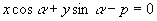

  
一般式 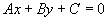

  
<b>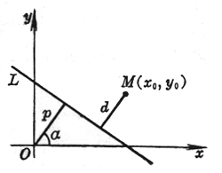</b>

  
<b>　</b>

  
<b>　</b>

  </td>
  <td width="61%" valign=top style='width:61.0%;padding:5.25pt 5.25pt 5.25pt 5.25pt;
  height:90.0pt'>
  
<i>d</i>法=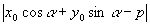

  
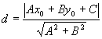

  
式中<i>d</i>为点<i>M</i>(<i>x</i>0, <i>y</i>0)到直线<i>L</i>的距离 

  </td>
 </tr>
 <tr style='height:90.0pt'>
  <td width="39%" valign=top style='width:39.0%;padding:5.25pt 5.25pt 5.25pt 5.25pt;
  height:90.0pt'>
  
[二直线的夹角]

  
<i>L1&nbsp;&nbsp;&nbsp;&nbsp;&nbsp;&nbsp;&nbsp;&nbsp;&nbsp;&nbsp; A1x
  + B1y + C1 = 0</i>

  
斜率为<i>k</i>1

  
<i>L2&nbsp;&nbsp;&nbsp;&nbsp;&nbsp;&nbsp;&nbsp;&nbsp;&nbsp;&nbsp; A2x
  + B2y + C2= 0</i>

  
斜率为<i>k</i>2

  
<b>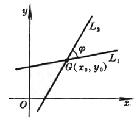</b>

  
为二直线的夹角（从<i>L</i>1到<i>L</i>2为逆时针时为正），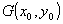为二直线的交点

  
　

  
　

  
　

  
　

  
　

  </td>
  <td width="61%" valign=top style='width:61.0%;padding:5.25pt 5.25pt 5.25pt 5.25pt;
  height:90.0pt'>
  
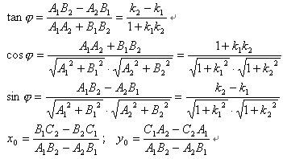

  
特别， 当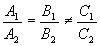(或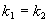)时，<i>L</i>1//<i>L</i>2;

  
&nbsp;&nbsp;&nbsp;&nbsp;&nbsp;&nbsp;&nbsp;&nbsp;&nbsp;&nbsp;&nbsp;&nbsp;&nbsp; 当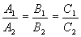时，<i>L</i>1与<i>L</i>2重合；

  
&nbsp;&nbsp;&nbsp;&nbsp;&nbsp;&nbsp;&nbsp;&nbsp;&nbsp;&nbsp;&nbsp;&nbsp;&nbsp; 当<i>A</i>1<i>A</i>2+<i>B</i>1<i>B</i>2
  = 0 (或1 + <i>k</i>1<i>k</i>2
  = 0)时，<i>L</i>1⊥<i>L</i>2

  </td>
 </tr>
 <tr style='height:13.5pt'>
  <td width="39%" valign=top style='width:39.0%;padding:5.25pt 5.25pt 5.25pt 5.25pt;
  height:13.5pt'>
  
方 程 与 图 形

  </td>
  <td width="61%" valign=top style='width:61.0%;padding:5.25pt 5.25pt 5.25pt 5.25pt;
  height:13.5pt'>
  
&nbsp;&nbsp;&nbsp;&nbsp;&nbsp;&nbsp; &nbsp;计 算 公 式 与 说 明

  </td>
 </tr>
 <tr style='height:211.5pt'>
  <td width="39%" valign=top style='width:39.0%;padding:5.25pt 5.25pt 5.25pt 5.25pt;
  height:211.5pt'>
  
[直线束× 三直线共点的条件]

  
&nbsp;&nbsp;&nbsp;&nbsp;&nbsp;&nbsp; <i>L</i><i>l </i>&nbsp;&nbsp;&nbsp; (<i>A</i>1<i>x </i>+
  <i>B</i>1<i>y </i>+ <i>C</i>1)
  + l (<i>A</i>2<i>x
  </i>+ <i>B</i>2<i>y </i>+ <i>C</i>2) = 0,&nbsp;&nbsp;&nbsp;&nbsp;&nbsp;&nbsp; (l 为参数，-&yen; &lt; l &lt; &yen; )

  
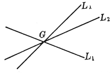

  </td>
  <td width="61%" valign=top style='width:61.0%;padding:5.25pt 5.25pt 5.25pt 5.25pt;
  height:211.5pt'>
  
对l
  的一个确定值，<i>L</i><i>l </i>表示一条通过二直线(<i>L</i>1和<i>L</i>2)的交点<i>G</i>的直线，当l 取一切值时，<i>L</i><i>l </i>所表示的通过<i>G</i>的直线的全体称为直线束，<i>G</i>称为直线束的顶点(或中心).

  
&nbsp;&nbsp;&nbsp;&nbsp;&nbsp;&nbsp; 设<i>L</i>3为<i>A</i>3<i>x </i>+ <i>B</i>3<i>y </i>+
  <i>C</i>3 = 0，则三条直线<i>L</i>1, <i>L</i>2, <i>L</i>3共点的条件为行列式

  
&nbsp;&nbsp;&nbsp;&nbsp;&nbsp;&nbsp;&nbsp;&nbsp;&nbsp;&nbsp;&nbsp;&nbsp;&nbsp;&nbsp;&nbsp;&nbsp;&nbsp;&nbsp;&nbsp;&nbsp;&nbsp;&nbsp;&nbsp;&nbsp;&nbsp;&nbsp;&nbsp; 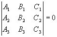

  
&nbsp;&nbsp;&nbsp;&nbsp;&nbsp;&nbsp; 如果二直线方程以法线式给定，则|l |为直线<i>L</i><i>l </i>上任一点到二给定直线之间的距离之比，对应与 l = 1和 l = -1的直线为给定二直线夹角的平分线&nbsp;&nbsp; 

  </td>
 </tr>
</table>

<b>　</b>

　

