

<b>§4 </b><b>空间中的直线与平面</b>

<h3 style='margin-left:36.0pt'>一、直线的方向
</h3>

<table class=MsoNormalTable border=1 cellspacing=1 cellpadding=0 width=624
 style='width:468.0pt'>
 <tr style='height:28.5pt'>
  <td width="50%" valign=top style='width:50.0%;padding:5.25pt 5.25pt 5.25pt 5.25pt;
  height:28.5pt'>
  
名 称 与 说 明

  </td>
  <td width="50%" valign=top style='width:50.0%;padding:5.25pt 5.25pt 5.25pt 5.25pt;
  height:28.5pt'>
  
图 形

  </td>
 </tr>
 <tr style='height:129.0pt'>
  <td width="50%" valign=top style='width:50.0%;padding:5.25pt 5.25pt 5.25pt 5.25pt;
  height:129.0pt'>
  
[方向角]

  
&nbsp;&nbsp;&nbsp;&nbsp;&nbsp;&nbsp; 通过原点<i>O</i>的直线<i>OM</i>与三条坐标轴的夹角a
  , b , g 称为该直线的方向角(<i>OM</i>的方向为离开原点<i>O</i>的方向)：

  
&nbsp;&nbsp;&nbsp;&nbsp;&nbsp;&nbsp; a =∠<i>MOx</i>，b
  =∠<i>MOy</i>，g =∠<i>MOz</i>

  
[方向余弦]

  
&nbsp;&nbsp;&nbsp;&nbsp;&nbsp;&nbsp; 直线的方向角的余弦称为方向余弦：

  
&nbsp;&nbsp;&nbsp;&nbsp;&nbsp;&nbsp; 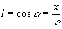，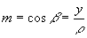，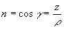

  
式中&nbsp;&nbsp; 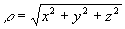，<i>l</i>2 + <i>m</i>2 + <i>n</i>2
  = 1 

  </td>
  <td width="50%" valign=top style='width:50.0%;padding:5.25pt 5.25pt 5.25pt 5.25pt;
  height:129.0pt'>
  
<b>　</b>

  
<b>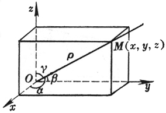</b>

  </td>
 </tr>
 <tr style='height:129.0pt'>
  <td width="50%" valign=top style='width:50.0%;padding:5.25pt 5.25pt 5.25pt 5.25pt;
  height:129.0pt'>
  
[方向数]

  
&nbsp;&nbsp;&nbsp;&nbsp;&nbsp;&nbsp; 通过原点且平行于直线<i>L</i>的直线<i>OM</i>上任意一点<i>W</i>的坐标(<i>p</i>, <i>q</i>, <i>r</i>)称为直线<i>L</i>的方向数，而

  
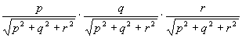&nbsp;&nbsp;&nbsp;&nbsp;&nbsp;&nbsp; 为直线<i>OM</i>的方向余弦

  
<b>　</b>

  </td>
  <td width="50%" valign=top style='width:50.0%;padding:5.25pt 5.25pt 5.25pt 5.25pt;
  height:129.0pt'>
  
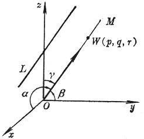

  
　

  
　

  
　

  </td>
 </tr>
 <tr style='height:12.0pt'>
  <td width="50%" valign=top style='width:50.0%;padding:5.25pt 5.25pt 5.25pt 5.25pt;
  height:12.0pt'>
  
名 称 与 说 明

  </td>
  <td width="50%" valign=top style='width:50.0%;padding:5.25pt 5.25pt 5.25pt 5.25pt;
  height:12.0pt'>
  
图 形

  </td>
 </tr>
 <tr style='height:177.0pt'>
  <td width="50%" valign=top style='width:50.0%;padding:5.25pt 5.25pt 5.25pt 5.25pt;
  height:177.0pt'>
  
[过两点的直线的方向余弦]

  
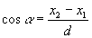，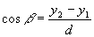，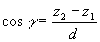

  
式中&nbsp;&nbsp;&nbsp;&nbsp;&nbsp;&nbsp; 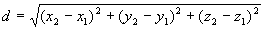

  
这时直线的正向为<i>M</i>1(<i>x</i>1, <i>y</i>1,
  <i>z</i>1)到<i>M</i>2(<i>x</i>2, <i>y</i>2,
  <i>z</i>2)的方向.

  
　

  </td>
  <td width="50%" valign=top style='width:50.0%;padding:5.25pt 5.25pt 5.25pt 5.25pt;
  height:177.0pt'>
  
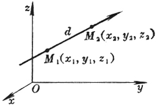

  </td>
 </tr>
</table>

　

