

<h3 style='margin-left:36.0pt'>二、平面的方程
</h3>

<table class=MsoNormalTable border=1 cellspacing=1 cellpadding=0 width=624
 style='width:468.0pt'>
 <tr style='height:9.75pt'>
  <td width="58%" colspan=6 valign=top style='width:58.0%;padding:5.25pt 5.25pt 5.25pt 5.25pt;
  height:9.75pt'>
  
方 程 与 图 形

  </td>
  <td width="42%" valign=top style='width:42.0%;padding:5.25pt 5.25pt 5.25pt 5.25pt;
  height:9.75pt'>
  
说 明

  </td>
 </tr>
 <tr style='height:67.5pt'>
  <td width="19%" colspan=2 valign=top style='width:19.0%;padding:5.25pt 5.25pt 5.25pt 5.25pt;
  height:67.5pt'>
  
[截距式]

  
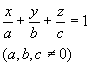

  </td>
  <td width="39%" colspan=4 valign=top style='width:39.0%;padding:5.25pt 5.25pt 5.25pt 5.25pt;
  height:67.5pt'>
  
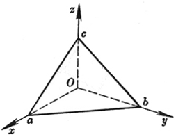

  </td>
  <td width="42%" valign=top style='width:42.0%;padding:5.25pt 5.25pt 5.25pt 5.25pt;
  height:67.5pt'>
  
&nbsp;&nbsp;&nbsp;&nbsp;&nbsp;&nbsp; 

  
<i>a, b, c</i>分别称为平面在三条坐标轴上的截距

  </td>
 </tr>
 <tr style='height:67.5pt'>
  <td width="31%" colspan=5 valign=top style='width:31.0%;padding:5.25pt 5.25pt 5.25pt 5.25pt;
  height:67.5pt'>
  
[点法式]

  
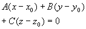

  
(<i>A</i>, <i>B</i>, <i>C</i>不同时等于零)

  </td>
  <td width="28%" valign=top style='width:28.0%;padding:5.25pt 5.25pt 5.25pt 5.25pt;
  height:67.5pt'>
  
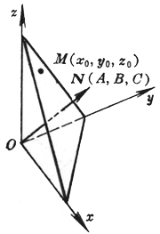

  </td>
  <td width="42%" valign=top style='width:42.0%;padding:5.25pt 5.25pt 5.25pt 5.25pt;
  height:67.5pt'>
  
&nbsp;&nbsp;&nbsp;&nbsp;&nbsp;&nbsp; 

  
　

  
平面通过点<i>M</i>(<i>x</i>0, <i>y</i>0,
  <i>z</i>0)，且法线<i>N</i>的方向数为<i>A</i>, <i>B</i>, <i>C</i>

  
　

  </td>
 </tr>
 <tr style='height:88.5pt'>
  <td width="25%" colspan=3 valign=top style='width:25.0%;padding:5.25pt 5.25pt 5.25pt 5.25pt;
  height:88.5pt'>
  
　

  
　

  
[三点式] 

  
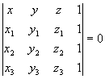

  </td>
  <td width="33%" colspan=3 valign=top style='width:33.0%;padding:5.25pt 5.25pt 5.25pt 5.25pt;
  height:88.5pt'>
  
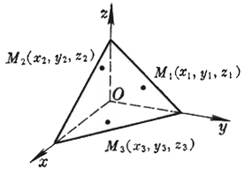

  </td>
  <td width="42%" rowspan=2 valign=top style='width:42.0%;padding:5.25pt 5.25pt 5.25pt 5.25pt;
  height:88.5pt'>
  
&nbsp;&nbsp;&nbsp;&nbsp;&nbsp;&nbsp; 

  
　

  
　

  
　

  
平面通过三点:

  
<i>M</i>1(<i>x</i>1, <i>y</i>1,
  <i>z</i>1)

  
<i>M</i>2(<i>x</i>2, <i>y</i>2,
  <i>z</i>2)

  
<i>M</i>3(<i>x</i>3, <i>y</i>3,
  <i>z</i>3)

  </td>
 </tr>
 <tr style='height:69.0pt'>
  <td width="58%" colspan=6 valign=top style='width:58.0%;padding:5.25pt 5.25pt 5.25pt 5.25pt;
  height:69.0pt'>
  
或

  
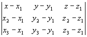=0

  
　

  
　

  
　

  </td>
 </tr>
 <tr style='height:15.75pt'>
  <td width="30%" colspan=4 valign=top style='width:30.0%;padding:5.25pt 5.25pt 5.25pt 5.25pt;
  height:15.75pt'>
  
方 程 

  </td>
  <td width="29%" colspan=2 valign=top style='width:29.0%;padding:5.25pt 5.25pt 5.25pt 5.25pt;
  height:15.75pt'>
  
与 图 形

  </td>
  <td width="42%" valign=top style='width:42.0%;padding:5.25pt 5.25pt 5.25pt 5.25pt;
  height:15.75pt'>
  
&nbsp;&nbsp;&nbsp;&nbsp;&nbsp;&nbsp; &nbsp;说 明

  </td>
 </tr>
 <tr style='height:101.25pt'>
  <td width="30%" colspan=4 valign=top style='width:30.0%;padding:5.25pt 5.25pt 5.25pt 5.25pt;
  height:101.25pt'>
  
　

  
[一般式]

  
<i>Ax</i> +<i>By</i> +<i>Cz</i> +<i>D
  </i>= 0

  
(<i>A</i>, <i>B</i>,
  <i>C</i>为该平面的法线的方向数，且不同时等于零) 

  </td>
  <td width="29%" colspan=2 valign=top style='width:29.0%;padding:5.25pt 5.25pt 5.25pt 5.25pt;
  height:101.25pt'>
  
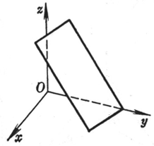

  </td>
  <td width="42%" valign=top style='width:42.0%;padding:5.25pt 5.25pt 5.25pt 5.25pt;
  height:101.25pt'>
  
当<i>D</i>=0时，平面通过原点

  
&nbsp;&nbsp;&nbsp;&nbsp;&nbsp;&nbsp; 当<i>A</i>=0时(或<i>B</i>=0，或<i>C</i>=0)时，平面与<i>x</i>轴(或<i>y</i>轴，或<i>z</i>轴)平行

  
&nbsp;&nbsp;&nbsp;&nbsp;&nbsp;&nbsp; 当<i>A</i>=<i>B</i>=0时(或<i>A</i>=<i>C</i>=0，或<i>B</i>=<i>C</i>=0)时，平面与<i>Oxy</i>平面(或<i>Ozx</i>，或<i>Oyz</i>)平行 

  </td>
 </tr>
 <tr style='height:67.5pt'>
  <td width="30%" colspan=4 valign=top style='width:30.0%;padding:5.25pt 5.25pt 5.25pt 5.25pt;
  height:67.5pt'>
  
[法线式]

  
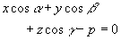

  
(a , b , g 为平面的法线的方向角，<i>p</i><i>&sup3; </i>0为法线长即原点到平面的距离)

  </td>
  <td width="29%" colspan=2 valign=top style='width:29.0%;padding:5.25pt 5.25pt 5.25pt 5.25pt;
  height:67.5pt'>
  
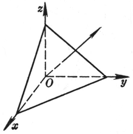

  </td>
  <td width="42%" valign=top style='width:42.0%;padding:5.25pt 5.25pt 5.25pt 5.25pt;
  height:67.5pt'>
  
&nbsp;&nbsp;&nbsp;&nbsp;&nbsp;&nbsp; 平面的一般式可化为法线式&nbsp;&nbsp;&nbsp;&nbsp; 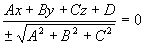，式中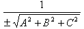称为平面的法化因子，当<i>D&lt; </i>0时取正号；<i>D</i>&gt;0时取负号

  </td>
 </tr>
 <tr style='height:67.5pt'>
  <td width="18%" valign=top style='width:18.0%;padding:5.25pt 5.25pt 5.25pt 5.25pt;
  height:67.5pt'>
  
[矢量式]

  
(<b><i>r </i></b><b>-<i>r</i></b>0)× <b><i>a </i></b>=
  0

  </td>
  <td width="40%" colspan=5 valign=top style='width:40.0%;padding:5.25pt 5.25pt 5.25pt 5.25pt;
  height:67.5pt'>
  
<b>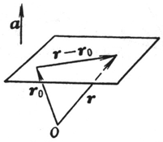</b>

  </td>
  <td width="42%" valign=top style='width:42.0%;padding:5.25pt 5.25pt 5.25pt 5.25pt;
  height:67.5pt'>
  
平面 通过矢径<b><i>r</i></b>0的终点，且与已知矢量<b><i>a</i></b>垂直<b>，</b><b><i>r</i></b>为平面上任意一点的矢径

  </td>
 </tr>
 <tr height=0>
  <td width=112 style='border:none'></td>
  <td width=7 style='border:none'></td>
  <td width=38 style='border:none'></td>
  <td width=32 style='border:none'></td>
  <td width=7 style='border:none'></td>
  <td width=174 style='border:none'></td>
  <td width=254 style='border:none'></td>
 </tr>
</table>

　

　

