

<h3 style='margin-left:36.0pt'>三、直线的方程
</h3>

<table class=MsoNormalTable border=1 cellspacing=1 cellpadding=0 width=624
 style='width:468.0pt'>
 <tr style='height:3.0pt'>
  <td width="60%" colspan=3 valign=top style='width:60.0%;padding:5.25pt 5.25pt 5.25pt 5.25pt;
  height:3.0pt'>
  
方 程 与 图 形

  </td>
  <td width="40%" valign=top style='width:40.0%;padding:5.25pt 5.25pt 5.25pt 5.25pt;
  height:3.0pt'>
  
说 明

  </td>
 </tr>
 <tr style='height:123.0pt'>
  <td width="60%" colspan=3 valign=top style='width:60.0%;padding:5.25pt 5.25pt 5.25pt 5.25pt;
  height:123.0pt'>
  
[一般式(或交面式)]

  
<i>L</i>&nbsp;&nbsp;&nbsp;&nbsp;&nbsp; 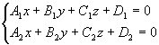

  
<i>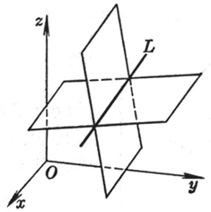</i>

  </td>
  <td width="40%" valign=top style='width:40.0%;padding:5.25pt 5.25pt 5.25pt 5.25pt;
  height:123.0pt'>
  
&nbsp;&nbsp;&nbsp;&nbsp;&nbsp;&nbsp; &nbsp;把直线<i>L</i>作为两个平面的交线，它的方向数为

  
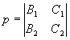

  
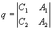

  
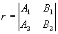

  </td>
 </tr>
 <tr style='height:101.25pt'>
  <td width="60%" colspan=3 valign=top style='width:60.0%;padding:5.25pt 5.25pt 5.25pt 5.25pt;
  height:101.25pt'>
  
[对称式(或参数式)]

  
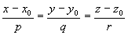 

  
或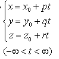 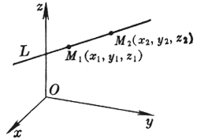

  </td>
  <td width="40%" valign=top style='width:40.0%;padding:5.25pt 5.25pt 5.25pt 5.25pt;
  height:101.25pt'>
  
　

  
　

  
直线<i>L</i>通过点<i>M</i>(<i>x</i>0, <i>y</i>0,
  <i>z</i>0)，且具有方向数<i>p</i>, <i>q</i>, <i>r</i>

  
<i>　</i>

  
<i>　</i>

  
<i>　</i>

  
<i>　</i>

  
<i>　</i>

  
<i>　</i>

  
<i>　</i>

  
<i>　</i>

  </td>
 </tr>
 <tr style='height:10.5pt'>
  <td width="60%" colspan=3 valign=top style='width:60.0%;padding:5.25pt 5.25pt 5.25pt 5.25pt;
  height:10.5pt'>
  
方 程 与 图 形

  </td>
  <td width="40%" valign=top style='width:40.0%;padding:5.25pt 5.25pt 5.25pt 5.25pt;
  height:10.5pt'>
  
说 明

  </td>
 </tr>
 <tr style='height:152.25pt'>
  <td width="60%" colspan=3 valign=top style='width:60.0%;padding:5.25pt 5.25pt 5.25pt 5.25pt;
  height:152.25pt'>
  
[两点式]

  
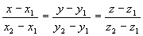

  
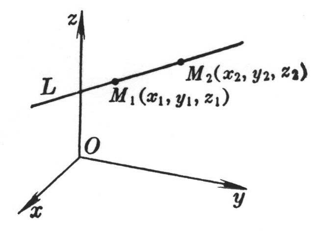

  </td>
  <td width="40%" valign=top style='width:40.0%;padding:5.25pt 5.25pt 5.25pt 5.25pt;
  height:152.25pt'>
  
　

  
直线<i>L</i>通过<i>M</i>1(<i>x</i>1, <i>y</i>1,
  <i>z</i>1)和<i>M</i>2(<i>x</i>2, <i>y</i>2,
  <i>z</i>2)两点

  </td>
 </tr>
 <tr style='height:66.0pt'>
  <td width="21%" colspan=2 valign=top style='width:21.0%;padding:5.25pt 5.25pt 5.25pt 5.25pt;
  height:66.0pt'>
  
[射影式]

  
<i>L</i>&nbsp;&nbsp;&nbsp;&nbsp;&nbsp;&nbsp; 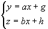 

  </td>
  <td width="40%" valign=top style='width:40.0%;padding:5.25pt 5.25pt 5.25pt 5.25pt;
  height:66.0pt'>
  
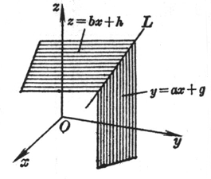

  </td>
  <td width="40%" valign=top style='width:40.0%;padding:5.25pt 5.25pt 5.25pt 5.25pt;
  height:66.0pt'>
  
直线<i>L</i>是<i>y = ax+ g </i>和<i>z </i>= <i>bx </i>+ <i>h</i>两个平面的交线；通过点(0, <i>g</i>, <i>h</i>)且具有方向数1, <i>a</i>, <i>b</i>

  </td>
 </tr>
 <tr style='height:101.25pt'>
  <td width="20%" valign=top style='width:20.0%;padding:5.25pt 5.25pt 5.25pt 5.25pt;
  height:101.25pt'>
  
[矢量式]

  
<b><i>r </i></b>= <b><i>r</i></b>0
  + <i>t<b>a</b></i>

  
(-&yen;
  &lt; <i>t</i> &lt; &yen; )

  </td>
  <td width="40%" colspan=2 valign=top style='width:40.0%;padding:5.25pt 5.25pt 5.25pt 5.25pt;
  height:101.25pt'>
  
　

  
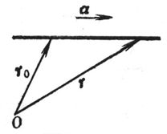

  </td>
  <td width="40%" valign=top style='width:40.0%;padding:5.25pt 5.25pt 5.25pt 5.25pt;
  height:101.25pt'>
  
　

  
直线<i>L</i>通过矢径<b><i>r</i></b>0的终点，且与已知矢量<b><i>a</i></b>平行，<b><i>r</i></b>为<i>L</i>上任意一点的矢径

  </td>
 </tr>
 <tr height=0>
  <td width=138 style='border:none'></td>
  <td width=8 style='border:none'></td>
  <td width=242 style='border:none'></td>
  <td width=236 style='border:none'></td>
 </tr>
</table>

　

