

l (<i>A</i>2<i>x</i>+ <i>B</i>2<i>y</i>+
<i>C</i>2<i>z</i>+<i>D</i>2)+

m (<i>A</i>3<i>x</i>+
<i>B</i>3<i>y</i>+<i>C</i>3<i>z</i>+<i>D</i>3)

<h3 style='margin-left:36.0pt'>四、空间中点、直线、平面的相互关系
</h3>

<table class=MsoNormalTable border=1 cellspacing=1 cellpadding=0 width=624
 style='width:468.0pt'>
 <tr style='height:6.0pt'>
  <td width="38%" valign=top style='width:38.0%;padding:5.25pt 5.25pt 5.25pt 5.25pt;
  height:6.0pt'>
  
方 程 与 图 形

  </td>
  <td width="62%" valign=top style='width:62.0%;padding:5.25pt 5.25pt 5.25pt 5.25pt;
  height:6.0pt'>
  
公 式 与 说 明

  </td>
 </tr>
 <tr style='height:48.0pt'>
  <td width="38%" valign=top style='width:38.0%;padding:5.25pt 5.25pt 5.25pt 5.25pt;
  height:48.0pt'>
  
[二平面的夹角]

  
<i>P</i>1&nbsp;&nbsp;&nbsp;&nbsp;&nbsp;&nbsp;&nbsp;&nbsp;&nbsp; <i>A</i>1<i>x</i>
  + <i>B</i>1<i>y</i> + <i>C</i>1<i>z</i> + <i>D</i>1
  = 0

  
<i>P</i>2&nbsp;&nbsp;&nbsp;&nbsp;&nbsp;&nbsp;&nbsp;&nbsp;&nbsp; <i>A</i>2<i>x</i>
  + <i>B</i>2<i>y</i> + <i>C</i>2<i>z</i> + <i>D</i>2
  = 0

  
　

  
<i>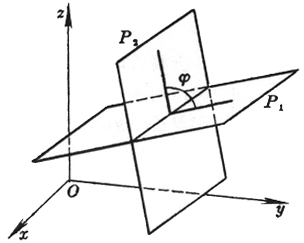</i>

  </td>
  <td width="62%" valign=top style='width:62.0%;padding:5.25pt 5.25pt 5.25pt 5.25pt;
  height:48.0pt'>
  
　

  
　

  
　

  
　

  
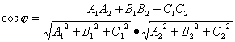

  
式中就是二平面<i>P</i>1和<i>P</i>2的二面角

  
<b>　</b>

  
<b>　</b>

  
<b>　</b>

  
<b>　</b>

  
<b>　</b>

  
<b>　</b>

  
<b>　</b>

  
<b>　</b>

  </td>
 </tr>
 <tr style='height:13.5pt'>
  <td width="38%" valign=top style='width:38.0%;padding:5.25pt 5.25pt 5.25pt 5.25pt;
  height:13.5pt'>
  
方 程 与 图 形

  </td>
  <td width="62%" valign=top style='width:62.0%;padding:5.25pt 5.25pt 5.25pt 5.25pt;
  height:13.5pt'>
  
&nbsp;&nbsp;&nbsp;&nbsp;&nbsp;&nbsp; &nbsp;公 式 与 说 明

  </td>
 </tr>
 <tr style='height:494.25pt'>
  <td width="38%" valign=top style='width:38.0%;padding:5.25pt 5.25pt 5.25pt 5.25pt;
  height:494.25pt'>
  
[平面束× 三平面共线的条件]

  
<i>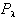</i>(<i>A</i>1<i>x</i>+
  <i>B</i>1<i>y</i>+ <i>C</i>1<i>z</i>+ <i>D</i>1)
  + l (<i>A</i>2<i>x
  </i>+ <i>B</i>2<i>y</i> + <i>C</i>2<i>z </i>+ <i>D</i>2) = 0

  
(l 为参数，-&yen;
  &lt;l &lt; &yen; )

  
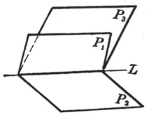

  
　

  
[平面把× 四平面共点的条件]

  
<i>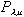</i>(<i>A</i>1<i>x</i>+
  <i>B</i>1<i>y </i>+ <i>C</i>1<i>z </i>+ <i>D</i>1)+ 

  
&nbsp; 

  
&nbsp; 

  
= 0

  
(l , m 为两个独立参数，

  
- &yen;
  &lt; l , m &lt; &yen; )

  
<b>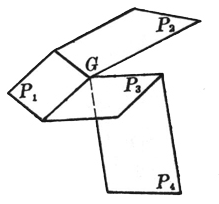</b>

  </td>
  <td width="62%" valign=top style='width:62.0%;padding:5.25pt 5.25pt 5.25pt 5.25pt;
  height:494.25pt'>
  
对l
  的一个确定值，表示一个通过二平面<i>P</i>1和<i>P</i>2交

  
线<i>L</i>的平面，当l 取一切值时，所表示的通过<i>L</i>的平面的全体称为平面束，<i>L</i>称为束的轴.

  
&nbsp;&nbsp;&nbsp;&nbsp;&nbsp;&nbsp; 设<i>P</i>3为<i>A</i>3<i>x </i>+ <i>B</i>3<i>y</i>
  + <i>C</i>3<i>z </i>+ <i>D</i>3 = 0，则三个平面<i>P</i>1, <i>P</i>2, <i>P</i>3共线的条件为矩阵

  
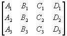&nbsp;&nbsp;&nbsp; 

  
的秩等于2.

  
&nbsp;&nbsp;&nbsp;&nbsp;&nbsp;&nbsp; 

  
　

  
对l
  ,m 的一对确定值，<i> </i>表示通过三平面<i>P</i>1, <i>P</i>2和<i>P</i>3交点<i>G</i>的一个平面，当l
  , m 取一切值时，<i> </i>&nbsp;&nbsp;&nbsp;&nbsp;&nbsp;&nbsp; 所表示的通过<i>G</i>的平面的全体称为平面把，<i>G</i>称为把的顶点.

  
&nbsp;&nbsp;&nbsp;&nbsp;&nbsp;&nbsp; 设<i>P</i>4为<i>A</i>4<i>x</i> + <i>B</i>4<i>y</i>
  + <i>C</i>4<i>z</i> + <i>D</i>4 = 0，则四个平面<i>P</i>1, <i>P</i>2, <i>P</i>3, <i>P</i>4共点的条件为行列式

  
&nbsp;&nbsp;&nbsp;&nbsp;&nbsp;&nbsp; 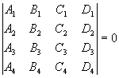

  </td>
 </tr>
 <tr style='height:48.0pt'>
  <td width="38%" valign=top style='width:38.0%;padding:5.25pt 5.25pt 5.25pt 5.25pt;
  height:48.0pt'>
  
[点面的距离]

  
法线式

  
<i>x</i>cosa +<i>y</i>cosb +<i>z</i>cosg -<i>p</i> = 0

  
一般式
  <i>Ax</i> + <i>By</i> + <i>Cz</i>
  + <i>D</i> = 0

  
<b>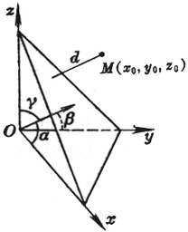</b>

  </td>
  <td width="62%" valign=top style='width:62.0%;padding:5.25pt 5.25pt 5.25pt 5.25pt;
  height:48.0pt'>
  
&nbsp;&nbsp;&nbsp;&nbsp;&nbsp;&nbsp; 

  
　

  
　

  
　

  
<i>d</i>法 = | <i>x</i>0cosa + <i>y</i>0cosb + <i>z</i>0cosg - <i>p </i>|

  
&nbsp;&nbsp;&nbsp;&nbsp;&nbsp;&nbsp; 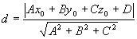

  
&nbsp;&nbsp;&nbsp;&nbsp;&nbsp;&nbsp; 式中<i>d</i>为点<i>M</i>(<i>x</i>0,<i>y</i>0,<i>z</i>0)到平面的距离

  </td>
 </tr>
 <tr style='height:11.25pt'>
  <td width="38%" valign=top style='width:38.0%;padding:5.25pt 5.25pt 5.25pt 5.25pt;
  height:11.25pt'>
  
方 程 与 图 形

  </td>
  <td width="62%" valign=top style='width:62.0%;padding:5.25pt 5.25pt 5.25pt 5.25pt;
  height:11.25pt'>
  
公 式 与 说 明

  </td>
 </tr>
 <tr style='height:208.5pt'>
  <td width="38%" valign=top style='width:38.0%;padding:5.25pt 5.25pt 5.25pt 5.25pt;
  height:208.5pt'>
  
[点线的距离]

  
<i>L</i>&nbsp;&nbsp;&nbsp;&nbsp;&nbsp; 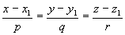

  
<b>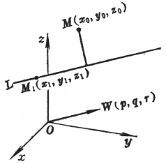</b>

  </td>
  <td width="62%" valign=top style='width:62.0%;padding:5.25pt 5.25pt 5.25pt 5.25pt;
  height:208.5pt'>
  
　

  
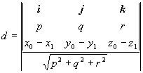

  
式中<i>d</i>为点<i>M</i>(<i>x</i>0, <i>y</i>0,
  <i>z</i>0)到直线<i>L</i>的距离，<b><i>i</i></b>，<b><i>j</i></b>，<b><i>k</i></b>为三个坐标轴上的单位矢量，最外面的符号“| |”表示矢量的模

  </td>
 </tr>
 <tr style='height:48.0pt'>
  <td width="38%" valign=top style='width:38.0%;padding:5.25pt 5.25pt 5.25pt 5.25pt;
  height:48.0pt'>
  
[二直线的夹角]

  
<i>L</i>1 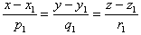

  
<i>L</i>2 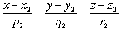

  
<b>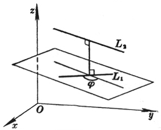</b>

  </td>
  <td width="62%" valign=top style='width:62.0%;padding:5.25pt 5.25pt 5.25pt 5.25pt;
  height:48.0pt'>
  
　

  
　

  
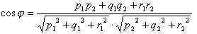 

  
式中j
  为二直线<i>L</i>1和<i>L</i>2的夹角

  </td>
 </tr>
 <tr style='height:48.0pt'>
  <td width="38%" valign=top style='width:38.0%;padding:5.25pt 5.25pt 5.25pt 5.25pt;
  height:48.0pt'>
  
[二不平行直线的最短距离]

  
&nbsp;&nbsp;&nbsp;&nbsp;&nbsp;&nbsp; <i>L</i>1&nbsp;&nbsp;&nbsp;&nbsp;&nbsp;&nbsp;&nbsp;&nbsp;&nbsp;&nbsp;&nbsp;&nbsp;&nbsp; 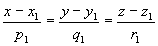

  
<i>&nbsp;&nbsp;&nbsp;&nbsp;&nbsp;&nbsp; L</i>2&nbsp;&nbsp;&nbsp;&nbsp;&nbsp;&nbsp; 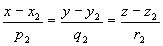

  
<b>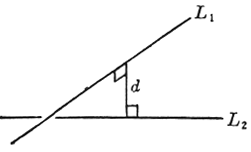</b>

  </td>
  <td width="62%" valign=top style='width:62.0%;padding:5.25pt 5.25pt 5.25pt 5.25pt;
  height:48.0pt'>
  
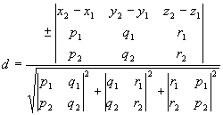

  
&nbsp;&nbsp;&nbsp;&nbsp;&nbsp;&nbsp; 所谓最短距离是指<i>L</i>1, <i>L</i>2的公共垂线与此两线交点之间的距离，式中正负号与行列式取同号.从此推出二直线共面的条件为<i>d</i>=0，所在平面的方程为&nbsp;&nbsp;&nbsp;&nbsp;&nbsp;&nbsp; 

  
&nbsp;&nbsp;&nbsp;&nbsp;&nbsp;&nbsp;&nbsp;&nbsp;&nbsp;&nbsp;&nbsp;&nbsp;&nbsp; 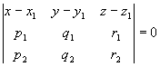

  </td>
 </tr>
 <tr style='height:30.0pt'>
  <td width="38%" valign=top style='width:38.0%;padding:5.25pt 5.25pt 5.25pt 5.25pt;
  height:30.0pt'>
  
　

  
<b>　</b>

  </td>
  <td width="62%" valign=top style='width:62.0%;padding:5.25pt 5.25pt 5.25pt 5.25pt;
  height:30.0pt'>
  
　

  
　

  
　

  
　

  
　

  
　

  
　

  </td>
 </tr>
 <tr style='height:19.5pt'>
  <td width="38%" valign=top style='width:38.0%;padding:5.25pt 5.25pt 5.25pt 5.25pt;
  height:19.5pt'>
  
方 程 与 图 形

  </td>
  <td width="62%" valign=top style='width:62.0%;padding:5.25pt 5.25pt 5.25pt 5.25pt;
  height:19.5pt'>
  
公 式 与 说 明

  </td>
 </tr>
 <tr style='height:253.5pt'>
  <td width="38%" valign=top style='width:38.0%;padding:5.25pt 5.25pt 5.25pt 5.25pt;
  height:253.5pt'>
  
[直线与平面的夹角]

  
<i>L</i>&nbsp;&nbsp;&nbsp;&nbsp;&nbsp; 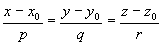

  
<i>P</i>&nbsp;&nbsp;&nbsp;&nbsp;&nbsp;&nbsp;&nbsp;&nbsp;&nbsp;&nbsp;&nbsp; <i>Ax</i>
  + <i>By</i> + <i>Cz</i> + <i>D</i> = 0

  
<b>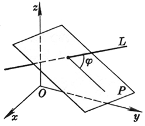</b>

  </td>
  <td width="62%" valign=top style='width:62.0%;padding:5.25pt 5.25pt 5.25pt 5.25pt;
  height:253.5pt'>
  
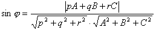

  
式中j
  为直线<i>L</i>与平面<i>P</i>的夹角

  </td>
 </tr>
</table>

　

[直线与平面的平行与垂直条件]

<table class=MsoNormalTable border=1 cellspacing=1 cellpadding=0 width=624
 style='width:468.0pt'>
 <tr style='height:19.5pt'>
  <td width="38%" valign=top style='width:38.0%;padding:5.25pt 5.25pt 5.25pt 5.25pt;
  height:19.5pt'>
  
平 行 条 件

  </td>
  <td width="62%" valign=top style='width:62.0%;padding:5.25pt 5.25pt 5.25pt 5.25pt;
  height:19.5pt'>
  
垂 直 条 件

  </td>
 </tr>
 <tr style='height:96.0pt'>
  <td width="38%" valign=top style='width:38.0%;padding:5.25pt 5.25pt 5.25pt 5.25pt;
  height:96.0pt'>
  
线与线 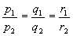

  
面与面 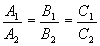

  
线与面 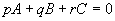

  </td>
  <td width="62%" valign=top style='width:62.0%;padding:5.25pt 5.25pt 5.25pt 5.25pt;
  height:96.0pt'>
  
<i>p</i>1<i>p</i>2 + <i>q</i>1<i>q</i>2
  + <i>r</i>1<i>r</i>2 = 0

  
&nbsp;&nbsp;&nbsp;&nbsp;&nbsp;&nbsp;&nbsp;&nbsp;&nbsp;&nbsp;&nbsp;&nbsp;&nbsp; <i>A</i>1<i>A</i>2
  + <i>B</i>1<i>B</i>2 + <i>C</i>1<i>C</i>2
  = 0

  
&nbsp;&nbsp;&nbsp;&nbsp;&nbsp;&nbsp; 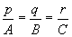

  </td>
 </tr>
</table>

　

　

