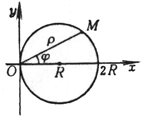

<b>§ 5 </b><b>二次曲线</b>

一、圆 

[圆的方程、圆心与半径]

<table class=MsoNormalTable border=1 cellspacing=1 cellpadding=0 width=624
 style='width:468.0pt'>
 <tr style='height:3.0pt'>
  <td width="54%" colspan=2 valign=top style='width:54.0%;padding:5.25pt 5.25pt 5.25pt 5.25pt;
  height:3.0pt'>
  
方 程 与 图 形 

  </td>
  <td width="46%" valign=top style='width:46.0%;padding:5.25pt 5.25pt 5.25pt 5.25pt;
  height:3.0pt'>
  
圆 心 与 半 径 

  </td>
 </tr>
 <tr style='height:109.5pt'>
  <td width="31%" valign=top style='width:31.0%;padding:5.25pt 5.25pt 5.25pt 5.25pt;
  height:109.5pt'>
  
<i>x</i>2 + <i>y</i>2 = <i>R</i>2
  

  
或 

  
(参数方程，<i>t</i>为动径<i>O</i><i>M</i>与<i>x</i>轴正方向的夹角)

  </td>
  <td width="23%" valign=top style='width:23.0%;padding:5.25pt 5.25pt 5.25pt 5.25pt;
  height:109.5pt'>
  

  </td>
  <td width="46%" valign=top style='width:46.0%;padding:5.25pt 5.25pt 5.25pt 5.25pt;
  height:109.5pt'>
  
　

  
圆心&nbsp;&nbsp;&nbsp;&nbsp;&nbsp;  <i>G</i>(0,0) 

  
半径&nbsp;&nbsp;  <i>r</i> = <i>R</i>

  
<b>　 </b>

  </td>
 </tr>
 <tr style='height:87.75pt'>
  <td width="31%" valign=top style='width:31.0%;padding:5.25pt 5.25pt 5.25pt 5.25pt;
  height:87.75pt'>
  
(<i>x</i> - <i>a</i>)2+(<i>y - b</i>)2
  = <i>R</i>2&nbsp;&nbsp;&nbsp;&nbsp;&nbsp;&nbsp;&nbsp;&nbsp; 

  
或 

  
(参数方程，<i>t</i>为动径<i>O</i><i>M</i>与<i>x</i>轴正方向的夹角) 

  </td>
  <td width="23%" valign=top style='width:23.0%;padding:5.25pt 5.25pt 5.25pt 5.25pt;
  height:87.75pt'>
  

  </td>
  <td width="46%" valign=top style='width:46.0%;padding:5.25pt 5.25pt 5.25pt 5.25pt;
  height:87.75pt'>
  
　

  
圆心 &nbsp; <i>G</i>(<i>a</i>, <i>b</i>)&nbsp;&nbsp; 

  
半径&nbsp;&nbsp;  <i>r</i> = <i>R</i>

  
　 

  </td>
 </tr>
 <tr style='height:87.75pt'>
  <td width="31%" valign=top style='width:31.0%;padding:5.25pt 5.25pt 5.25pt 5.25pt;
  height:87.75pt'>
  
<i>x</i>2 +<i>y</i>2 +2<i>mx</i>
  + 2<i>ny </i>+ <i>q </i>= 0&nbsp;&nbsp;&nbsp;&nbsp;&nbsp;&nbsp;&nbsp;&nbsp;&nbsp;&nbsp;&nbsp;&nbsp;&nbsp; 

  
<i>m</i>2 + <i>n</i>2 &gt; <i>q</i>

  
<i>r</i>2+2r(<i>m</i>cos<i>t </i>+ <i>n</i>sin<i>t</i>) + <i>q</i> = 0&nbsp;&nbsp;&nbsp; (极坐标方程)

  </td>
  <td width="23%" valign=top style='width:23.0%;padding:5.25pt 5.25pt 5.25pt 5.25pt;
  height:87.75pt'>
  

  </td>
  <td width="46%" valign=top style='width:46.0%;padding:5.25pt 5.25pt 5.25pt 5.25pt;
  height:87.75pt'>
  
圆心&nbsp;&nbsp;&nbsp;&nbsp;&nbsp;  <i>G</i>(-<i>m</i>,- <i>n</i>)

  
半径&nbsp;&nbsp;  

  
<b>　</b>

  
　 

  </td>
 </tr>
 <tr style='height:84.0pt'>
  <td width="31%" valign=top style='width:31.0%;padding:5.25pt 5.25pt 5.25pt 5.25pt;
  height:84.0pt'>
  
<i>　</i>

  
<i>　</i>

  
<i>r</i>2-2rr0cos(j<i>-</i><i> </i>j0)+r02 = <i>R</i>2&nbsp;&nbsp;&nbsp;&nbsp;&nbsp;&nbsp;&nbsp;&nbsp;&nbsp;&nbsp; 
  (极坐标方程)

  </td>
  <td width="23%" valign=top style='width:23.0%;padding:5.25pt 5.25pt 5.25pt 5.25pt;
  height:84.0pt'>
  

  </td>
  <td width="46%" valign=top style='width:46.0%;padding:5.25pt 5.25pt 5.25pt 5.25pt;
  height:84.0pt'>
  
<b>　</b>

  
圆心&nbsp;&nbsp;  <i>G</i>(r0,j0)

  
半径&nbsp;&nbsp;  <i>r</i> = <i>R</i>

  
　 

  </td>
 </tr>
 <tr style='height:86.25pt'>
  <td width="31%" valign=top style='width:31.0%;padding:5.25pt 5.25pt 5.25pt 5.25pt;
  height:86.25pt'>
  
<i>　</i>

  
<i>x</i>2 + <i>y</i>2 = 2<i>Rx</i>

  
或<i> </i><i>r </i>= 2<i>R</i>cosj 

  
(极坐标方程) 

  </td>
  <td width="23%" valign=top style='width:23.0%;padding:5.25pt 5.25pt 5.25pt 5.25pt;
  height:86.25pt'>
  

  </td>
  <td width="46%" valign=top style='width:46.0%;padding:5.25pt 5.25pt 5.25pt 5.25pt;
  height:86.25pt'>
  
<b>　</b>

  
圆心&nbsp;&nbsp;  <i>G</i>(<i>R</i>, 0)

  
半径 &nbsp; <i>r</i> = <i>R</i>

  </td>
 </tr>
 <tr style='height:99.75pt'>
  <td width="31%" valign=top style='width:31.0%;padding:5.25pt 5.25pt 5.25pt 5.25pt;
  height:99.75pt'>
  
<i>x</i>2 + <i>y</i>2 = 2<i>Ry</i>

  
或<i> </i><i>r </i>= 2<i>R</i>sinj 

  
(极坐标方程) 

  </td>
  <td width="23%" valign=top style='width:23.0%;padding:5.25pt 5.25pt 5.25pt 5.25pt;
  height:99.75pt'>
  

  </td>
  <td width="46%" valign=top style='width:46.0%;padding:5.25pt 5.25pt 5.25pt 5.25pt;
  height:99.75pt'>
  
圆心 &nbsp;&nbsp;&nbsp; G(0,<i>R</i>)

  
半径 &nbsp;&nbsp;&nbsp; <i>r</i>
  = <i>R</i> 

  </td>
 </tr>
</table>

[圆的切线]

圆&nbsp;&nbsp;&nbsp;&nbsp; <i>x</i>2 + <i>y</i>2 = <i>R</i>2
上一点<i>M</i>(<i>x</i>0, <i>y</i>0)的切线方程为 

&nbsp;&nbsp;&nbsp;&nbsp;&nbsp;&nbsp;&nbsp;&nbsp;&nbsp;&nbsp;&nbsp;&nbsp;&nbsp; <i>x</i>0<i>x</i>
+ <i>y</i>0<i>y</i> = <i>R</i>2

圆&nbsp;&nbsp;&nbsp;&nbsp;&nbsp;&nbsp;&nbsp;&nbsp;&nbsp; <i>x</i>2 + <i>y</i>2 + 2<i>mx
</i>+ 2<i>ny </i>+ <i>q</i> = 0&nbsp;&nbsp;&nbsp;&nbsp;&nbsp;&nbsp;&nbsp;&nbsp;&nbsp;&nbsp;&nbsp; 上一点<i>M</i>(<i>x</i>0, <i>y</i>0)的切线方程为

<i>x</i>0<i>x </i>+ <i>y</i>0<i>y</i> + <i>m</i>(<i>x</i>
+ <i>x</i>0) + <i>n</i>(<i>y </i>+ <i>y</i>0) + <i>q </i>=
0

[两个圆的交角、圆束与根轴]

<table class=MsoNormalTable border=1 cellspacing=1 cellpadding=0 width=624
 style='width:468.0pt'>
 <tr style='height:27.0pt'>
  <td width="40%" valign=top style='width:40.0%;padding:5.25pt 5.25pt 5.25pt 5.25pt;
  height:27.0pt'>
  
方 程 与 图 形 

  </td>
  <td width="60%" valign=top style='width:60.0%;padding:5.25pt 5.25pt 5.25pt 5.25pt;
  height:27.0pt'>
  
公 式 与 说 明 

  </td>
 </tr>
 <tr style='height:72.0pt'>
  <td width="40%" valign=top style='width:40.0%;padding:5.25pt 5.25pt 5.25pt 5.25pt;
  height:72.0pt'>
  
两个圆的交角

  
<i>C</i>1&nbsp;&nbsp;&nbsp;&nbsp;&nbsp;&nbsp;&nbsp;&nbsp;&nbsp; <i>x</i>2
  +<i>y</i>2 +2<i>m</i>1<i>x </i>+2<i>n</i>1<i>y
  </i>+<i>q</i>1 = 0

  
<i>C</i>2&nbsp;&nbsp;&nbsp;&nbsp;&nbsp;&nbsp;&nbsp;&nbsp;&nbsp; <i>x</i>2
  +<i>y</i>2 +2<i>m</i>2<i>x </i>+2<i>n</i>2<i>y
  </i>+<i>q</i>2 = 0

  
&nbsp;&nbsp;&nbsp;&nbsp;&nbsp;&nbsp; 两个圆的交角是指它们在交点的两条切线的夹角

  

  </td>
  <td width="60%" valign=top style='width:60.0%;padding:5.25pt 5.25pt 5.25pt 5.25pt;
  height:72.0pt'>
  
　

  
　

  
&nbsp;&nbsp;&nbsp;&nbsp;&nbsp;&nbsp; 

  
式中q
  表示两个圆<i>C</i>1和<i>C</i>2的交角，因为公式中不包含交点的坐标，所以在两交点的两交角必相等.

  
&nbsp;&nbsp;&nbsp;&nbsp;&nbsp;&nbsp; 两个圆<i>C</i>1和<i>C</i>2正交条件为

  
&nbsp;&nbsp;&nbsp;&nbsp;&nbsp;&nbsp;&nbsp;&nbsp;&nbsp;&nbsp;&nbsp;&nbsp;&nbsp; 2<i>m</i>1<i>m</i>2
  + 2<i>n</i>1<i>n</i>2 - <i>q</i>1 - <i>q</i>2
  = 0

  </td>
 </tr>
 <tr style='height:72.0pt'>
  <td width="40%" valign=top style='width:40.0%;padding:5.25pt 5.25pt 5.25pt 5.25pt;
  height:72.0pt'>
  
圆束× 两个圆的根轴

  
<i>C</i>1 + l <i>C</i>2 = 0&nbsp;&nbsp;&nbsp;&nbsp;&nbsp;&nbsp; (l 为参数)

  
或 (l+1)(<i>x</i>2+<i>y</i>2)
  +2(<i>m</i>1+l <i>m</i>2)<i>x </i>

  
+(<i>n</i>1+l<i>n</i>2)<i>y </i>+ (<i>q</i>1 +l<i>q</i>2) = 0

  
根轴方程为 2(<i>m</i>1
  - <i>m</i>2)<i>x </i>+ 2(<i>n</i>1 - <i>n</i>2)<i>y
  </i>+ (<i>q</i>1 - <i>q</i>2) = 0

  

  

  

  </td>
  <td width="60%" valign=top style='width:60.0%;padding:5.25pt 5.25pt 5.25pt 5.25pt;
  height:72.0pt'>
  
&nbsp;&nbsp;&nbsp;&nbsp;&nbsp;&nbsp; 对l
  (l <i>&sup1; </i>-1)的一个确定值，表示一个圆.当l
  取一切值(l <i>&sup1; </i>-1)时，所表示的圆的全体，称为圆束.l = -1时，为一直线，称为两个圆<i>C</i>1和<i>C</i>2的根轴.根轴与<i>C</i>1和<i>C</i>2的连心线垂直，束中任一圆的圆心在<i>C</i>1和<i>C</i>2的连心线上，且分连心线的比等于l .

  
(<i>a</i>)如果<i>C</i>1和<i>C</i>2 相交于两点<i>M</i>1，<i>M</i>2，则束中一切圆都通过两交点<i>M</i>1，<i>M</i>2，它们的根轴就是它们的公共弦.这时圆束称为共轴圆系(图(<i>a</i>)).

  
(<i>b</i>)如果<i>C</i>1和<i>C</i>2切于一点<i>M</i>，则束中一切圆都在一点<i>M</i>相切，根轴就是在点<i>M</i>的公切线(图(<i>b</i>)).

  
(<i>c</i>)如果<i>C</i>1和<i>C</i>2不相交，则束中一切圆都不相交，根轴也与圆束中一切圆都不相交(图(<i>c</i>)).

  
从点<i>P</i>作两个圆<i>C</i>1和<i>C</i>2的切线，具有相等切线长的点<i>P</i>的轨迹就是根轴.两个同心圆的根轴是从公共圆心到无穷远处的直线.三个圆中每对圆的根轴(共三个)交于一点，它称为根心.若三个圆心共线，则其根心在无穷远处.

  </td>
 </tr>
</table>

　

[反演] 设<i>C</i>为一定圆，<i>O</i>为圆心，<i>r</i>为半径(图7.1)，对平面上任一点<i>M</i>，有一点<i>M</i><i>&cent; </i>与它对应.使得满足下列两个条件：

（i）<i>O</i>, <i>M</i>, <i>M</i><i>&cent; </i>共线，

&nbsp;&nbsp;&nbsp;&nbsp;&nbsp;&nbsp; （ii）<i>O</i><i>M</i><i>× O</i><i>M</i><i>&cent; </i>= <i>r</i>2，

这种点<i>M</i><i>&cent; </i>称为点<i>M</i>关于定圆<i>C</i>的反演点，<i>C</i>称为反演圆，<i>O</i>称为反演中心，<i>r</i>称为反演半径.

由于<i>M</i>和<i>M</i><i>&cent; </i>的关系是对称的，所以<i>M</i>也是<i>M</i><i>&cent; </i>的反演点.因<i>r</i>2 &gt; 0，所以<i>M</i>和<i>M</i><i>&cent; </i>都在<i>O</i>的同侧.<i>M</i>和<i>M</i><i>&cent; </i>之间的对应称为关于定圆<i>C</i>的反演.

取<i>O</i>为原点，则一切反演点<i>M</i>(<i>x</i>, <i>y</i>)和<i>M</i><i>&cent; </i>(<i>x</i><i>&cent; </i>,<i>y</i><i>&cent; </i>)的对应方程为

反演具有性质：

&nbsp;

&nbsp;

&nbsp;

&nbsp;

&nbsp;

1° &nbsp;&nbsp;&nbsp; 不通过反演中心的一条直线变为通过反演中心的一个圆.

2° &nbsp;&nbsp;&nbsp; 通过反演中心的圆变为不通过反演中心的直线.

3° &nbsp;&nbsp;&nbsp; 通过反演中心的一条直线变为它自己.

4° &nbsp;&nbsp;&nbsp; 不通过反演中心的圆变为不通过反演中心的圆.

5° &nbsp;&nbsp;&nbsp; 反演圆变为它自己.

6° &nbsp;&nbsp;&nbsp; 与反演圆正交的圆变为它自己，其逆也真.

7° &nbsp;&nbsp;&nbsp; 如果两条曲线<i>C</i>1，<i>C</i>2交于一点<i>M</i>，则经过反演后的曲线<i>C</i>1&cent; , <i>C</i>2&cent; 必交于<i>M</i>的反演点<i>M</i><i>&cent; </i>.

8° &nbsp;&nbsp;&nbsp; 如果两条曲线<i>C</i>1, <i>C</i>2在一点<i>M</i>相切，则经过反演后的曲线<i>C</i>1&cent; , <i>C</i>2&cent; 必在<i>M</i>的反演点<i>M</i><i>&cent; </i>相切.

9° &nbsp;&nbsp;&nbsp; 两条曲线的交角在反演下是不变的.由此可见，反演是一个保角变换.

　

