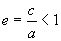

二、椭圆 

<ol start=1 type=1>
 <li class=MsoNormal>椭圆的基本元素</li>
</ol>

主轴(对称轴)

顶 点&nbsp;&nbsp; <i>A</i>, <i>B</i>, <i>C</i>, <i>D</i>

椭圆中心&nbsp;&nbsp;&nbsp;&nbsp;&nbsp;&nbsp; <i>G</i>

焦 点&nbsp;&nbsp;&nbsp;&nbsp;&nbsp; <i>F</i>1, <i>F</i>2

焦 距&nbsp;&nbsp; 

离 心 率&nbsp;&nbsp;&nbsp;&nbsp;&nbsp;&nbsp; 

压缩系数&nbsp;&nbsp;&nbsp;&nbsp;&nbsp;&nbsp; 

焦点参数&nbsp;&nbsp;&nbsp;&nbsp;&nbsp;&nbsp; (等于过焦点且垂直于长轴的弦长之半，即<i>F</i>1<i>H</i>)

焦点半径&nbsp;&nbsp;&nbsp;&nbsp;&nbsp;&nbsp; <i>r</i>1, <i>r</i>2(椭圆上一点(<i>x</i>, <i>y</i>)到焦点的距离) 

<i>r</i>1 = <i>a</i> - <i>ex</i>，&nbsp; <i>r</i>2
= <i>a</i> + <i>ex</i>

直 径&nbsp;&nbsp; <i>PQ</i>(通过椭圆中心的弦)

图 7.2

共轭直径&nbsp;&nbsp;&nbsp;&nbsp;&nbsp;&nbsp; 二直径斜率为，且满足

准 线&nbsp;&nbsp; <i>L</i>1和<i>L</i>2(平行于短轴，到短轴的距离为)

