

2．&nbsp;
2．椭圆的方程、顶点、中心与焦点

<table class=MsoNormalTable border=1 cellspacing=0 cellpadding=0
 style='border-collapse:collapse;border:none'>
 <tr style='height:14.35pt'>
  <td width=384 colspan=2 valign=top style='width:288.0pt;border:solid windowtext 1.0pt;
  border-left:none;padding:0mm 5.4pt 0mm 5.4pt;height:14.35pt'>
  
方&nbsp; 程&nbsp; 与&nbsp; 图&nbsp; 形

  </td>
  <td width=240 valign=top style='width:180.0pt;border-top:solid windowtext 1.0pt;
  border-left:none;border-bottom:solid windowtext 1.0pt;border-right:none;
  padding:0mm 5.4pt 0mm 5.4pt;height:14.35pt'>
  
顶点·中心·焦点

  </td>
 </tr>
 <tr style='height:149.25pt'>
  <td width=163 valign=top style='width:122.25pt;border:none;border-right:solid windowtext 1.0pt;
  padding:0mm 5.4pt 0mm 5.4pt;height:149.25pt'>
  
&nbsp;
  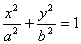(标准方程)或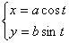

  
(参数方程，<i>t</i>为与<i>M</i>点对应的同心圆(半径为<i>a</i>, <i>b</i>)的半径与<i>x</i>轴正方向的夹角)

  </td>
  <td width=221 valign=top style='width:165.75pt;border:none;border-right:solid windowtext 1.0pt;
  padding:0mm 5.4pt 0mm 5.4pt;height:149.25pt'>
  
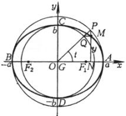

  </td>
  <td width=240 valign=top style='width:180.0pt;border:none;padding:0mm 5.4pt 0mm 5.4pt;
  height:149.25pt'>
  
顶点&nbsp;&nbsp;&nbsp;&nbsp;&nbsp; <i>A</i>,
  <i>B</i>(±<i>a</i>, 0)

  
&nbsp;&nbsp;&nbsp;&nbsp;&nbsp;&nbsp;&nbsp;&nbsp;&nbsp;&nbsp;&nbsp;&nbsp;&nbsp; <i>C</i>,
  <i>D</i>(0,±<i>b</i>)

  
中心&nbsp;&nbsp;&nbsp;&nbsp;&nbsp; <i>G</i>(0,0)

  
焦点&nbsp;&nbsp;&nbsp;&nbsp;&nbsp; <i>F</i>1,
  <i>F</i>2(±<i>c</i>,0)&nbsp;&nbsp; 

  
&nbsp;&nbsp;&nbsp;&nbsp;&nbsp;&nbsp;
  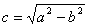

  </td>
 </tr>
 <tr style='height:150.0pt'>
  <td width=163 valign=top style='width:122.25pt;border-top:solid windowtext 1.0pt;
  border-left:none;border-bottom:none;border-right:solid windowtext 1.0pt;
  padding:0mm 5.4pt 0mm 5.4pt;height:150.0pt'>
  
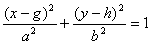或

  
&nbsp;
  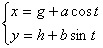

  
&nbsp;&nbsp;&nbsp;
  (<i>t</i>同上)<b> </b>

  </td>
  <td width=221 valign=top style='width:165.75pt;border-top:solid windowtext 1.0pt;
  border-left:none;border-bottom:none;border-right:solid windowtext 1.0pt;
  padding:0mm 5.4pt 0mm 5.4pt;height:150.0pt'>
  
<b>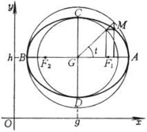</b>

  </td>
  <td width=240 valign=top style='width:180.0pt;border:none;border-top:solid windowtext 1.0pt;
  padding:0mm 5.4pt 0mm 5.4pt;height:150.0pt'>
  
顶点&nbsp;&nbsp;&nbsp;&nbsp;&nbsp; <i>A</i>,
  <i>B</i>(<i>g </i>± <i>a</i>, <i>h</i>)

  
&nbsp;&nbsp;&nbsp;&nbsp;&nbsp;&nbsp;
  <i>C</i>, <i>D</i>(<i>g</i>, <i>h </i>± <i>b</i>)

  
中心&nbsp;&nbsp;&nbsp;&nbsp;&nbsp; <i>G</i>(<i>g</i>,
  <i>h</i>)

  
焦点&nbsp;&nbsp;&nbsp;&nbsp;&nbsp; <i>F</i>1,
  <i>F</i>2(<i>g </i>± <i>c</i>, <i>h</i>)

  
&nbsp;&nbsp;&nbsp;&nbsp;&nbsp;&nbsp;
  

  </td>
 </tr>
 <tr style='height:159.0pt'>
  <td width=163 valign=top style='width:122.25pt;border:none;border-right:solid windowtext 1.0pt;
  padding:0mm 5.4pt 0mm 5.4pt;height:159.0pt'>
  
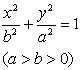&nbsp; 

  </td>
  <td width=221 valign=top style='width:165.75pt;border:none;border-right:solid windowtext 1.0pt;
  padding:0mm 5.4pt 0mm 5.4pt;height:159.0pt'>
  
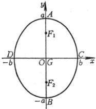

  </td>
  <td width=240 valign=top style='width:180.0pt;border:none;padding:0mm 5.4pt 0mm 5.4pt;
  height:159.0pt'>
  
顶点&nbsp;&nbsp;&nbsp;&nbsp;&nbsp; <i>A</i>,
  <i>B</i>(0, ± <i>a</i>)

  
&nbsp;&nbsp;&nbsp;
  &nbsp;&nbsp;&nbsp;<i>C</i>, <i>D</i>(± <i>b</i>, 0)

  
中心&nbsp;&nbsp;&nbsp;&nbsp;&nbsp; <i>G</i>
  (0, 0)

  
焦点&nbsp;&nbsp;&nbsp;&nbsp;&nbsp; <i>F</i>1,
  <i>F</i>2(0, ± <i>c</i>)

  
&nbsp;&nbsp;&nbsp;&nbsp;&nbsp;&nbsp;
  

  </td>
 </tr>
 <tr style='height:148.6pt'>
  <td width=163 valign=top style='width:122.25pt;border-top:none;border-left:
  none;border-bottom:solid windowtext 1.0pt;border-right:solid windowtext 1.0pt;
  padding:0mm 5.4pt 0mm 5.4pt;height:148.6pt'>
  
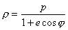，<i>e </i>&lt; 1

  
&nbsp;(极坐标方程，极点位于椭圆一焦点上，极轴为从焦点指向最近一个顶点的射线，<i>j</i>为极角，<i>p</i>, <i>e</i>如前述)

  </td>
  <td width=221 valign=top style='width:165.75pt;border-top:none;border-left:
  none;border-bottom:solid windowtext 1.0pt;border-right:solid windowtext 1.0pt;
  padding:0mm 5.4pt 0mm 5.4pt;height:148.6pt'>
  
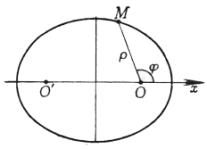

  </td>
  <td width=240 valign=top style='width:180.0pt;border:none;border-bottom:solid windowtext 1.0pt;
  padding:0mm 5.4pt 0mm 5.4pt;height:148.6pt'>
  
长轴&nbsp;&nbsp;&nbsp;&nbsp;&nbsp; 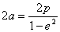

  
短轴&nbsp;&nbsp;&nbsp;&nbsp;&nbsp; 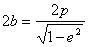

  
焦距&nbsp;&nbsp;&nbsp;&nbsp;&nbsp; 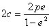

  </td>
 </tr>
</table>

&nbsp;

