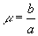
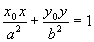
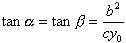
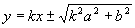
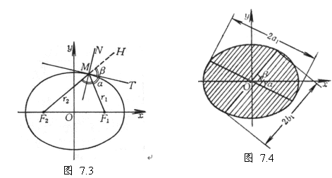
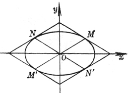

<ol start=3 type=1>
 <li class=MsoNormal>椭圆的性质</li>
</ol>

1° &nbsp;&nbsp;&nbsp; 椭圆是到两定点(即焦点)的距离之和为常数(即长轴)的动点<i>M</i>的轨迹 (<i>r</i>1 +
<i>r</i>2 = 2<i>a</i>).

2° &nbsp;&nbsp;&nbsp; 椭圆也是到一定点(即焦点之一)的距离与到一定直线(即一准线<i>L</i>)的距离之比为小于1的常数(即离心率)的动点<i>M</i>的轨迹(<i>MF</i>1/<i>ME</i>1 = <i>MF</i>2/<i>ME</i>2
= <i>e</i>).

3° &nbsp;&nbsp;&nbsp;&nbsp; 椭圆是将半径为<i>a</i>的圆沿<i>y</i>轴方向按比(即压缩系数)压缩而得到. 

4° &nbsp;&nbsp;&nbsp;&nbsp; 椭圆上一点<i>M</i>(<i>x</i>0,
<i>y</i>0)的切线(<i>MT</i>)方程为

&nbsp;

切线把点<i>M</i>的两焦点半径间的外角(即∠<i>F</i>1<i>MH</i>)平分(即a
=b ,),<i>M</i>点的法线<i>MN</i>把内角(即∠<i>F</i>1<i>MF</i>2)平分(图7.3)

 如果椭圆的切线(<i>MT</i>)的斜率为<i>k</i>,则其方程为

 

&nbsp;

式中正负号表示直径两端点的两切线.

5° &nbsp;&nbsp;&nbsp; 椭圆的任一直径把平行于其共轭直径的弦平分(图7.4)

&nbsp;&nbsp;&nbsp;&nbsp;&nbsp;&nbsp; 如果两共轭直径的长分别为2<i>a</i>1和2<i>b</i>1,
两直径与长轴的夹角(锐角)分别为a 和b ,则<i>a</i>1<i>b</i>1sin(a + b )= <i>ab</i>&nbsp;&nbsp;&nbsp;&nbsp;&nbsp;&nbsp; 

<i>a</i>12 + <i>b</i>12 =
<i>a</i>2 + <i>b</i>2

&nbsp;&nbsp;&nbsp;&nbsp;&nbsp;&nbsp; 6° &nbsp;&nbsp;&nbsp; 椭圆上任一点<i>M</i>的焦点半径之积等于它的对应半共轭直径的平方.

&nbsp;&nbsp;&nbsp;&nbsp;&nbsp;&nbsp; 7° &nbsp;&nbsp;&nbsp; 设<i>MM</i><i>&cent; </i>, <i>NN</i><i>&cent; </i>为椭圆的两共轭直径, 通过<i>M</i>,
<i>M</i><i>&cent; </i>分别作直线平行于<i>NN</i><i>&cent; </i>; 又通过<i>N</i>, <i>N</i><i>&cent; </i>分别作直线平行于<i>MM</i><i>&cent; </i>, 则这四条直线构成的平行四边形的面积为一常数4<i>ab</i>(图7.5).

&nbsp;

&nbsp;

&nbsp;

&nbsp;

&nbsp;

<pre ALIGN=JUSTIFY>&nbsp;&nbsp;&nbsp;&nbsp;&nbsp;&nbsp;&nbsp;&nbsp;&nbsp; (图7.5) &nbsp;&nbsp;&nbsp; </pre>
