

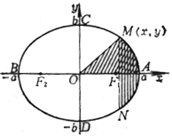

4.椭圆各量计算公式

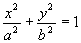

&nbsp;

&nbsp; 

<table class=MsoNormalTable border=1 cellspacing=1 cellpadding=0 width=624
 style='width:468.0pt'>
 <tr style='height:34.5pt'>
  <td width="17%" valign=top style='width:17.0%;padding:5.25pt 5.25pt 5.25pt 5.25pt;
  height:34.5pt'>
  
椭圆各量

  </td>
  <td width="83%" colspan=3 valign=top style='width:83.0%;padding:5.25pt 5.25pt 5.25pt 5.25pt;
  height:34.5pt'>
  
计 算 公 式

  </td>
 </tr>
 <tr style='height:84.75pt'>
  <td width="17%" valign=top style='width:17.0%;padding:5.25pt 5.25pt 5.25pt 5.25pt;
  height:84.75pt'>
  
[曲率半径]

  
<i>R</i>

  </td>
  <td width="83%" colspan=3 valign=top style='width:83.0%;padding:5.25pt 5.25pt 5.25pt 5.25pt;
  height:84.75pt'>
  
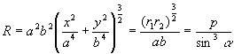

  
式中<i>r</i>1,
  <i>r</i>2为焦点半径, <i>p</i>为焦点参数, a 为点<i>M</i>(<i>x</i>, <i>y</i>)的焦点半径与切线的夹角.特别, 顶点的曲率半径

  
&nbsp;&nbsp;&nbsp;&nbsp;&nbsp;&nbsp;&nbsp;&nbsp;&nbsp;&nbsp;&nbsp;&nbsp;&nbsp; 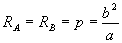,&nbsp;&nbsp;&nbsp;&nbsp; 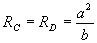

  </td>
 </tr>
 <tr style='height:55.5pt'>
  <td width="17%" valign=top style='width:17.0%;padding:5.25pt 5.25pt 5.25pt 5.25pt;
  height:55.5pt'>
  
[弧长]

  
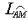

  </td>
  <td width="83%" colspan=3 valign=top style='width:83.0%;padding:5.25pt 5.25pt 5.25pt 5.25pt;
  height:55.5pt'>
  
=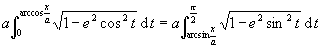

  
式中<i>e</i>为离心率

  </td>
 </tr>
 <tr style='height:84.75pt'>
  <td width="17%" valign=top style='width:17.0%;padding:5.25pt 5.25pt 5.25pt 5.25pt;
  height:84.75pt'>
  
[周长]

  
<i>L</i>

  </td>
  <td width="83%" colspan=3 valign=top style='width:83.0%;padding:5.25pt 5.25pt 5.25pt 5.25pt;
  height:84.75pt'>
  
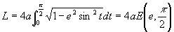

  
式中,&nbsp; 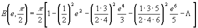

  
设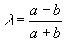,则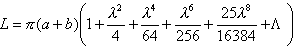

  
&nbsp;&nbsp;&nbsp;&nbsp;&nbsp;&nbsp; 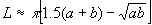&nbsp; 或&nbsp;&nbsp;&nbsp;&nbsp; 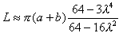 

  </td>
 </tr>
 <tr style='height:84.75pt'>
  <td width="17%" valign=top style='width:17.0%;padding:5.25pt 5.25pt 5.25pt 5.25pt;
  height:84.75pt'>
  
[面积]

  
<i>S</i>

  </td>
  <td width="83%" colspan=3 valign=top style='width:83.0%;padding:5.25pt 5.25pt 5.25pt 5.25pt;
  height:84.75pt'>
  
扇形(<i>OAM</i>)面积&nbsp;&nbsp;&nbsp;&nbsp;&nbsp;&nbsp;&nbsp; 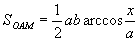

  
弓形(<i>MAN</i>)面积&nbsp;&nbsp;&nbsp;&nbsp;&nbsp;&nbsp;&nbsp; 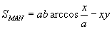

  
椭 圆 面 积&nbsp;&nbsp;&nbsp;&nbsp;&nbsp;&nbsp;&nbsp;&nbsp;&nbsp; <i>S</i> = p <i>ab</i>

  </td>
 </tr>
 <tr style='height:84.75pt'>
  <td width="17%" valign=top style='width:17.0%;padding:5.25pt 5.25pt 5.25pt 5.25pt;
  height:84.75pt'>
  
[几何重心]

  
&nbsp;&nbsp;&nbsp;&nbsp;&nbsp;&nbsp; <i>G</i>

  </td>
  <td width="32%" colspan=2 valign=top style='width:32.0%;padding:5.25pt 5.25pt 5.25pt 5.25pt;
  height:84.75pt'>
  
椭 圆 形&nbsp;&nbsp;&nbsp;&nbsp;&nbsp; <i>G</i>与<i>O</i>重合

  
半椭圆形&nbsp;&nbsp;&nbsp;&nbsp;&nbsp;&nbsp; 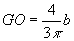

  
(<i>a</i>, <i>b</i>为椭圆的半轴长) 

  </td>
  <td width="51%" valign=top style='width:51.0%;padding:5.25pt 5.25pt 5.25pt 5.25pt;
  height:84.75pt'>
  
&nbsp;&nbsp;&nbsp;&nbsp;&nbsp;&nbsp; 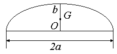

  </td>
 </tr>
 <tr style='height:62.25pt'>
  <td width="17%" valign=top style='width:17.0%;padding:5.25pt 5.25pt 5.25pt 5.25pt;
  height:62.25pt'>
  
[转动惯量]&nbsp;&nbsp;&nbsp;&nbsp;&nbsp;&nbsp; <i>J</i>

  </td>
  <td width="30%" valign=top style='width:30.0%;padding:5.25pt 5.25pt 5.25pt 5.25pt;
  height:62.25pt'>
  
椭圆的转轴通过<i>b</i>轴

  
&nbsp;&nbsp;&nbsp;&nbsp;&nbsp;&nbsp; 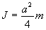

  
式中<i>m</i>为质量 

  </td>
  <td width="53%" colspan=2 valign=top style='width:53.0%;padding:5.25pt 5.25pt 5.25pt 5.25pt;
  height:62.25pt'>
  
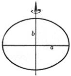

  </td>
 </tr>
 <tr height=0>
  <td width=107 style='border:none'></td>
  <td width=187 style='border:none'></td>
  <td width=13 style='border:none'></td>
  <td width=317 style='border:none'></td>
 </tr>
</table>

　

