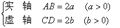
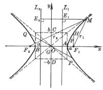
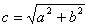
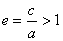
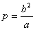
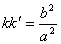

三、&nbsp;&nbsp;&nbsp;&nbsp;&nbsp;&nbsp;&nbsp;
三、&nbsp;&nbsp;&nbsp; 双曲线

1．&nbsp;&nbsp;&nbsp;&nbsp;&nbsp;&nbsp;&nbsp;&nbsp;&nbsp;&nbsp;&nbsp;&nbsp;&nbsp;
1．<a class=msocomanchor id="_anchor_1"
 href="#None" language=JavaScript
name="_msoanchor_1">[1051]</a>&nbsp;双曲线的基本元素

主轴(对称轴)

<table cellspacing=0 cellpadding=0 hspace=0 vspace=0 width=206 height=174
 align=left>
 <tr>
  <td valign=top align=left height=174 style='padding-top:0mm;padding-right:
  9.0pt;padding-bottom:0mm;padding-left:9.0pt'>
  

  
&nbsp;

  
&nbsp;&nbsp;&nbsp;&nbsp;&nbsp;&nbsp;&nbsp;&nbsp;&nbsp;&nbsp;
  图 7.6

  

  </td>
 </tr>
</table>

顶&nbsp;&nbsp;&nbsp; 点&nbsp; <i>A</i>, <i>B</i>

中&nbsp;&nbsp;&nbsp; 心&nbsp; <i>G</i>

焦&nbsp;&nbsp;&nbsp; 点&nbsp; <i>F</i>1, <i>F</i>2

焦&nbsp;&nbsp;&nbsp; 距&nbsp; <i>F</i>1<i>F</i>2 = 2<i>c</i>,&nbsp;&nbsp;&nbsp;&nbsp; 

离 心 率&nbsp;&nbsp;&nbsp;&nbsp;&nbsp;&nbsp; 

焦点参数&nbsp;&nbsp;&nbsp;&nbsp;  (等于过焦点且垂直于实轴的弦长之半,即<i>F</i>1<i>H</i>)

焦点半径&nbsp;&nbsp;&nbsp;&nbsp; <i>r</i>1, <i>r</i>2&nbsp;&nbsp;&nbsp;&nbsp;&nbsp;&nbsp; (双曲线上一点(<i>x</i>,
<i>y</i>)到焦点的距离,即<i>MF</i>1, <i>MF</i>2)

<i>r</i>1 = ± (<i>ex </i>- <i>a</i>), <i>r</i>2
= ± (<i>ex </i>+ <i>a</i>)

直&nbsp;&nbsp;&nbsp; 径&nbsp; <i>PQ</i>(通过中心的弦) 

共轭直径&nbsp;&nbsp;&nbsp;&nbsp; 二直径斜率为<i>k</i>, <i>k</i>&cent;,且满足

准&nbsp;&nbsp;&nbsp; 线&nbsp; <i>L</i>1和<i>L</i>2&nbsp;&nbsp;&nbsp;&nbsp;&nbsp;&nbsp;&nbsp;&nbsp; (垂直于实轴, 到中心的距离为)

