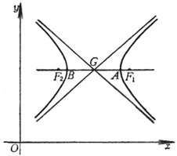
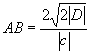

2．双曲线的方程、顶点、中心、焦点与渐进线

<table class=MsoNormalTable border=1 cellspacing=1 cellpadding=0 width=632
 style='width:474.0pt'>
 <tr style='height:13.5pt'>
  <td width="66%" colspan=3 valign=top style='width:66.0%;padding:5.25pt 5.25pt 5.25pt 5.25pt;
  height:13.5pt'>
  
方 程 与 图 形 

  </td>
  <td width="34%" valign=top style='width:34.0%;padding:5.25pt 5.25pt 5.25pt 5.25pt;
  height:13.5pt'>
  
顶点·中心·焦点·渐近线 

  </td>
 </tr>
 <tr style='height:138.0pt'>
  <td width="33%" colspan=2 valign=top style='width:33.0%;padding:5.25pt 5.25pt 5.25pt 5.25pt;
  height:138.0pt'>
  
&nbsp;&nbsp;&nbsp; (标准方程)

  
或

  

  
 (参数方程)

  
或 

  </td>
  <td width="33%" valign=top style='width:33.0%;padding:5.25pt 5.25pt 5.25pt 5.25pt;
  height:138.0pt'>
  

  </td>
  <td width="34%" valign=top style='width:34.0%;padding:5.25pt 5.25pt 5.25pt 5.25pt;
  height:138.0pt'>
  
顶 点 &nbsp; <i>A</i>, <i>B</i>(± <i>a</i>,0) 

  
中 心 &nbsp; <i>G</i>(0,0)

  
焦 点 &nbsp; <i>F</i>1, <i>F</i>2(± <i>c</i>,0)

  
 

  
渐 近 线 

  </td>
 </tr>
 <tr style='height:124.5pt'>
  <td width="33%" colspan=2 valign=top style='width:33.0%;padding:5.25pt 5.25pt 5.25pt 5.25pt;
  height:124.5pt'>
  
　

  

  
(与&nbsp; 成共轭双曲线)

  </td>
  <td width="33%" valign=top style='width:33.0%;padding:5.25pt 5.25pt 5.25pt 5.25pt;
  height:124.5pt'>
  

  </td>
  <td width="34%" valign=top style='width:34.0%;padding:5.25pt 5.25pt 5.25pt 5.25pt;
  height:124.5pt'>
  
顶
  点 &nbsp; 

  
中 心 &nbsp; 

  
焦 点   

  
渐 近 线&nbsp;&nbsp;&nbsp;&nbsp;&nbsp;  

  </td>
 </tr>
 <tr style='height:150.75pt'>
  <td width="33%" colspan=2 valign=top style='width:33.0%;padding:5.25pt 5.25pt 5.25pt 5.25pt;
  height:150.75pt'>
  

  
　

  
　

  
　

  
　

  
　

  
　

  
　

  
　
  

  </td>
  <td width="33%" valign=top style='width:33.0%;padding:5.25pt 5.25pt 5.25pt 5.25pt;
  height:150.75pt'>
  
　

  

  </td>
  <td width="34%" valign=top style='width:34.0%;padding:5.25pt 5.25pt 5.25pt 5.25pt;
  height:150.75pt'>
  
顶 点&nbsp;&nbsp;  

  
中 心 

  
焦 点  

  
渐 近 线&nbsp;&nbsp;&nbsp;&nbsp;&nbsp;&nbsp; 

  
　 

  </td>
 </tr>
 <tr style='height:27.0pt'>
  <td colspan=3 valign=top style='padding:5.25pt 5.25pt 5.25pt 5.25pt;
  height:27.0pt'>
  
方程与图形 

  </td>
  <td width="34%" valign=top style='width:34.0%;padding:5.25pt 5.25pt 5.25pt 5.25pt;
  height:27.0pt'>
  
顶点·中心·焦点·渐近线 

  </td>
 </tr>
 <tr style='height:126.75pt'>
  <td width="33%" colspan=2 valign=top style='width:33.0%;padding:5.25pt 5.25pt 5.25pt 5.25pt;
  height:126.75pt'>
  

  
(极坐标方程.极点位于一焦点上，极轴为从焦点背向顶点的射线，<i>p</i>, <i>e</i>如前述.由此方程只能确定一支，另一支可由对称性而得到)

  </td>
  <td width="33%" valign=top style='width:33.0%;padding:5.25pt 5.25pt 5.25pt 5.25pt;
  height:126.75pt'>
  

  </td>
  <td width="34%" valign=top style='width:34.0%;padding:5.25pt 5.25pt 5.25pt 5.25pt;
  height:126.75pt'>
  
实 轴 

  
虚 轴&nbsp;&nbsp;  

  
焦 距&nbsp;&nbsp;  

  </td>
 </tr>
 <tr style='height:189.75pt'>
  <td width="66%" colspan=3 valign=top style='width:66.0%;padding:5.25pt 5.25pt 5.25pt 5.25pt;
  height:189.75pt'>
  
&nbsp;&nbsp; (等轴双曲线)

  

  </td>
  <td width="34%" valign=top style='width:34.0%;padding:5.25pt 5.25pt 5.25pt 5.25pt;
  height:189.75pt'>
  
顶
  点

  
中 心&nbsp;&nbsp;  

  
焦
  点 

  
(当<i>k</i><i>&gt; </i>0时取同号，<i>k</i><i>&lt; </i>0时取异号)

  
轴 长 

  
渐 近 线  

  </td>
 </tr>
 <tr style='height:228.0pt'>
  <td width="21%" valign=top style='width:21.0%;padding:5.25pt 5.25pt 5.25pt 5.25pt;
  height:228.0pt'>
  
&nbsp;&nbsp;&nbsp;&nbsp; 

  
(等轴双曲线)

  

  </td>
  <td width="44%" colspan=2 valign=top style='width:44.0%;padding:5.25pt 5.25pt 5.25pt 5.25pt;
  height:228.0pt'>
  

  </td>
  <td width="34%" valign=top style='width:34.0%;padding:5.25pt 5.25pt 5.25pt 5.25pt;
  height:228.0pt'>
  
顶 点 (当<i>D</i><i>&lt; </i>0时取同号，<i>D</i><i>&gt; </i>0时取异号)

  
中 心&nbsp;&nbsp; 

  
轴 长

  

  
渐 近 线&nbsp;&nbsp;&nbsp;&nbsp;&nbsp;  

  

  </td>
 </tr>
 <tr height=0>
  <td width=137 style='border:none'></td>
  <td width=78 style='border:none'></td>
  <td width=205 style='border:none'></td>
  <td width=212 style='border:none'></td>
 </tr>
</table>

&nbsp;

