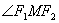

3.双曲线的性质

1° 双曲线是到两定点(焦点)的距离之差为常数(等于实轴2<i>a</i>)的动点<i>M</i>的轨迹(使的各点属于双曲线的一支，而使的各点属于其另一支).

2° 双曲线也是到一定点(焦点之一)的距离与到一定直线(准线<i>L</i>1)的距离之比为大于1的常数(即离心率)的动点<i>M</i>的轨迹().

3° 双曲线上一点<i>M</i>的切线(<i>MT</i>)的方程为

<pre align=center>&nbsp;&nbsp;&nbsp;&nbsp;&nbsp;&nbsp;&nbsp;&nbsp;&nbsp;&nbsp;&nbsp;&nbsp;&nbsp;&nbsp;&nbsp;&nbsp;&nbsp;&nbsp;&nbsp;&nbsp;&nbsp;&nbsp;&nbsp;&nbsp;&nbsp;&nbsp;&nbsp;&nbsp;&nbsp;&nbsp; </pre>

<table cellspacing=0 cellpadding=0 hspace=0 vspace=0 width=225 align=left>
 <tr>
  <td valign=top align=left style='padding-top:0mm;padding-right:9.05pt;
  padding-bottom:0mm;padding-left:9.05pt'>
  

  

  
&nbsp;&nbsp;&nbsp;&nbsp;
  图&nbsp; 7.8

  

  </td>
 </tr>
</table>

它把<i>M</i>点两焦点半径间的内角(即)平分(即)，而<i>M</i>点的法线<i>MN</i>把外角(即)平分(图7.7).

如果双曲线的切线的斜率为<i>k</i>，则其切线的方程为

<pre align=left>&nbsp;&nbsp;&nbsp;&nbsp;&nbsp;&nbsp;&nbsp;&nbsp;&nbsp;&nbsp;&nbsp;&nbsp;&nbsp;&nbsp;&nbsp;&nbsp;&nbsp;&nbsp;&nbsp;&nbsp;&nbsp;&nbsp; </pre>

式中正负号表示在直径两端点的两切线.

4°&nbsp;&nbsp; 两条渐近线之间的切线线段<i>TT</i>1被切点<i>M</i>平分(<i>TM </i>=
<i>MT</i>1)，且

&nbsp;&nbsp;&nbsp;&nbsp;&nbsp;&nbsp;&nbsp;&nbsp;&nbsp;&nbsp;&nbsp;&nbsp;&nbsp;&nbsp;&nbsp;&nbsp;&nbsp;&nbsp;&nbsp;&nbsp; D<i>OTT</i>1的面积，

平行四边形<i>OJMI</i>的面积(图7.8的阴影部分)

<pre align=left>&nbsp;&nbsp;&nbsp;&nbsp;&nbsp;&nbsp;&nbsp;&nbsp;&nbsp;&nbsp;&nbsp;&nbsp;&nbsp;&nbsp;&nbsp;&nbsp;&nbsp;&nbsp;&nbsp;&nbsp;&nbsp;&nbsp; </pre>

5°&nbsp;&nbsp; 双曲线的任一直径把平行于共轭直径的弦平分(图7.9)

<table cellspacing=0 cellpadding=0 hspace=0 vspace=0 width=228 height=239
 align=left>
 <tr>
  <td valign=top align=left height=239 style='padding-top:0mm;padding-right:
  9.05pt;padding-bottom:0mm;padding-left:9.05pt'>
  

  

  
&nbsp;&nbsp;&nbsp;&nbsp;&nbsp;&nbsp;
  图&nbsp; 7.9

  

  </td>
 </tr>
</table>

如果两共轭直径的长分别为2<i>a</i>1,2<i>b</i>1,
两直径与实轴夹角(锐角)分别为<i>a</i>和<i>b</i>(<i>a</i>&lt;<i>b</i>)，则

<pre align=left>&nbsp;&nbsp;&nbsp;&nbsp;&nbsp;&nbsp;&nbsp;&nbsp;&nbsp;&nbsp;&nbsp;&nbsp;&nbsp;&nbsp;&nbsp;&nbsp;&nbsp;&nbsp;&nbsp;&nbsp;&nbsp;&nbsp; </pre>

6°&nbsp;&nbsp; 双曲线上任一点<i>M</i>的焦点半径之积等于它的对应半共轭直径的平方.

&nbsp;

&nbsp;

&nbsp;

7°&nbsp;&nbsp; 设<i>MM</i>&cent;, <i>NN</i>&cent;为双曲线的两共轭直径，通过<i>M</i>, <i>M</i>&cent;分别作直线平行于<i>NN</i>&cent;；又通过<i>N</i>, <i>N</i>&cent;分别作直线平行于<i>MM</i>&cent;，则这四条直线构成的平行四边形的面积为一常数4<i>ab</i>(图7.10).

<table class=MsoNormalTable border=0 cellpadding=0 align=right width="24%"
 style='width:24.0%'>
 <tr>
  <td style='padding:.75pt .75pt .75pt .75pt'>
  

  
图&nbsp; 7.10

  </td>
 </tr>
</table>

&nbsp;

