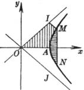
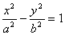
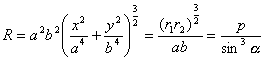
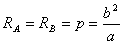
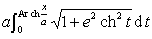
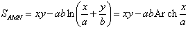
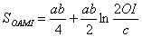

4．&nbsp;
4．双曲线各量计算公式

<table cellspacing=0 cellpadding=0 hspace=0 vspace=0 align=left>
 <tr>
  <td valign=top align=left style='padding-top:0mm;padding-right:9.0pt;
  padding-bottom:0mm;padding-left:9.0pt'>
  

  

  

  </td>
 </tr>
</table>

<pre style='vertical-align:top' align=left>&nbsp;&nbsp;&nbsp;&nbsp;&nbsp;&nbsp;&nbsp;&nbsp;&nbsp;&nbsp;&nbsp;&nbsp;&nbsp;&nbsp;&nbsp;&nbsp;&nbsp; &nbsp;</pre>

&nbsp;

&nbsp;

&nbsp;&nbsp;&nbsp;&nbsp;&nbsp;&nbsp;&nbsp;&nbsp;&nbsp;&nbsp;&nbsp;&nbsp;&nbsp;&nbsp;&nbsp;&nbsp;&nbsp;&nbsp;&nbsp;&nbsp;&nbsp;&nbsp;&nbsp;&nbsp;&nbsp;&nbsp;&nbsp;&nbsp;&nbsp;&nbsp;&nbsp;&nbsp;&nbsp;&nbsp;&nbsp;&nbsp;&nbsp;&nbsp;&nbsp;&nbsp;&nbsp;

<table class=MsoNormalTable border=1 cellspacing=0 cellpadding=0
 style='border-collapse:collapse;border:none'>
 <tr style='height:28.5pt'>
  <td width=104 valign=top style='width:78.0pt;border:solid windowtext 1.0pt;
  border-left:none;padding:0mm 5.4pt 0mm 5.4pt;height:28.5pt'>
  
双曲线各量

  </td>
  <td width=520 valign=top style='width:390.0pt;border-top:solid windowtext 1.0pt;
  border-left:none;border-bottom:solid windowtext 1.0pt;border-right:none;
  padding:0mm 5.4pt 0mm 5.4pt;height:28.5pt'>
  
计&nbsp;&nbsp; 算&nbsp;&nbsp;
  公&nbsp;&nbsp; 式

  </td>
 </tr>
 <tr style='height:39.0pt'>
  <td width=104 valign=top style='width:78.0pt;border-top:none;border-left:
  none;border-bottom:solid windowtext 1.0pt;border-right:solid windowtext 1.0pt;
  padding:0mm 5.4pt 0mm 5.4pt;height:39.0pt'>
  
[曲率半径]

  
<i>&nbsp;&nbsp;&nbsp;&nbsp;
  R</i>

  </td>
  <td width=520 valign=top style='width:390.0pt;border:none;border-bottom:solid windowtext 1.0pt;
  padding:0mm 5.4pt 0mm 5.4pt;height:39.0pt'>
  
&nbsp;&nbsp;&nbsp;&nbsp;&nbsp;&nbsp; 

  
&nbsp;&nbsp;&nbsp;&nbsp;&nbsp;&nbsp; 式中<i>r</i>1, <i>r</i>2为焦点半径，<i>p</i>为焦点参数，<i>a</i>为点<i>M</i>(<i>x</i>,
  <i>y</i>)的焦点半径与切线的夹角，特别，顶点<i>A</i>, <i>B</i>的曲率半径

  

  </td>
 </tr>
 <tr style='height:44.25pt'>
  <td width=104 valign=top style='width:78.0pt;border:none;border-right:solid windowtext 1.0pt;
  padding:0mm 5.4pt 0mm 5.4pt;height:44.25pt'>
  
&nbsp;[弧长]

  
&nbsp;&nbsp;
  

  </td>
  <td width=520 valign=top style='width:390.0pt;border:none;padding:0mm 5.4pt 0mm 5.4pt;
  height:44.25pt'>
  
&nbsp;
  =

  
式中<i>e</i>为离心率

  </td>
 </tr>
 <tr style='height:96.0pt'>
  <td width=104 valign=top style='width:78.0pt;border-top:none;border-left:
  none;border-bottom:solid windowtext 1.0pt;border-right:solid windowtext 1.0pt;
  padding:0mm 5.4pt 0mm 5.4pt;height:96.0pt'>
  
&nbsp;
  [面积]

  
&nbsp;&nbsp;&nbsp;&nbsp;
  <i>S</i>

  </td>
  <td width=520 valign=top style='width:390.0pt;border:none;border-bottom:solid windowtext 1.0pt;
  padding:0mm 5.4pt 0mm 5.4pt;height:96.0pt'>
  
弓形(<i>AMN</i>)的面积：

  
&nbsp;&nbsp;&nbsp;&nbsp;&nbsp;&nbsp;&nbsp;&nbsp;&nbsp;&nbsp;&nbsp;&nbsp;&nbsp; 

  
<i>OAMI</i>的面积：

  
这里<i>OI</i>, <i>OJ</i>为渐近线，<i>MI</i> // <i>OJ</i>

  </td>
 </tr>
</table>

&nbsp;

