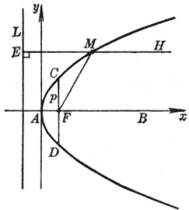
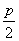

四、&nbsp;&nbsp;&nbsp;&nbsp;&nbsp;&nbsp;&nbsp;
四、&nbsp;&nbsp;&nbsp; 抛物线

<table cellspacing=0 cellpadding=0 hspace=0 vspace=0 align=left>
 <tr>
  <td valign=top align=left style='padding-top:0mm;padding-right:9.05pt;
  padding-bottom:0mm;padding-left:9.05pt'>
  

  

  
&nbsp;&nbsp;&nbsp;&nbsp;&nbsp;&nbsp;&nbsp;&nbsp;&nbsp;&nbsp;
  图 7.11

  

  </td>
 </tr>
</table>

1．&nbsp;
1．抛物线的基本元素

抛物线的主轴&nbsp;&nbsp;&nbsp; <i>AB</i>

顶&nbsp;&nbsp;&nbsp; 点&nbsp;&nbsp;&nbsp;&nbsp;&nbsp;&nbsp;&nbsp;&nbsp; <i>A</i>

焦&nbsp;&nbsp;&nbsp; 点&nbsp;&nbsp;&nbsp;&nbsp;&nbsp;&nbsp;&nbsp;&nbsp; <i>F</i>

焦点参数&nbsp;&nbsp;&nbsp;&nbsp;&nbsp;&nbsp;&nbsp;&nbsp;&nbsp;&nbsp;&nbsp; <i>p</i>(等于过焦点且垂直于轴的弦<i>CD</i>之长的一半)

焦点半径&nbsp;&nbsp;&nbsp;&nbsp;&nbsp;&nbsp;&nbsp;&nbsp;&nbsp;&nbsp;&nbsp; <i>MF</i>(抛物线上一点到焦点的距离)

直&nbsp;&nbsp;&nbsp; 径&nbsp;&nbsp;&nbsp;&nbsp;&nbsp;&nbsp;&nbsp;&nbsp; <i>EMH</i>(平行于抛物线的轴的直线)

准&nbsp;&nbsp;&nbsp; 线&nbsp;&nbsp;&nbsp;&nbsp;&nbsp;&nbsp;&nbsp;&nbsp; <i>L</i>(与抛物线的轴垂直，到顶点<i>A</i>的距离等于，到焦点<i>F</i>的距离等于<i>p</i>)

