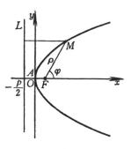
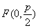
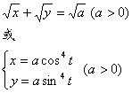

2．&nbsp;
2．抛物线的方程、顶点、焦点与准线

<table class=MsoNormalTable border=1 cellspacing=0 cellpadding=0
 style='border-collapse:collapse;border:none'>
 <tr style='height:15.1pt'>
  <td width=347 colspan=2 valign=top style='width:260.25pt;border:solid windowtext 1.0pt;
  border-left:none;padding:0mm 5.4pt 0mm 5.4pt;height:15.1pt'>
  
方&nbsp; 程&nbsp; 与&nbsp; 图&nbsp; 形

  </td>
  <td width=277 valign=top style='width:207.75pt;border-top:solid windowtext 1.0pt;
  border-left:none;border-bottom:solid windowtext 1.0pt;border-right:none;
  padding:0mm 5.4pt 0mm 5.4pt;height:15.1pt'>
  
顶点·焦点·准线

  </td>
 </tr>
 <tr style='height:133.2pt'>
  <td width=175 valign=top style='width:131.25pt;border:none;padding:0mm 5.4pt 0mm 5.4pt;
  height:133.2pt'>
  
(标准方程)&nbsp;&nbsp;&nbsp;&nbsp;&nbsp;&nbsp; 或 

  
(极坐标方程，极点位于焦点<i>F</i>上，极轴与抛物线的轴重合，背向顶点)

  </td>
  <td width=172 valign=top style='width:129.0pt;border:none;border-right:solid windowtext 1.0pt;
  padding:0mm 5.4pt 0mm 5.4pt;height:133.2pt'>
  

  </td>
  <td width=277 valign=top style='width:207.75pt;border:none;padding:0mm 5.4pt 0mm 5.4pt;
  height:133.2pt'>
  
顶&nbsp;&nbsp;&nbsp; 点&nbsp; <i>A</i>(0,
  0)

  
焦&nbsp;&nbsp;&nbsp; 点&nbsp; 

  
准&nbsp;&nbsp;&nbsp; 线&nbsp; 

  </td>
 </tr>
 <tr style='height:94.5pt'>
  <td width=175 valign=top style='width:131.25pt;border:none;border-bottom:
  solid windowtext 1.0pt;padding:0mm 5.4pt 0mm 5.4pt;height:94.5pt'>
  
&nbsp;&nbsp;&nbsp;&nbsp;&nbsp; 

  </td>
  <td width=172 valign=top style='width:129.0pt;border-top:none;border-left:
  none;border-bottom:solid windowtext 1.0pt;border-right:solid windowtext 1.0pt;
  padding:0mm 5.4pt 0mm 5.4pt;height:94.5pt'>
  

  </td>
  <td width=277 valign=top style='width:207.75pt;border:none;border-bottom:
  solid windowtext 1.0pt;padding:0mm 5.4pt 0mm 5.4pt;height:94.5pt'>
  
顶&nbsp;&nbsp;&nbsp; 点&nbsp; <i>A</i>(0,
  0)

  
焦&nbsp;&nbsp;&nbsp; 点&nbsp; 

  
准&nbsp;&nbsp;&nbsp; 线&nbsp; 

  </td>
 </tr>
 <tr style='height:13.5pt'>
  <td width=347 colspan=2 valign=top style='width:260.25pt;border-top:none;
  border-left:none;border-bottom:solid windowtext 1.0pt;border-right:solid windowtext 1.0pt;
  padding:0mm 5.4pt 0mm 5.4pt;height:13.5pt'>
  
&nbsp;&nbsp;&nbsp;&nbsp;&nbsp;&nbsp;&nbsp;&nbsp;&nbsp;&nbsp;&nbsp;
  方&nbsp; 程&nbsp; 与&nbsp; 图&nbsp; 形

  </td>
  <td width=277 valign=top style='width:207.75pt;border:none;border-bottom:
  solid windowtext 1.0pt;padding:0mm 5.4pt 0mm 5.4pt;height:13.5pt'>
  
&nbsp;&nbsp;&nbsp;
  顶点·焦点·准线

  </td>
 </tr>
 <tr style='height:97.5pt'>
  <td width=175 valign=top style='width:131.25pt;border:none;padding:0mm 5.4pt 0mm 5.4pt;
  height:97.5pt'>
  
&nbsp;&nbsp; 

  </td>
  <td width=172 valign=top style='width:129.0pt;border:none;border-right:solid windowtext 1.0pt;
  padding:0mm 5.4pt 0mm 5.4pt;height:97.5pt'>
  

  </td>
  <td width=277 valign=top style='width:207.75pt;border:none;padding:0mm 5.4pt 0mm 5.4pt;
  height:97.5pt'>
  
顶&nbsp;&nbsp;&nbsp; 点&nbsp; <i>A</i>(0,
  0)

  
焦&nbsp;&nbsp; &nbsp;点&nbsp; 

  
&nbsp;&nbsp;&nbsp;
  准&nbsp;&nbsp;&nbsp; 线&nbsp;&nbsp;&nbsp;&nbsp; 

  </td>
 </tr>
 <tr style='height:99.0pt'>
  <td width=175 valign=top style='width:131.25pt;border:none;padding:0mm 5.4pt 0mm 5.4pt;
  height:99.0pt'>
  
&nbsp;&nbsp; 

  </td>
  <td width=172 valign=top style='width:129.0pt;border:none;border-right:solid windowtext 1.0pt;
  padding:0mm 5.4pt 0mm 5.4pt;height:99.0pt'>
  

  </td>
  <td width=277 valign=top style='width:207.75pt;border:none;padding:0mm 5.4pt 0mm 5.4pt;
  height:99.0pt'>
  
顶&nbsp;&nbsp;&nbsp; 点&nbsp; <i>A</i>(0,
  0)

  
焦&nbsp;&nbsp; &nbsp;点&nbsp; 

  
&nbsp;&nbsp;&nbsp;
  准&nbsp;&nbsp;&nbsp; 线&nbsp;&nbsp;&nbsp;&nbsp; 

  </td>
 </tr>
 <tr style='height:102.75pt'>
  <td width=175 valign=top style='width:131.25pt;border:none;padding:0mm 5.4pt 0mm 5.4pt;
  height:102.75pt'>
  

  </td>
  <td width=172 valign=top style='width:129.0pt;border:none;border-right:solid windowtext 1.0pt;
  padding:0mm 5.4pt 0mm 5.4pt;height:102.75pt'>
  

  </td>
  <td width=277 valign=top style='width:207.75pt;border:none;padding:0mm 5.4pt 0mm 5.4pt;
  height:102.75pt'>
  
顶&nbsp;&nbsp;&nbsp; 点&nbsp; <i>A</i>(<i>g</i>,
  <i>h</i>)

  
焦&nbsp;&nbsp;&nbsp; 点&nbsp; 

  
准&nbsp;&nbsp;&nbsp; 线&nbsp; 

  </td>
 </tr>
 <tr style='height:104.05pt'>
  <td width=175 valign=top style='width:131.25pt;border:none;padding:0mm 5.4pt 0mm 5.4pt;
  height:104.05pt'>
  

  </td>
  <td width=172 valign=top style='width:129.0pt;border:none;border-right:solid windowtext 1.0pt;
  padding:0mm 5.4pt 0mm 5.4pt;height:104.05pt'>
  

  </td>
  <td width=277 valign=top style='width:207.75pt;border:none;padding:0mm 5.4pt 0mm 5.4pt;
  height:104.05pt'>
  
顶&nbsp;&nbsp;&nbsp; 点&nbsp; <i>A</i>(<i>g</i>,
  <i>h</i>)

  
焦&nbsp;&nbsp;&nbsp; 点

  
&nbsp;&nbsp;&nbsp;
  准&nbsp;&nbsp;&nbsp; 线&nbsp;&nbsp;&nbsp;&nbsp; 

  </td>
 </tr>
 <tr style='height:169.4pt'>
  <td width=175 valign=top style='width:131.25pt;border:none;border-bottom:
  solid windowtext 1.0pt;padding:0mm 5.4pt 0mm 5.4pt;height:169.4pt'>
  

  

  </td>
  <td width=172 valign=top style='width:129.0pt;border-top:none;border-left:
  none;border-bottom:solid windowtext 1.0pt;border-right:solid windowtext 1.0pt;
  padding:0mm 5.4pt 0mm 5.4pt;height:169.4pt'>
  

  

  </td>
  <td width=277 valign=top style='width:207.75pt;border:none;border-bottom:
  solid windowtext 1.0pt;padding:0mm 5.4pt 0mm 5.4pt;height:169.4pt'>
  
顶&nbsp;&nbsp;&nbsp; 点&nbsp; 

  
(当<i>a</i>&gt;0时，开口向上，&nbsp;
  

  
&nbsp;当<i>a</i>&lt;0时，开口向下)

  
焦点参数&nbsp;&nbsp;&nbsp;&nbsp; 

  
&nbsp;&nbsp;&nbsp;
  与<i>x</i>轴的交点&nbsp;&nbsp;&nbsp; 

  
&nbsp;&nbsp;&nbsp;&nbsp;&nbsp;&nbsp;
  

  
顶&nbsp;&nbsp;&nbsp; 点&nbsp; 

  
&nbsp;&nbsp;&nbsp;
  焦点参数 

  </td>
 </tr>
</table>

&nbsp;

