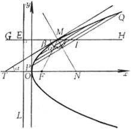
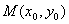
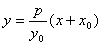
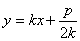

3．&nbsp;
3．抛物线的性质

<table cellspacing=0 cellpadding=0 hspace=0 vspace=0 align=left>
 <tr>
  <td valign=top align=left style='padding-top:0mm;padding-right:9.05pt;
  padding-bottom:0mm;padding-left:9.05pt'>
  

  

  
&nbsp;&nbsp;&nbsp;&nbsp;&nbsp;&nbsp;&nbsp;&nbsp;&nbsp;&nbsp;
  图&nbsp; 7.12

  

  </td>
 </tr>
</table>

1°&nbsp;&nbsp; 抛物线是到一定点<i>F</i>(焦点)的距离与到一定直线<i>L</i>(准线)的距离相等的动点<i>M</i>的轨迹(<i>MF</i>&cent;=<i>ME</i>)(图7.12)

2°&nbsp;&nbsp; 抛物线上一点的切线<i>MT</i>的方程为

<pre align=left>&nbsp;&nbsp;&nbsp;&nbsp;&nbsp;&nbsp;&nbsp; </pre>

它把<i>M</i>点的焦点半径与直径的夹角(&ETH;<i>FMG</i>)平分(&ETH;<i>FMT</i>=&ETH;<i>TMG</i>)，并且一切与切线<i>MT</i>平行的弦被过<i>M</i>点的直径平分(<i>PI</i>=<i>IQ</i>).

如果抛物线的切线的斜率为<i>k</i>，则其切线的方程为

<pre align=left>&nbsp;&nbsp;&nbsp;&nbsp;&nbsp;&nbsp;&nbsp; &nbsp;&nbsp;&nbsp;&nbsp;&nbsp;&nbsp;&nbsp;&nbsp;&nbsp;&nbsp;&nbsp; </pre>

3°&nbsp;&nbsp; 抛物线的任两切线的夹角等于两切点的焦点半径的夹角的一半.

4°&nbsp;&nbsp; 从焦点<i>F</i>作抛物线在点<i>M</i>的切线的垂线，则垂足的轨迹为在顶点的切线.

