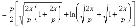

4．&nbsp;
4．抛物线各量计算公式

<pre style='vertical-align:top' align=left>&nbsp;&nbsp; &nbsp;&nbsp;&nbsp;&nbsp;&nbsp;&nbsp;&nbsp;&nbsp;&nbsp;&nbsp;&nbsp;</pre>
<table class=MsoNormalTable border=0 cellspacing=0 cellpadding=0
 style='border-collapse:collapse'>
 <tr>
  <td width=144 valign=top style='width:108.0pt;border:solid windowtext 1.0pt;
  border-left:none;padding:0mm 5.4pt 0mm 5.4pt'>
  
抛物线各量

  </td>
  <td width=480 valign=top style='width:360.0pt;border-top:solid windowtext 1.0pt;
  border-left:none;border-bottom:solid windowtext 1.0pt;border-right:none;
  padding:0mm 5.4pt 0mm 5.4pt'>
  
计&nbsp;&nbsp;&nbsp;&nbsp;
  算&nbsp;&nbsp;&nbsp; 公&nbsp;&nbsp;&nbsp; 式

  </td>
 </tr>
 <tr style='height:75.0pt'>
  <td width=144 valign=top style='width:108.0pt;border:none;border-right:solid windowtext 1.0pt;
  padding:0mm 5.4pt 0mm 5.4pt;height:75.0pt'>
  
[曲率半径]

  <h2>R</h2>
  </td>
  <td width=480 valign=top style='width:360.0pt;padding:0mm 5.4pt 0mm 5.4pt;
  height:75.0pt'>
  

  
式中<i>a</i>为点<i>M</i>(<i>x</i>, <i>y</i>)的切线与主轴的夹角，<i>n</i>为法线<i>MN</i>之长.特别，顶点的曲率半径<i>R</i>0 =
  <i>p</i>

  </td>
 </tr>
 <tr style='height:84.0pt'>
  <td width=144 valign=top style='width:108.0pt;border:none;border-right:solid windowtext 1.0pt;
  padding:0mm 5.4pt 0mm 5.4pt;height:84.0pt'>
  
&nbsp;&nbsp; [弧长]

  

  </td>
  <td width=480 valign=top style='width:360.0pt;padding:0mm 5.4pt 0mm 5.4pt;
  height:84.0pt'>
  
=

  
&nbsp;&nbsp;&nbsp;&nbsp; 

  </td>
 </tr>
 <tr>
  <td width=144 valign=top style='width:108.0pt;border:none;border-right:solid windowtext 1.0pt;
  padding:0mm 5.4pt 0mm 5.4pt'>
  
[面积]

  
S

  </td>
  <td width=480 valign=top style='width:360.0pt;padding:0mm 5.4pt 0mm 5.4pt'>
  
弓形(<i>MOD</i>)的面积=平行四边形(<i>MBCD</i>)的面积

  
&nbsp; 即&nbsp;&nbsp;&nbsp;&nbsp;&nbsp;&nbsp;&nbsp;
  

  
这里<i>MD</i>弓形弦长,<i>CD</i>平行于主轴,<i>BC</i>与抛物线相切,

  
<i>h</i>为该平行四边形的高(即弓形拱高),特别,

  </td>
 </tr>
 <tr>
  <td width=144 valign=top style='width:108.0pt;border-top:none;border-left:
  none;border-bottom:solid windowtext 1.0pt;border-right:solid windowtext 1.0pt;
  padding:0mm 5.4pt 0mm 5.4pt'>
  
[几何重心]

  <h2>G</h2>
  </td>
  <td width=480 valign=top style='width:360.0pt;border:none;border-bottom:solid windowtext 1.0pt;
  padding:0mm 5.4pt 0mm 5.4pt'>
  
弓形(<i>MOD</i>)的重心

  
(<i>BC</i>平行于<i>MD</i>,<i>P</i>为切点,<i>PQ</i>平行于<i>Ox</i>)

  </td>
 </tr>
</table>

&nbsp;

