

五、&nbsp;&nbsp;&nbsp;&nbsp;&nbsp;&nbsp;&nbsp;
五、&nbsp;&nbsp;&nbsp; 一般二次曲线

1．二次曲线的一般性质

上面所列举的椭圆、双曲线、抛物线等,它们的方程关于<i>x,y</i>都是二次的,关于<i>x,y</i>的一般二次方程的形式是

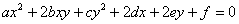

它所表示的曲线称为一般二次曲线.这里列举它们的一些共同性质.

[直线与二次曲线的交点]&nbsp; 一直线与一个二次曲线交于两点(实的,虚的,重合的).

[二次曲线的直径与中心]&nbsp; 一个二次曲线的平行于已知方向的弦的中点在一直线上,称它为二次曲线的直径,它平分某一组弦.设已知方向的方向数为<i>a,</i><i>b</i>,则直径的方程为

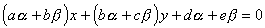

或改写为

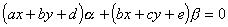

由此可见,二次曲线的直径组成一个直线束.束内任一直径通过下列两直线交点:

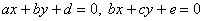

1°&nbsp;&nbsp; 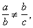即.

这时二次曲线的一切直径通过同一点,称为中心,这种曲线称为有心二次曲线,中心的坐标为

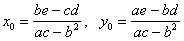

2°&nbsp;&nbsp; 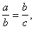即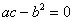

(i) &nbsp;&nbsp;&nbsp;&nbsp;&nbsp;
(i) &nbsp;&nbsp;&nbsp; 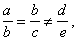这时曲线无中心;

(ii) &nbsp;&nbsp;&nbsp;
(ii) &nbsp; 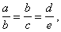这时曲线有无限个中心,即中心在同一直线上(中心直线).

这两种曲线称为无心二次曲线.

[二次曲线的主轴(或对称轴)]&nbsp; 如果直径垂直于被它所平分的弦,则称它为二次曲线的主轴(对称轴), 无心二次曲线有一条实的主轴;有心二次曲线有两条实的主轴,它们是互相垂直的,交点就是中心.

[二次曲线的切线与法线]&nbsp; 

二次曲线上的一点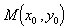的切线方程为

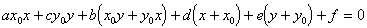

&nbsp;&nbsp;&nbsp; 在点<i>M</i>与二次曲线的切线垂直的直线称为在点<i>M</i>的法线,它的方程为

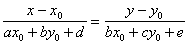

