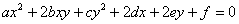
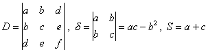

2．二次曲线的不变量

由一般二次曲线的方程

<pre style='text-align:right' align=right>&nbsp;&nbsp;&nbsp;&nbsp;&nbsp;&nbsp;&nbsp;&nbsp;&nbsp;&nbsp; &nbsp;&nbsp;&nbsp;&nbsp;&nbsp;&nbsp;&nbsp;&nbsp;&nbsp;&nbsp;&nbsp;&nbsp;&nbsp;&nbsp;&nbsp;&nbsp;&nbsp;&nbsp;&nbsp;&nbsp;&nbsp;&nbsp;&nbsp;&nbsp;(1)</pre>

的系数所组成的下列三个函数:

称为二次曲线的不变量,即经过坐标变换后,这些量是不变的.行列式<i>D</i>称为二次方程(1)的判别式.

