

3．二次曲线的标准方程与形状

<table class=MsoNormalTable border=0 cellspacing=0 cellpadding=0
 style='border-collapse:collapse'>
 <tr>
  <td width=176 colspan=3 valign=top style='width:132.0pt;border-top:solid windowtext 1.0pt;
  border-left:none;border-bottom:none;border-right:solid windowtext 1.0pt;
  padding:0mm 5.4pt 0mm 5.4pt'>
  
不&nbsp; 变&nbsp; 量

  </td>
  <td width=264 valign=top style='width:198.0pt;border-top:solid windowtext 1.0pt;
  border-left:none;border-bottom:none;border-right:solid windowtext 1.0pt;
  padding:0mm 5.4pt 0mm 5.4pt'>
  
坐标变换后的标准方程

  </td>
  <td width=184 valign=top style='width:138.0pt;border:none;border-top:solid windowtext 1.0pt;
  padding:0mm 5.4pt 0mm 5.4pt'>
  
曲线形状

  </td>
 </tr>
 <tr style='height:7.75pt'>
  <td width=48 rowspan=4 style='width:36.0pt;border:solid windowtext 1.0pt;
  border-left:none;padding:0mm 5.4pt 0mm 5.4pt;height:7.75pt'>
  
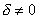

  
有

  
心

  
二

  
次

  
曲

  
线

  </td>
  <td width=64 rowspan=2 style='width:48.0pt;border-top:solid windowtext 1.0pt;
  border-left:none;border-bottom:none;border-right:solid windowtext 1.0pt;
  padding:0mm 5.4pt 0mm 5.4pt;height:7.75pt'>
  
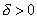

  </td>
  <td width=64 style='width:48.0pt;border:solid windowtext 1.0pt;border-left:
  none;padding:0mm 5.4pt 0mm 5.4pt;height:7.75pt'>
  

  </td>
  <td width=264 rowspan=4 valign=top style='width:198.0pt;border:solid windowtext 1.0pt;
  border-left:none;padding:0mm 5.4pt 0mm 5.4pt;height:7.75pt'>
  
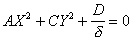

  
式中 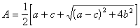

  
&nbsp;&nbsp;&nbsp;&nbsp; 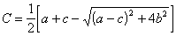

  
<i>A , C</i>是特征方程

  
&nbsp;&nbsp;&nbsp; 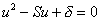的两特征根

  </td>
  <td width=184 valign=top style='width:138.0pt;border:none;border-top:solid windowtext 1.0pt;
  padding:0mm 5.4pt 0mm 5.4pt;height:7.75pt'>
  
时为椭圆

  
时为虚椭圆

  </td>
 </tr>
 <tr style='height:35.65pt'>
  <td width=64 style='width:48.0pt;border:none;border-right:solid windowtext 1.0pt;
  padding:0mm 5.4pt 0mm 5.4pt;height:35.65pt'>
  

  </td>
  <td width=184 valign=top style='width:138.0pt;border:none;border-top:solid windowtext 1.0pt;
  padding:0mm 5.4pt 0mm 5.4pt;height:35.65pt'>
  
有一公共实点的一对虚直线

  </td>
 </tr>
 <tr style='height:7.75pt'>
  <td width=64 rowspan=2 style='width:48.0pt;border:solid windowtext 1.0pt;
  border-left:none;padding:0mm 5.4pt 0mm 5.4pt;height:7.75pt'>
  
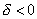

  </td>
  <td width=64 style='width:48.0pt;border-top:solid windowtext 1.0pt;
  border-left:none;border-bottom:none;border-right:solid windowtext 1.0pt;
  padding:0mm 5.4pt 0mm 5.4pt;height:7.75pt'>
  

  </td>
  <td width=184 valign=top style='width:138.0pt;border:none;border-top:solid windowtext 1.0pt;
  padding:0mm 5.4pt 0mm 5.4pt;height:7.75pt'>
  
双曲线

  </td>
 </tr>
 <tr style='height:30.8pt'>
  <td width=64 style='width:48.0pt;border:solid windowtext 1.0pt;border-left:
  none;padding:0mm 5.4pt 0mm 5.4pt;height:30.8pt'>
  

  </td>
  <td width=184 style='width:138.0pt;border-top:solid windowtext 1.0pt;
  border-left:none;border-bottom:solid windowtext 1.0pt;border-right:none;
  padding:0mm 5.4pt 0mm 5.4pt;height:30.8pt'>
  
相交两直线

  </td>
 </tr>
 <tr style='height:.7pt'>
  <td width=176 colspan=3 style='width:132.0pt;padding:0mm 5.4pt 0mm 5.4pt;
  height:.7pt'>
  
&nbsp; 

  </td>
  <td width=264 style='width:198.0pt;padding:0mm 5.4pt 0mm 5.4pt;height:.7pt'>
  
&nbsp; 

  </td>
  <td width=184 style='width:138.0pt;padding:0mm 5.4pt 0mm 5.4pt;height:.7pt'>
  
&nbsp; 

  </td>
 </tr>
 <tr style='height:22.7pt'>
  <td width=112 colspan=2 rowspan=2 style='width:84.0pt;border:solid windowtext 1.0pt;
  border-left:none;padding:0mm 5.4pt 0mm 5.4pt;height:22.7pt'>
  
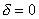

  
无

  
心

  
二

  
次

  
曲

  
线

  </td>
  <td width=64 style='width:48.0pt;border:solid windowtext 1.0pt;border-left:
  none;padding:0mm 5.4pt 0mm 5.4pt;height:22.7pt'>
  

  </td>
  <td width=264 valign=top style='width:198.0pt;border:solid windowtext 1.0pt;
  border-left:none;padding:0mm 5.4pt 0mm 5.4pt;height:22.7pt'>
  
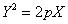

  
式中

  
&nbsp;&nbsp;&nbsp; 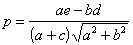

  </td>
  <td width=184 style='width:138.0pt;border-top:solid windowtext 1.0pt;
  border-left:none;border-bottom:solid windowtext 1.0pt;border-right:none;
  padding:0mm 5.4pt 0mm 5.4pt;height:22.7pt'>
  
抛物线

  </td>
 </tr>
 <tr style='height:7.75pt'>
  <td width=64 style='width:48.0pt;border-top:none;border-left:none;border-bottom:
  solid windowtext 1.0pt;border-right:solid windowtext 1.0pt;padding:0mm 5.4pt 0mm 5.4pt;
  height:7.75pt'>
  

  </td>
  <td width=264 style='width:198.0pt;border-top:none;border-left:none;
  border-bottom:solid windowtext 1.0pt;border-right:solid windowtext 1.0pt;
  padding:0mm 5.4pt 0mm 5.4pt;height:7.75pt'>
  
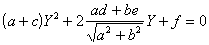

  </td>
  <td width=184 valign=top style='width:138.0pt;border:none;border-bottom:solid windowtext 1.0pt;
  padding:0mm 5.4pt 0mm 5.4pt;height:7.75pt'>
  
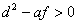时为平行两直线

  
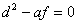时为重合二直线

  
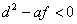时为一对虚直线

  </td>
 </tr>
</table>

&nbsp;

