

4．二次曲线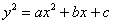的几种情况

<table class=MsoNormalTable border=0 cellspacing=0 cellpadding=0
 style='border-collapse:collapse'>
 <tr>
  <td width=80 valign=top style='width:60.0pt;border:none;border-top:solid windowtext 1.0pt;
  padding:0mm 5.4pt 0mm 5.4pt'>
  
<i>A</i>

  </td>
  <td width=296 valign=top style='width:222.0pt;border:solid windowtext 1.0pt;
  padding:0mm 5.4pt 0mm 5.4pt'>
  
图&nbsp;&nbsp;&nbsp;&nbsp;
  形

  </td>
  <td width=248 valign=top style='width:186.0pt;border:none;border-top:solid windowtext 1.0pt;
  padding:0mm 5.4pt 0mm 5.4pt'>
  
顶点·中心·焦点参数

  </td>
 </tr>
 <tr>
  <td width=80 style='width:60.0pt;border:none;border-top:solid windowtext 1.0pt;
  padding:0mm 5.4pt 0mm 5.4pt'>
  
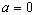

  
抛物线

  </td>
  <td width=296 valign=top style='width:222.0pt;border:solid windowtext 1.0pt;
  border-top:none;padding:0mm 5.4pt 0mm 5.4pt'>
  
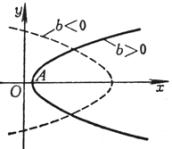

  </td>
  <td width=248 valign=top style='width:186.0pt;border:none;border-top:solid windowtext 1.0pt;
  padding:0mm 5.4pt 0mm 5.4pt'>
  
顶点&nbsp;&nbsp;&nbsp;&nbsp;&nbsp; 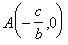

  
焦点参数&nbsp; 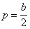

  </td>
 </tr>
 <tr style='height:68.6pt'>
  <td width=80 valign=top style='width:60.0pt;border:none;border-top:solid windowtext 1.0pt;
  padding:0mm 5.4pt 0mm 5.4pt;height:68.6pt'>
  

  
椭圆

  </td>
  <td width=296 valign=top style='width:222.0pt;border:solid windowtext 1.0pt;
  border-top:none;padding:0mm 5.4pt 0mm 5.4pt;height:68.6pt'>
  
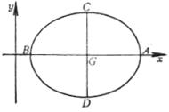

  </td>
  <td width=248 rowspan=2 valign=top style='width:186.0pt;border-top:solid windowtext 1.0pt;
  border-left:none;border-bottom:solid windowtext 1.0pt;border-right:none;
  padding:0mm 5.4pt 0mm 5.4pt;height:68.6pt'>
  
顶点&nbsp; 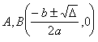

  
&nbsp;&nbsp;&nbsp;&nbsp;&nbsp; 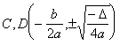

  
其中 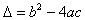

  
中心 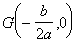

  </td>
 </tr>
 <tr>
  <td width=80 valign=top style='width:60.0pt;border-top:solid windowtext 1.0pt;
  border-left:none;border-bottom:solid windowtext 1.0pt;border-right:none;
  padding:0mm 5.4pt 0mm 5.4pt'>
  

  
双曲线

  </td>
  <td width=296 valign=top style='width:222.0pt;border:solid windowtext 1.0pt;
  border-top:none;padding:0mm 5.4pt 0mm 5.4pt'>
  
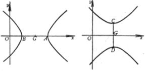

  </td>
 </tr>
</table>

&nbsp;

