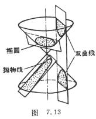

5．&nbsp; 5．圆锥截线

二次曲线都是用平面切割正圆锥面的截线.因此二次曲线也称为圆锥截线（图7.13）

&nbsp;

&nbsp;&nbsp;&nbsp; 用一平面<i>P</i>切割正圆锥时,若<i>P</i>不通过锥顶,且不平行于任一母线,则截线为椭圆;若<i>P</i>不通过锥顶,而平行于一条母线时,截线为抛物线;若<i>P</i>不通过锥顶而平行于两条母线时,截线为双曲线;若<i>P</i>垂直于锥轴,截线为圆. 

若<i>P</i>通过锥顶,则椭圆变为一点,双曲线变为一对相交直线,抛物线变为<i>P</i>与圆锥相切的一直线.

