

<b>§</b><b>6&nbsp; </b><b>二</b><b> </b><b>次</b><b>
</b><b>曲</b><b> </b><b>面</b>

一、&nbsp;&nbsp; 一、&nbsp;&nbsp;&nbsp;&nbsp;&nbsp;&nbsp;&nbsp; 球面

&nbsp;&nbsp;&nbsp; [球面的方程、球心与半径]

<table class=MsoNormalTable border=0 cellspacing=0 cellpadding=0
 style='border-collapse:collapse'>
 <tr>
  <td width=364 colspan=3 valign=top style='width:273.0pt;border:solid windowtext 1.0pt;
  border-left:none;padding:0mm 5.4pt 0mm 5.4pt'>
  
方 程 与 图 形

  </td>
  <td width=260 valign=top style='width:195.0pt;border:none;border-top:solid windowtext 1.0pt;
  padding:0mm 5.4pt 0mm 5.4pt'>
  
球心与半径

  </td>
 </tr>
 <tr style='height:42.0pt'>
  <td width=164 valign=top style='width:123.0pt;border:none;padding:0mm 5.4pt 0mm 5.4pt;
  height:42.0pt'>
  
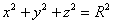

  
或

  
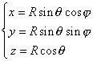

  
(球面坐标方程.式中<i>j</i>为经度,<i>q</i>为余纬度)

  </td>
  <td width=200 colspan=2 valign=top style='width:150.0pt;border:none;
  border-right:solid windowtext 1.0pt;padding:0mm 5.4pt 0mm 5.4pt;height:42.0pt'>
  
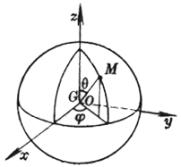

  </td>
  <td width=260 style='width:195.0pt;border:none;border-top:solid windowtext 1.0pt;
  padding:0mm 5.4pt 0mm 5.4pt;height:42.0pt'>
  
&nbsp;&nbsp; 球心&nbsp; <i>G</i>(0,0,0)

  
&nbsp;&nbsp; 半径&nbsp; <i>R</i>

  </td>
 </tr>
 <tr style='height:42.0pt'>
  <td width=192 colspan=2 valign=top style='width:144.0pt;border:none;
  border-bottom:solid windowtext 1.0pt;padding:0mm 5.4pt 0mm 5.4pt;height:42.0pt'>
  
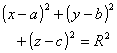

  
或

  
&nbsp;&nbsp;&nbsp; 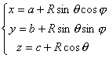

  
(球面坐标方程式中<i>j</i>,<i>q </i>同上)&nbsp;&nbsp;&nbsp;&nbsp;
  

  </td>
  <td width=172 valign=top style='width:129.0pt;border-top:none;border-left:
  none;border-bottom:solid windowtext 1.0pt;border-right:solid windowtext 1.0pt;
  padding:0mm 5.4pt 0mm 5.4pt;height:42.0pt'>
  
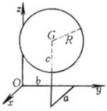

  </td>
  <td width=260 style='width:195.0pt;border:none;border-bottom:solid windowtext 1.0pt;
  padding:0mm 5.4pt 0mm 5.4pt;height:42.0pt'>
  
&nbsp;&nbsp;&nbsp; 球心&nbsp; <i>G</i>(<i>a,b,c</i>)

  
半径&nbsp; <i>R</i>

  </td>
 </tr>
 <tr style='height:15.0pt'>
  <td width=364 colspan=3 style='width:273.0pt;border-top:none;border-left:
  none;border-bottom:solid windowtext 1.0pt;border-right:solid windowtext 1.0pt;
  padding:0mm 5.4pt 0mm 5.4pt;height:15.0pt'>
  
&nbsp;&nbsp;&nbsp;&nbsp;&nbsp;&nbsp;&nbsp;&nbsp;&nbsp;&nbsp;&nbsp;&nbsp;&nbsp;
  方 程 与 图 形

  </td>
  <td width=260 style='width:195.0pt;border:none;border-bottom:solid windowtext 1.0pt;
  padding:0mm 5.4pt 0mm 5.4pt;height:15.0pt'>
  
&nbsp;&nbsp;&nbsp;&nbsp;&nbsp;&nbsp;&nbsp;&nbsp;
  球心与半径

  </td>
 </tr>
 <tr style='height:178.5pt'>
  <td width=364 colspan=3 style='width:273.0pt;border-top:none;border-left:
  none;border-bottom:solid windowtext 1.0pt;border-right:solid windowtext 1.0pt;
  padding:0mm 5.4pt 0mm 5.4pt;height:178.5pt'>
  
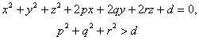

  
&nbsp;&nbsp;&nbsp;&nbsp;&nbsp;&nbsp;&nbsp;&nbsp;&nbsp;&nbsp;&nbsp;&nbsp;&nbsp;&nbsp;&nbsp;
  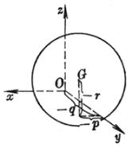

  </td>
  <td width=260 style='width:195.0pt;border:none;border-bottom:solid windowtext 1.0pt;
  padding:0mm 5.4pt 0mm 5.4pt;height:178.5pt'>
  
&nbsp;&nbsp; 球心&nbsp; <i>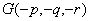</i>

  
<i>&nbsp;&nbsp; </i>半径 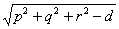

  </td>
 </tr>
 <tr>
  <td width=165 style='width:123.75pt;padding:0mm 5.4pt 0mm 5.4pt'>
  
&nbsp;

  </td>
  <td width=28 style='width:21.0pt;padding:0mm 5.4pt 0mm 5.4pt'>
  
&nbsp;

  </td>
  <td width=172 style='width:129.0pt;padding:0mm 5.4pt 0mm 5.4pt'>
  
&nbsp;

  </td>
  <td width=260 style='width:195.0pt;padding:0mm 5.4pt 0mm 5.4pt'>
  
&nbsp;

  </td>
 </tr>
</table>

[球面的切面与法线] 设一平面<i>P</i>通过球面上一点<i>M</i>且垂直于半径<i>GM</i>,则称<i>P</i>为球面在<i>M</i>的切面.直线<i>MG</i>称为球面在点<i>M</i>的法线.

设球面方程为

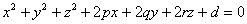

则球面在点<i>M</i>()的切面方程为

<pre>&nbsp;&nbsp;&nbsp;&nbsp;&nbsp;&nbsp;&nbsp;&nbsp;&nbsp;&nbsp; 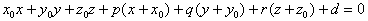</pre>

球面在点<i>M</i>(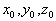)的法线方程为

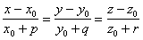

[两个球面的交角] 设两个球面

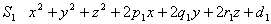=0

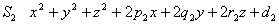=0

两个球面的交角是指它们在交点的两个切面的夹角,记作<i>q</i>,则

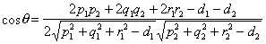

因公式中不包含交点的坐标,所以在两个球面的交线上的各点的交角必相等.

两个球面的正交条件为

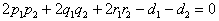

[球面束·两个球面的根面] 设

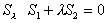

式中和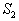如(1)式定义,为参数,则有

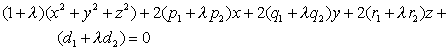

对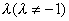的一个确定值,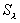表示一个球面,当取一切值时,所表示的球面的全体称为球面束.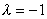时为一平面,称为两个球面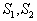的根面,其方程为

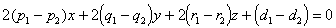

根面与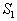和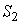的连心线垂直,束中任一球面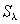的中心在连心线上,且分连心线的比为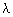.

[球面汇·三个球面的根轴] 设和如(1)式定义,又设

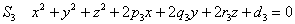

设&nbsp;&nbsp;&nbsp;&nbsp;&nbsp;&nbsp;&nbsp;&nbsp;&nbsp;&nbsp;&nbsp;&nbsp;&nbsp;&nbsp;&nbsp;&nbsp;&nbsp;&nbsp;&nbsp;
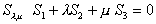

式中为二独立参数,则有

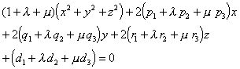

对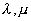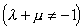的一对确定值,表示一个球面,当取一切值时,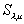所表示的球面的全体称为球面汇.

三个球面中每对球面的根面分别为

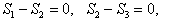和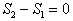

这三个平面交于一条直线,称为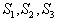的根轴.

