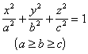
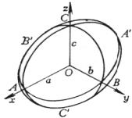
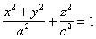
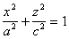
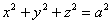
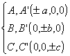
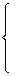
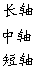
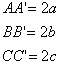
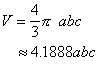

二、&nbsp;&nbsp;&nbsp;&nbsp;&nbsp;&nbsp;&nbsp;
二、&nbsp;&nbsp;&nbsp; 椭球面

<table class=MsoNormalTable border=0 cellspacing=0 cellpadding=0
 style='border-collapse:collapse'>
 <tr>
  <td width=248 valign=top style='width:186.0pt;border-top:solid windowtext 1.0pt;
  border-left:none;border-bottom:solid windowtext 1.0pt;border-right:none;
  padding:0mm 5.4pt 0mm 5.4pt'>
  
方 程 与 图 形

  </td>
  <td width=168 valign=top style='width:126.0pt;border:solid windowtext 1.0pt;
  padding:0mm 5.4pt 0mm 5.4pt'>
  
基 本 元 素

  </td>
  <td width=208 valign=top style='width:156.0pt;border-top:solid windowtext 1.0pt;
  border-left:none;border-bottom:solid windowtext 1.0pt;border-right:none;
  padding:0mm 5.4pt 0mm 5.4pt'>
  
特&nbsp;&nbsp;&nbsp;&nbsp;&nbsp;
  征

  </td>
 </tr>
 <tr>
  <td width=248 valign=top style='width:186.0pt;border:none;border-bottom:solid windowtext 1.0pt;
  padding:0mm 5.4pt 0mm 5.4pt'>
  
[椭球面]

  
&nbsp; 

  

  
&nbsp; 当<i>a=b</i>时为旋转椭球面

  
&nbsp; 

  
&nbsp; (在<i>Ozx</i>平面上的曲线

  
&nbsp; &nbsp;绕<i>z</i>轴旋转而得到)

  
&nbsp; 当<i>a=b=c</i>时为球面

  
&nbsp;&nbsp; 

  </td>
  <td width=168 valign=top style='width:126.0pt;border:solid windowtext 1.0pt;
  border-top:none;padding:0mm 5.4pt 0mm 5.4pt'>
  
顶点

  
主轴

  
主平面及其方程:

  
<i>&nbsp; Oxy</i>平面<i>z=0</i>

  
<i>&nbsp; Oyz</i>平面<i>x=0</i>

  
<i>&nbsp; Ozx</i>平面<i>y=0</i>

  
主轴的方程:

  
&nbsp; <i>AA’ y=z=0</i>

  
<i>&nbsp; BB’ z=x=0</i>

  
<i>&nbsp; CC’ x=y=0</i>

  
中心<i>O</i>(0,0,0)

  
直径平面 通过中心的平面

  </td>
  <td width=208 valign=top style='width:156.0pt;border:none;border-bottom:solid windowtext 1.0pt;
  padding:0mm 5.4pt 0mm 5.4pt'>
  
&nbsp; 任一平面与椭球面的交线为一椭圆(特殊情况下为一圆).

  
&nbsp; 平行于一已知方向<b><i>d</i></b>的一组弦的中点在一个平面上,该平面是一直径平面,它共轭于方向<b><i>d</i></b>.

  
&nbsp; 三个主平面是分别共轭于主轴的直径平面.

  
&nbsp; 椭球体的体积:

  
&nbsp; 

  </td>
 </tr>
</table>

&nbsp;

