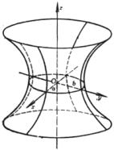

三、&nbsp;&nbsp;&nbsp;&nbsp;&nbsp;&nbsp;&nbsp;
三、&nbsp;&nbsp;&nbsp; 双曲面

<table class=MsoNormalTable border=0 cellspacing=0 cellpadding=0
 style='border-collapse:collapse'>
 <tr>
  <td width=192 valign=top style='width:144.0pt;border-top:solid windowtext 1.0pt;
  border-left:none;border-bottom:solid windowtext 1.0pt;border-right:none;
  padding:0mm 5.4pt 0mm 5.4pt'>
  
方 程 与 图 形

  </td>
  <td width=192 valign=top style='width:144.0pt;border:solid windowtext 1.0pt;
  padding:0mm 5.4pt 0mm 5.4pt'>
  
基 本 元 素

  </td>
  <td width=240 valign=top style='width:180.0pt;border-top:solid windowtext 1.0pt;
  border-left:none;border-bottom:solid windowtext 1.0pt;border-right:none;
  padding:0mm 5.4pt 0mm 5.4pt'>
  
特&nbsp;&nbsp;&nbsp;&nbsp;&nbsp;
  征

  </td>
 </tr>
 <tr>
  <td width=192 valign=top style='width:144.0pt;border:none;border-bottom:solid windowtext 1.0pt;
  padding:0mm 5.4pt 0mm 5.4pt'>
  
[单叶双曲面]

  
&nbsp; 

  

  
[双叶双曲面]

  
&nbsp; 

  
&nbsp; 

  
当<i>a</i>=<i>b</i>时,为

  
[旋转双曲面]

  
(在<i>Oxz</i>平面上的曲线

  
&nbsp; 

  
绕<i>z</i>轴旋转而得到)

  </td>
  <td width=192 valign=top style='width:144.0pt;border:solid windowtext 1.0pt;
  border-top:none;padding:0mm 5.4pt 0mm 5.4pt'>
  
主轴 

  
中心<i>O</i>(0,0,0)

  
主平面及其方程:

  
<i>Oxy</i>平面<i>z</i>=0

  
<i>Oyz</i>平面<i>x</i>=0

  
<i>Ozx</i>平面<i>y</i>=0

  </td>
  <td width=240 valign=top style='width:180.0pt;border:none;border-bottom:solid windowtext 1.0pt;
  padding:0mm 5.4pt 0mm 5.4pt'>
  
&nbsp; 平行于<i>z</i>轴的平面与双曲面的交线都是双曲线(对于单叶双曲面,可能是一对相交直线).

  
&nbsp; 平行于<i>Oxy</i>平面的平面与双曲面的交线都是椭圆.

  
&nbsp; 单叶双曲面上有两族直母线,它们的方程是

  
&nbsp;

  
&nbsp;&nbsp;&nbsp;&nbsp;&nbsp;&nbsp; (<i>l</i>为参数)

  
与

  
&nbsp;

  
&nbsp;&nbsp;&nbsp;&nbsp;&nbsp;&nbsp;&nbsp;&nbsp;
  ( <i>m</i>为参数)

  </td>
 </tr>
</table>

&nbsp;

