

五、&nbsp;&nbsp;&nbsp;&nbsp;&nbsp;&nbsp;&nbsp;
五、&nbsp;&nbsp;&nbsp; 锥面与柱面

<table class=MsoNormalTable border=1 cellspacing=0 cellpadding=0
 style='border-collapse:collapse;border:none'>
 <tr>
  <td width=192 valign=top style='width:144.0pt;border-top:solid windowtext 1.0pt;
  border-left:none;border-bottom:solid windowtext 1.0pt;border-right:none;
  padding:0mm 5.4pt 0mm 5.4pt'>
  
方 程 与 图 形

  </td>
  <td width=192 valign=top style='width:144.0pt;border:solid windowtext 1.0pt;
  padding:0mm 5.4pt 0mm 5.4pt'>
  
基 本 元 素

  </td>
  <td width=240 valign=top style='width:180.0pt;border-top:solid windowtext 1.0pt;
  border-left:none;border-bottom:solid windowtext 1.0pt;border-right:none;
  padding:0mm 5.4pt 0mm 5.4pt'>
  
特&nbsp;&nbsp;&nbsp;&nbsp;&nbsp;
  征

  </td>
 </tr>
 <tr style='height:273.0pt'>
  <td width=192 valign=top style='width:144.0pt;border:none;padding:0mm 5.4pt 0mm 5.4pt;
  height:273.0pt'>
  
[椭圆锥面]

  
&nbsp; 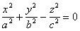

  
&nbsp;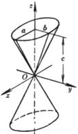

  
当<i>a</i>=<i>b</i>时, 为圆锥面

  
(在<i>Oxz</i>平面上的直线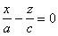绕<i>z</i>轴旋转而得到)

  </td>
  <td width=192 valign=top style='width:144.0pt;border-top:none;border-left:
  solid windowtext 1.0pt;border-bottom:none;border-right:solid windowtext 1.0pt;
  padding:0mm 5.4pt 0mm 5.4pt;height:273.0pt'>
  
主轴&nbsp;&nbsp; <i>z</i>轴

  
顶点&nbsp; 原点<i>O</i>

  
<i>a,b</i>为<i>z=c</i>的平面与锥面的交线(椭圆)的半轴

  </td>
  <td width=240 valign=top style='width:180.0pt;border:none;padding:0mm 5.4pt 0mm 5.4pt;
  height:273.0pt'>
  
&nbsp; 椭圆锥面与平行于<i>Oxy</i>的平面<i>z</i>=<i>h</i>的交线是椭圆

  
&nbsp; 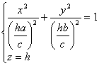

  
与<i>Oxy</i>平面交于原点<i>O.</i>

  </td>
 </tr>
 <tr style='height:213.0pt'>
  <td width=192 valign=top style='width:144.0pt;border:none;padding:0mm 5.4pt 0mm 5.4pt;
  height:213.0pt'>
  
[椭圆柱面]

  
&nbsp; 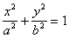

  
&nbsp;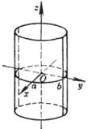

  
当<i>a</i>=<i>b</i>时,为圆柱面

  
&nbsp; 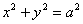

  </td>
  <td width=192 valign=top style='width:144.0pt;border-top:none;border-left:
  solid windowtext 1.0pt;border-bottom:none;border-right:solid windowtext 1.0pt;
  padding:0mm 5.4pt 0mm 5.4pt;height:213.0pt'>
  
准线的方程为

  
&nbsp;&nbsp; 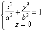

  
母线的方向数为(0,0,1)

  </td>
  <td width=240 valign=top style='width:180.0pt;border:none;padding:0mm 5.4pt 0mm 5.4pt;
  height:213.0pt'>
  
&nbsp; 椭圆柱面与任何平行于<i>Oxy</i>的平面的交线都是同样的椭圆

  
&nbsp; 

  </td>
 </tr>
 <tr style='height:180.0pt'>
  <td width=192 valign=top style='width:144.0pt;border:none;border-bottom:solid windowtext 1.0pt;
  padding:0mm 5.4pt 0mm 5.4pt;height:180.0pt'>
  
[双曲柱面]

  
&nbsp; 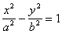

  
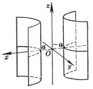

  </td>
  <td width=192 valign=top style='width:144.0pt;border:solid windowtext 1.0pt;
  border-top:none;padding:0mm 5.4pt 0mm 5.4pt;height:180.0pt'>
  
准线的方程为

  
&nbsp;&nbsp; 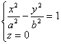

  
母线的方向数为

  
&nbsp;&nbsp; (0,0,1)

  </td>
  <td width=240 valign=top style='width:180.0pt;border:none;border-bottom:solid windowtext 1.0pt;
  padding:0mm 5.4pt 0mm 5.4pt;height:180.0pt'>
  
&nbsp; 

  </td>
 </tr>
 <tr style='height:11.25pt'>
  <td width=192 valign=top style='width:144.0pt;border:none;border-bottom:solid windowtext 1.0pt;
  padding:0mm 5.4pt 0mm 5.4pt;height:11.25pt'>
  
&nbsp; 方 程 与 图 形

  </td>
  <td width=192 valign=top style='width:144.0pt;border:solid windowtext 1.0pt;
  border-top:none;padding:0mm 5.4pt 0mm 5.4pt;height:11.25pt'>
  
&nbsp;&nbsp;&nbsp;&nbsp;&nbsp; 基 本 元 素

  </td>
  <td width=240 valign=top style='width:180.0pt;border:none;border-bottom:solid windowtext 1.0pt;
  padding:0mm 5.4pt 0mm 5.4pt;height:11.25pt'>
  
&nbsp;&nbsp;&nbsp;&nbsp;&nbsp;&nbsp;&nbsp;
  特&nbsp;&nbsp;&nbsp;&nbsp;&nbsp; 征

  </td>
 </tr>
 <tr style='height:189.75pt'>
  <td width=192 valign=top style='width:144.0pt;border:none;padding:0mm 5.4pt 0mm 5.4pt;
  height:189.75pt'>
  
[抛物柱面]

  
&nbsp; 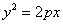

  
&nbsp;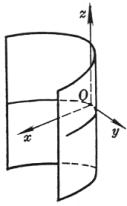

  </td>
  <td width=192 valign=top style='width:144.0pt;border-top:none;border-left:
  solid windowtext 1.0pt;border-bottom:none;border-right:solid windowtext 1.0pt;
  padding:0mm 5.4pt 0mm 5.4pt;height:189.75pt'>
  
准线的方程为

  
&nbsp;&nbsp; 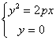

  
母线的方向数为

  
&nbsp;&nbsp; (0,0,1)

  </td>
  <td width=240 valign=top style='width:180.0pt;border:none;padding:0mm 5.4pt 0mm 5.4pt;
  height:189.75pt'>
  
&nbsp; 

  </td>
 </tr>
 <tr style='height:132.65pt'>
  <td width=192 valign=top style='width:144.0pt;border:none;border-bottom:solid windowtext 1.0pt;
  padding:0mm 5.4pt 0mm 5.4pt;height:132.65pt'>
  
[渐近锥面]

  
&nbsp; 二次锥面

  
&nbsp; 

  
为双曲面

  
&nbsp;&nbsp; 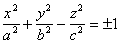

  
的渐近锥面

  </td>
  <td width=192 valign=top style='width:144.0pt;border:solid windowtext 1.0pt;
  border-top:none;padding:0mm 5.4pt 0mm 5.4pt;height:132.65pt'>
  
&nbsp; 

  </td>
  <td width=240 valign=top style='width:180.0pt;border:none;border-bottom:solid windowtext 1.0pt;
  padding:0mm 5.4pt 0mm 5.4pt;height:132.65pt'>
  
&nbsp; 与双曲线的渐近线类似,通过<i>z</i>轴的每个平面与双曲面的交线为一对共轭双曲线,与锥面的交线是两条直线,即这对双曲线的渐近线.

  </td>
 </tr>
</table>

&nbsp;

