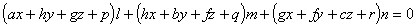

六、&nbsp;&nbsp;&nbsp; 六、一般二次曲面

1. &nbsp;&nbsp;&nbsp;&nbsp;&nbsp;
1. &nbsp;&nbsp;&nbsp; 二次曲面的一般性质

&nbsp;&nbsp;&nbsp; 上面所列举的椭球面、双曲面、抛物面等,它们的方程关于<i>x,y,z</i>都是二次的.关于<i>x,y,z</i>的一般二次方程的形式是

<pre>&nbsp;&nbsp;&nbsp;&nbsp;&nbsp;&nbsp; </pre>

它表示的曲面称为一般二次曲面.这里列举这些曲面的一些共同性质.

&nbsp;&nbsp;&nbsp; [直线与二次曲面的交点] 一直线与一个二次曲面交于两点(实的,虚的,重合的).或者这直线全在曲面上,此时称它为二次曲面的直母线或母线.

&nbsp;&nbsp;&nbsp; [平面与二次曲面的交线] 任一平面与一个二次曲面的交线为一个二次曲线.

&nbsp;&nbsp;&nbsp; [二次曲面的直径平面与中心] 一个二次曲面的平行于已知方向的弦的中点在一个平面上,称为直径平面,它平分某一组平行弦.设已知方向的方向数为<i>l</i>,<i>m</i>,<i>n</i>,则直径平面的方程为

或改写为

当<i>l</i>,<i>m</i>,<i>n</i>变动时,这个方程表示一个平面把,由此二次曲面的直径平面组成一个平面把.把内任一平面都通过下列三个平面的交点:

&nbsp;&nbsp;&nbsp; 如果交点不在曲面上,则称它为二次曲面的中心,如果交点在曲面上,则称它为二次曲面的顶点.凡有中心的二次曲面称为有心二次曲面,其余的都称为无心二次曲面.

&nbsp;&nbsp;&nbsp; [二次曲面的主平面与主轴] 如果直径平面垂直于被它所平分的弦,则称为主平面(对称平面),每个二次曲面至少有一个实主平面,非旋转二次曲面的任两主平面是互相垂直的,它们的交线为主轴.

&nbsp;&nbsp;&nbsp; [二次曲面的切面与法线] 二次曲面在一点<i>M</i>()的切面方程为

&nbsp;&nbsp;&nbsp; 在点<i>M</i>与二次曲面的切面垂直的直线称为曲面在点<i>M</i>的法线,它的方程可写为

&nbsp;&nbsp;&nbsp; [二次曲面的圆截面] 如果一个平面与一个二次曲面的交线为一个圆,则称该平面为曲面的圆截面.

&nbsp;&nbsp;&nbsp; 如果二次曲面不是球面,则通过空间中一点,二次曲面有六个圆截面;其中一般有两个实圆截面,四个虚圆截面;而且六个圆截面中有几个是重合的.

