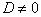
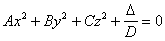
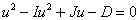
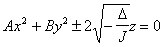
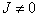
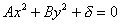
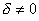
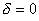
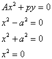

3.3.二次曲面的标准方程及形状

<table class=MsoNormalTable border=1 cellspacing=0 cellpadding=0
 style='border-collapse:collapse;border:none'>
 <tr>
  <td width=163 colspan=3 valign=top style='width:122.4pt;border:none;
  border-top:solid windowtext 1.0pt;padding:0mm 5.4pt 0mm 5.4pt'>
  
不 变 量

  </td>
  <td width=216 valign=top style='width:162.0pt;border-top:solid windowtext 1.0pt;
  border-left:solid windowtext 1.0pt;border-bottom:none;border-right:none;
  padding:0mm 5.4pt 0mm 5.4pt'>
  
坐标变换后的方程

  </td>
  <td width=211 valign=top style='width:158.4pt;border:solid windowtext 1.0pt;
  border-right:none;padding:0mm 5.4pt 0mm 5.4pt'>
  
曲 线 形 状

  </td>
 </tr>
 <tr style='height:20.5pt'>
  <td width=55 rowspan=3 style='width:41.4pt;border:none;border-top:solid windowtext 1.0pt;
  padding:0mm 5.4pt 0mm 5.4pt;height:20.5pt'>
  

  
有心二次曲 面

  </td>
  <td width=108 colspan=2 style='width:81.0pt;border:solid windowtext 1.0pt;
  padding:0mm 5.4pt 0mm 5.4pt;height:20.5pt'>
  
D&gt;0

  </td>
  <td width=216 rowspan=3 style='width:162.0pt;border:none;border-top:solid windowtext 1.0pt;
  padding:0mm 5.4pt 0mm 5.4pt;height:20.5pt'>
  

  
式中<i>A</i>,<i>B</i>,<i>C</i>,为特征方程

  

  
的三个特征根

  </td>
  <td width=211 valign=top style='width:158.4pt;border-top:none;border-left:
  solid windowtext 1.0pt;border-bottom:solid windowtext 1.0pt;border-right:
  none;padding:0mm 5.4pt 0mm 5.4pt;height:20.5pt'>
  
<i>A</i>,<i>B</i>,<i>C</i>,异号时为单叶双曲面

  
<i>A</i>,<i>B</i>,<i>C</i>,同号时无轨迹

  </td>
 </tr>
 <tr style='height:20.5pt'>
  <td width=108 colspan=2 style='width:81.0pt;border:solid windowtext 1.0pt;
  border-top:none;padding:0mm 5.4pt 0mm 5.4pt;height:20.5pt'>
  
D&lt;0

  </td>
  <td width=211 valign=top style='width:158.4pt;border-top:none;border-left:
  solid windowtext 1.0pt;border-bottom:solid windowtext 1.0pt;border-right:
  none;padding:0mm 5.4pt 0mm 5.4pt;height:20.5pt'>
  
<i>A</i>,<i>B</i>,<i>C</i>,
  同号时为椭球面

  
<i>A</i>,<i>B</i>,<i>C</i>,
  异号时为双叶双曲面

  </td>
 </tr>
 <tr style='height:20.5pt'>
  <td width=108 colspan=2 style='width:81.0pt;border:solid windowtext 1.0pt;
  border-top:none;padding:0mm 5.4pt 0mm 5.4pt;height:20.5pt'>
  
D=0

  </td>
  <td width=211 valign=top style='width:158.4pt;border-top:none;border-left:
  solid windowtext 1.0pt;border-bottom:solid windowtext 1.0pt;border-right:
  none;padding:0mm 5.4pt 0mm 5.4pt;height:20.5pt'>
  
<i>A</i>,<i>B</i>,<i>C</i>,同号时无轨迹

  
<i>A</i>,<i>B</i>,<i>C</i>,异号时为二次锥面

  </td>
 </tr>
 <tr>
  <td width=55 rowspan=4 style='width:41.4pt;border-top:solid windowtext 1.0pt;
  border-left:none;border-bottom:solid windowtext 1.0pt;border-right:none;
  padding:0mm 5.4pt 0mm 5.4pt'>
  
<i>D </i>= 0

  
无心二次曲 面

  </td>
  <td width=108 colspan=2 style='width:81.0pt;border:solid windowtext 1.0pt;
  border-top:none;padding:0mm 5.4pt 0mm 5.4pt'>
  
D&lt;0

  </td>
  <td width=216 rowspan=2 style='width:162.0pt;border:none;border-top:solid windowtext 1.0pt;
  padding:0mm 5.4pt 0mm 5.4pt'>
  

  </td>
  <td width=211 valign=top style='width:158.4pt;border-top:none;border-left:
  solid windowtext 1.0pt;border-bottom:solid windowtext 1.0pt;border-right:
  none;padding:0mm 5.4pt 0mm 5.4pt'>
  
椭圆抛物面

  
(<i>A</i>,<i>B</i>都是正的时,根号前取负号;<i> A</i>,<i>B</i>都是负的时,根号前取正号)

  </td>
 </tr>
 <tr>
  <td width=108 colspan=2 valign=top style='width:81.0pt;border:solid windowtext 1.0pt;
  border-top:none;padding:0mm 5.4pt 0mm 5.4pt'>
  
D&gt;0

  </td>
  <td width=211 valign=top style='width:158.4pt;border-top:none;border-left:
  solid windowtext 1.0pt;border-bottom:solid windowtext 1.0pt;border-right:
  none;padding:0mm 5.4pt 0mm 5.4pt'>
  
双曲抛物面

  </td>
 </tr>
 <tr style='height:40.55pt'>
  <td width=48 rowspan=2 style='width:36.0pt;border:solid windowtext 1.0pt;
  border-top:none;padding:0mm 5.4pt 0mm 5.4pt;height:40.55pt'>
  
D=0

  </td>
  <td width=60 style='width:45.0pt;border-top:none;border-left:none;border-bottom:
  solid windowtext 1.0pt;border-right:solid windowtext 1.0pt;padding:0mm 5.4pt 0mm 5.4pt;
  height:40.55pt'>
  

  </td>
  <td width=216 style='width:162.0pt;border-top:solid windowtext 1.0pt;
  border-left:none;border-bottom:solid windowtext 1.0pt;border-right:none;
  padding:0mm 5.4pt 0mm 5.4pt;height:40.55pt'>
  

  </td>
  <td width=211 valign=top style='width:158.4pt;border-top:none;border-left:
  solid windowtext 1.0pt;border-bottom:solid windowtext 1.0pt;border-right:
  none;padding:0mm 5.4pt 0mm 5.4pt;height:40.55pt'>
  
:<i> A</i>,<i>B</i>,<i>C</i>,同号时为椭圆柱面或无轨迹,<i>
  A</i>,<i>B</i>,异号时为双曲柱面

  
:<i> A</i>,<i>B</i>,<i>C</i>,异号时为一对相交平面.

  
<i>A</i>,<i>B</i>同号时无轨迹

  </td>
 </tr>
 <tr style='height:55.6pt'>
  <td width=60 style='width:45.0pt;border-top:none;border-left:none;border-bottom:
  solid windowtext 1.0pt;border-right:solid windowtext 1.0pt;padding:0mm 5.4pt 0mm 5.4pt;
  height:55.6pt'>
  
<i>J </i>= 0

  </td>
  <td width=216 style='width:162.0pt;border:none;border-bottom:solid windowtext 1.0pt;
  padding:0mm 5.4pt 0mm 5.4pt;height:55.6pt'>
  

  </td>
  <td width=211 style='width:158.4pt;border-top:none;border-left:solid windowtext 1.0pt;
  border-bottom:solid windowtext 1.0pt;border-right:none;padding:0mm 5.4pt 0mm 5.4pt;
  height:55.6pt'>
  
抛物柱面

  
一对平行平面

  
无轨迹

  
一对重合平面

  </td>
 </tr>
</table>

&nbsp;

