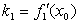
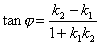
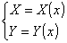
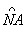

<b>§</b><b>7&nbsp; </b><b>平面曲线</b>

&nbsp;&nbsp;&nbsp; [曲线方程与正方向]

<table class=MsoNormalTable border=0 cellspacing=0 cellpadding=0
 style='border-collapse:collapse'>
 <tr>
  <td width=280 valign=top style='width:210.0pt;border-top:solid windowtext 1.0pt;
  border-left:none;border-bottom:none;border-right:solid windowtext 1.0pt;
  padding:0mm 5.4pt 0mm 5.4pt'>
  
曲线方程的形式

  </td>
  <td width=344 valign=top style='width:258.0pt;border:none;border-top:solid windowtext 1.0pt;
  padding:0mm 5.4pt 0mm 5.4pt'>
  
曲线的正向

  </td>
 </tr>
 <tr>
  <td width=280 valign=top style='width:210.0pt;border-top:solid windowtext 1.0pt;
  border-left:none;border-bottom:solid windowtext 1.0pt;border-right:none;
  padding:0mm 5.4pt 0mm 5.4pt'>
  
直角坐标系

  
&nbsp; 隐&nbsp; 式&nbsp; <i>F</i>(<i>x</i>,<i>y</i>)
  = 0

  
&nbsp; 显&nbsp; 式&nbsp; <i>y</i>
  = <i>f</i>(<i>x</i>)&nbsp; 

  
&nbsp; 参数式 &nbsp;或 

  
&nbsp; (<i>t</i>为任意参数,<i>s</i>为曲线的弧长)

  
极坐标系

  
<i>&nbsp;&nbsp;&nbsp;&nbsp;&nbsp;&nbsp;&nbsp;&nbsp;&nbsp;&nbsp;
  </i><i>r </i>= <i>r</i>(<i>j</i>)

  </td>
  <td width=344 valign=top style='width:258.0pt;border:solid windowtext 1.0pt;
  border-right:none;padding:0mm 5.4pt 0mm 5.4pt'>
  
&nbsp; <i>x</i>增加时,曲线上一点的运动方向

  
&nbsp; <i>t</i>或<i>s</i>增加时,曲线上一点的运动方向

  
&nbsp; <i>j</i>增加(即逆时针方向)时,曲线上一点运动方向

  </td>
 </tr>
</table>

[曲线的切线与法线] 当曲线上的点<i>Q</i>趋于<i>M</i>时,割线<i>MQ</i>的极限位置称为曲线在点<i>M</i>处的切线,通过点<i>M</i>并垂直于切线的直线称为法线.切线的正向就是曲线在切点处的正向,法线的正向就是切线的正向按逆时针方向旋转90°而得到的方向.

&nbsp;&nbsp;&nbsp; [曲线的切矩、法矩、次切矩、次法矩与切线倾斜度公式]

<table class=MsoNormalTable border=0 cellspacing=0 cellpadding=0
 style='border-collapse:collapse'>
 <tr>
  <td width=112 valign=top style='width:84.0pt;border-top:solid windowtext 1.0pt;
  border-left:none;border-bottom:none;border-right:solid windowtext 1.0pt;
  padding:0mm 5.4pt 0mm 5.4pt'>
  
&nbsp; 

  </td>
  <td width=240 valign=top style='width:180.0pt;border-top:solid windowtext 1.0pt;
  border-left:none;border-bottom:none;border-right:solid windowtext 1.0pt;
  padding:0mm 5.4pt 0mm 5.4pt'>
  
直角坐标系

  </td>
  <td width=272 valign=top style='width:204.0pt;border:none;border-top:solid windowtext 1.0pt;
  padding:0mm 5.4pt 0mm 5.4pt'>
  
极坐标系

  </td>
 </tr>
 <tr>
  <td width=112 valign=top style='width:84.0pt;border-top:solid windowtext 1.0pt;
  border-left:none;border-bottom:none;border-right:solid windowtext 1.0pt;
  padding:0mm 5.4pt 0mm 5.4pt'>
  
图&nbsp; 形

  </td>
  <td width=240 valign=top style='width:180.0pt;border-top:solid windowtext 1.0pt;
  border-left:none;border-bottom:none;border-right:solid windowtext 1.0pt;
  padding:0mm 5.4pt 0mm 5.4pt'>
  

  </td>
  <td width=272 valign=top style='width:204.0pt;border:none;border-top:solid windowtext 1.0pt;
  padding:0mm 5.4pt 0mm 5.4pt'>
  

  </td>
 </tr>
 <tr>
  <td width=112 valign=top style='width:84.0pt;border:none;border-right:solid windowtext 1.0pt;
  padding:0mm 5.4pt 0mm 5.4pt'>
  
切&nbsp; 距

  </td>
  <td width=240 valign=top style='width:180.0pt;border:none;border-right:solid windowtext 1.0pt;
  padding:0mm 5.4pt 0mm 5.4pt'>
  

  </td>
  <td width=272 valign=top style='width:204.0pt;padding:0mm 5.4pt 0mm 5.4pt'>
  

  </td>
 </tr>
 <tr>
  <td width=112 valign=top style='width:84.0pt;border:none;border-right:solid windowtext 1.0pt;
  padding:0mm 5.4pt 0mm 5.4pt'>
  
法&nbsp; 距

  </td>
  <td width=240 valign=top style='width:180.0pt;border:none;border-right:solid windowtext 1.0pt;
  padding:0mm 5.4pt 0mm 5.4pt'>
  

  </td>
  <td width=272 valign=top style='width:204.0pt;padding:0mm 5.4pt 0mm 5.4pt'>
  

  </td>
 </tr>
 <tr>
  <td width=112 valign=top style='width:84.0pt;border:none;border-right:solid windowtext 1.0pt;
  padding:0mm 5.4pt 0mm 5.4pt'>
  
次切距

  </td>
  <td width=240 valign=top style='width:180.0pt;border:none;border-right:solid windowtext 1.0pt;
  padding:0mm 5.4pt 0mm 5.4pt'>
  

  </td>
  <td width=272 valign=top style='width:204.0pt;padding:0mm 5.4pt 0mm 5.4pt'>
  

  </td>
 </tr>
 <tr>
  <td width=112 valign=top style='width:84.0pt;border:none;border-right:solid windowtext 1.0pt;
  padding:0mm 5.4pt 0mm 5.4pt'>
  
次法距

  </td>
  <td width=240 valign=top style='width:180.0pt;border:none;border-right:solid windowtext 1.0pt;
  padding:0mm 5.4pt 0mm 5.4pt'>
  

  </td>
  <td width=272 valign=top style='width:204.0pt;padding:0mm 5.4pt 0mm 5.4pt'>
  

  </td>
 </tr>
 <tr>
  <td width=112 valign=top style='width:84.0pt;border-top:none;border-left:
  none;border-bottom:solid windowtext 1.0pt;border-right:solid windowtext 1.0pt;
  padding:0mm 5.4pt 0mm 5.4pt'>
  
切线倾斜度

  </td>
  <td width=240 valign=top style='width:180.0pt;border-top:none;border-left:
  none;border-bottom:solid windowtext 1.0pt;border-right:solid windowtext 1.0pt;
  padding:0mm 5.4pt 0mm 5.4pt'>
  
tan <i>a</i> 

  </td>
  <td width=272 valign=top style='width:204.0pt;border:none;border-bottom:solid windowtext 1.0pt;
  padding:0mm 5.4pt 0mm 5.4pt'>
  

  </td>
 </tr>
</table>

表中.对于参数表达的曲线,表中

.

&nbsp; [曲线的切线方程与法线方程]

<table class=MsoNormalTable border=0 cellspacing=0 cellpadding=0
 style='border-collapse:collapse'>
 <tr>
  <td width=88 valign=top style='width:66.0pt;border-top:solid windowtext 1.0pt;
  border-left:none;border-bottom:solid windowtext 1.0pt;border-right:none;
  padding:0mm 5.4pt 0mm 5.4pt'>
  
曲线方程

  </td>
  <td width=240 valign=top style='width:180.0pt;border:solid windowtext 1.0pt;
  padding:0mm 5.4pt 0mm 5.4pt'>
  
切线方程(<i>MT</i>)

  </td>
  <td width=296 valign=top style='width:222.0pt;border-top:solid windowtext 1.0pt;
  border-left:none;border-bottom:solid windowtext 1.0pt;border-right:none;
  padding:0mm 5.4pt 0mm 5.4pt'>
  
法线方程(<i>MN</i>)

  </td>
 </tr>
 <tr>
  <td width=88 style='width:66.0pt;padding:0mm 5.4pt 0mm 5.4pt'>
  
<i>F</i>(<i>x</i>,<i>y</i>)
  = 0

  </td>
  <td width=240 style='width:180.0pt;border-top:none;border-left:solid windowtext 1.0pt;
  border-bottom:none;border-right:solid windowtext 1.0pt;padding:0mm 5.4pt 0mm 5.4pt'>
  

  </td>
  <td width=296 style='width:222.0pt;padding:0mm 5.4pt 0mm 5.4pt'>
  

  </td>
 </tr>
 <tr>
  <td width=88 style='width:66.0pt;padding:0mm 5.4pt 0mm 5.4pt'>
  
<i>y</i> = <i>f</i>(<i>x</i>)

  </td>
  <td width=240 style='width:180.0pt;border-top:none;border-left:solid windowtext 1.0pt;
  border-bottom:none;border-right:solid windowtext 1.0pt;padding:0mm 5.4pt 0mm 5.4pt'>
  

  </td>
  <td width=296 style='width:222.0pt;padding:0mm 5.4pt 0mm 5.4pt'>
  

  </td>
 </tr>
 <tr>
  <td width=88 style='width:66.0pt;padding:0mm 5.4pt 0mm 5.4pt'>
  

  </td>
  <td width=240 style='width:180.0pt;border-top:none;border-left:solid windowtext 1.0pt;
  border-bottom:none;border-right:solid windowtext 1.0pt;padding:0mm 5.4pt 0mm 5.4pt'>
  

  </td>
  <td width=296 style='width:222.0pt;padding:0mm 5.4pt 0mm 5.4pt'>
  

  </td>
 </tr>
 <tr>
  <td width=88 style='width:66.0pt;border:none;border-bottom:solid windowtext 1.0pt;
  padding:0mm 5.4pt 0mm 5.4pt'>
  
<i>r</i> = <i>r</i>(<i>j</i>)

  </td>
  <td width=240 style='width:180.0pt;border:solid windowtext 1.0pt;border-top:
  none;padding:0mm 5.4pt 0mm 5.4pt'>
  

  </td>
  <td width=296 style='width:222.0pt;border:none;border-bottom:solid windowtext 1.0pt;
  padding:0mm 5.4pt 0mm 5.4pt'>
  

  </td>
 </tr>
</table>

<table cellspacing=0 cellpadding=0 hspace=0 vspace=0 align=left>
 <tr>
  <td valign=top align=left style='padding-top:0mm;padding-right:9.0pt;
  padding-bottom:0mm;padding-left:9.0pt'>
  

  

  
图 7.14

  

  </td>
 </tr>
</table>

&nbsp;&nbsp;&nbsp; 表中分别表示在点的值,同前.

&nbsp;&nbsp;&nbsp; [曲线的夹角]&nbsp; 两条相交于点的曲线和在交点的切线斜率分别为和,其夹角<i>j</i>称为两条曲线的夹角(图7.14),且

<pre>&nbsp;&nbsp;&nbsp;&nbsp;&nbsp;&nbsp;&nbsp;&nbsp;&nbsp;&nbsp; </pre>

&nbsp;&nbsp;&nbsp; [弧的微分]

<table class=MsoNormalTable border=0 cellspacing=0 cellpadding=0
 style='border-collapse:collapse'>
 <tr>
  <td width=280 colspan=2 valign=top style='width:210.0pt;border:solid windowtext 1.0pt;
  border-left:none;padding:0mm 5.4pt 0mm 5.4pt'>
  
曲线方程与图形

  </td>
  <td width=344 colspan=2 valign=top style='width:258.0pt;border:none;
  border-top:solid windowtext 1.0pt;padding:0mm 5.4pt 0mm 5.4pt'>
  
弧的微分d<i>s</i>

  </td>
 </tr>
 <tr>
  <td width=85 valign=top style='width:63.75pt;border:none;border-bottom:solid windowtext 1.0pt;
  padding:0mm 5.4pt 0mm 5.4pt'>
  
<i>&nbsp; y</i> =
  <i>f</i>(<i>x</i>) 

  
<i>&nbsp;</i><i>r</i> = <i>r</i>(<i>j</i>)

  </td>
  <td width=195 valign=top style='width:146.25pt;border-top:none;border-left:
  none;border-bottom:solid windowtext 1.0pt;border-right:solid windowtext 1.0pt;
  padding:0mm 5.4pt 0mm 5.4pt'>
  
&nbsp;

  </td>
  <td width=113 valign=top style='width:84.8pt;border-top:solid windowtext 1.0pt;
  border-left:none;border-bottom:solid windowtext 1.0pt;border-right:none;
  padding:0mm 5.4pt 0mm 5.4pt'>
  
&nbsp; 

  
&nbsp; 

  

  </td>
  <td width=231 valign=top style='width:173.2pt;border:none;border-bottom:solid windowtext 1.0pt;
  padding:0mm 5.4pt 0mm 5.4pt'>
  

  </td>
 </tr>
 <tr>
  <td width=85 style='width:63.75pt;padding:0mm 5.4pt 0mm 5.4pt'>
  
&nbsp;

  </td>
  <td width=195 style='width:146.25pt;padding:0mm 5.4pt 0mm 5.4pt'>
  
&nbsp;

  </td>
  <td width=113 style='width:84.75pt;padding:0mm 5.4pt 0mm 5.4pt'>
  
&nbsp;

  </td>
  <td width=231 style='width:173.25pt;padding:0mm 5.4pt 0mm 5.4pt'>
  
&nbsp;

  </td>
 </tr>
</table>

<table cellspacing=0 cellpadding=0 hspace=0 vspace=0 align=left>
 <tr>
  <td valign=top align=left style='padding-top:0mm;padding-right:9.0pt;
  padding-bottom:0mm;padding-left:9.0pt'>
  

  

  
图 7.15

  

  </td>
 </tr>
</table>

[曲率、曲率半径、曲率圆(或密切圆)与曲率中心的定义]&nbsp;
曲线上两点<i>M</i>和<i>Q</i>的切线正向的夹角<i>d</i>与弧长之比,当<i>Q</i>趋于<i>M</i>时的极限,即

<pre>&nbsp;&nbsp;&nbsp;&nbsp;&nbsp;&nbsp;&nbsp;&nbsp;&nbsp;&nbsp; </pre>

称为曲线在点<i>M</i>的曲率,也就是切线的方向角对于弧长的转动率.当<i>k</i>&gt;0时,表明曲线凹向朝法线的正向;当<i>k</i>&lt;0时, 表明曲线凹向朝法线的负向(图7.15).

<pre>&nbsp;&nbsp;&nbsp;&nbsp;&nbsp;&nbsp;&nbsp;&nbsp;&nbsp;&nbsp;&nbsp;&nbsp;&nbsp;&nbsp;&nbsp;&nbsp;&nbsp;&nbsp;&nbsp;&nbsp;&nbsp; </pre>

称为曲线在点<i>M</i>的曲率半径.在曲线凹向的法线上截,则称<i>C</i>为曲线在点<i>M</i>的曲率中心,以<i>C</i>为圆心,<i>R</i>为半径的圆称为曲线在点<i>M</i>的曲率圆,又称为密切圆.<i>C</i>点的坐标为

[曲率半径与曲率中心坐标的计算公式] 设<i>R</i>为曲率半径,()为曲率中心的坐标,则有

1°曲线方程为<i>F</i>(<i>x</i>,<i>y</i>) = 0时

&nbsp;&nbsp;&nbsp;&nbsp;&nbsp;&nbsp; 

2° 曲线方程为<i>y</i> = <i>f </i>(<i>x</i>)时

&nbsp;&nbsp;&nbsp;&nbsp;&nbsp; 

3° 曲线方程为时

<pre style='line-height:200%'>&nbsp;&nbsp;&nbsp;&nbsp;&nbsp;&nbsp;&nbsp;&nbsp;&nbsp;&nbsp;&nbsp;&nbsp;&nbsp;&nbsp;&nbsp;&nbsp;&nbsp;&nbsp;&nbsp;&nbsp;&nbsp;&nbsp;&nbsp;&nbsp;&nbsp;&nbsp;&nbsp;&nbsp;&nbsp;&nbsp; </pre><pre style='line-height:200%'>&nbsp;&nbsp;&nbsp;&nbsp;&nbsp;&nbsp;&nbsp;&nbsp;&nbsp;&nbsp;&nbsp;&nbsp;&nbsp;&nbsp;&nbsp;&nbsp;&nbsp;</pre>

4° 曲线方程为时

<pre style='line-height:200%'>&nbsp;&nbsp;&nbsp;&nbsp;&nbsp;&nbsp;&nbsp;&nbsp;&nbsp;&nbsp;&nbsp;&nbsp;&nbsp;&nbsp;&nbsp;&nbsp;&nbsp;&nbsp;&nbsp;&nbsp;&nbsp;&nbsp;&nbsp;&nbsp;&nbsp;&nbsp;&nbsp;&nbsp;&nbsp;&nbsp; </pre><pre style='line-height:200%'>&nbsp;&nbsp;&nbsp;&nbsp;&nbsp;&nbsp;&nbsp;&nbsp;&nbsp;&nbsp;&nbsp;&nbsp;&nbsp;&nbsp;&nbsp;&nbsp;&nbsp;&nbsp;&nbsp;</pre><pre style='line-height:200%'>&nbsp;&nbsp;&nbsp;&nbsp;&nbsp;&nbsp;&nbsp;&nbsp;&nbsp;&nbsp;&nbsp;&nbsp;&nbsp;&nbsp;&nbsp;&nbsp;&nbsp;&nbsp;&nbsp;</pre>

[等距线、渐屈线、渐开线与包络线] 

<table class=MsoNormalTable border=1 cellspacing=0 cellpadding=0
 style='border-collapse:collapse;border:none'>
 <tr>
  <td width=289 style='width:216.8pt;border:solid windowtext 1.0pt;border-left:
  none;padding:0mm 5.4pt 0mm 5.4pt'>
  
定 义 与 图 形

  </td>
  <td width=311 style='width:233.2pt;border-top:solid windowtext 1.0pt;
  border-left:none;border-bottom:solid windowtext 1.0pt;border-right:none;
  padding:0mm 5.4pt 0mm 5.4pt'>
  
方程与说明(<i>G</i> : <i>y</i>
  = <i>f </i>(<i>x</i>))

  </td>
 </tr>
 <tr style='height:15.75pt'>
  <td width=289 valign=top style='width:216.8pt;border-top:none;border-left:
  none;border-bottom:solid windowtext 1.0pt;border-right:solid windowtext 1.0pt;
  padding:0mm 5.4pt 0mm 5.4pt;height:15.75pt'>
  
&nbsp; 等距线&nbsp; 曲线<i>G</i> 上的每点沿<i>G</i> 在该点法线的一定方向(正负两个方向)移动等距离<i>a</i>得到新的点,这些点的轨迹(和)称为曲线<i>G</i> 的等距线

  

  
&nbsp; 渐屈线&nbsp; 曲线<i>G</i> 上的每点的曲率中心的轨迹<i>C</i>称为曲线<i>G</i> 的渐屈线，也称为曲线<i>G </i>的法包线(即曲线的法线的包络线)

  
&nbsp; 

  
&nbsp; 渐开线&nbsp; 曲线<i>G</i> 对它的渐屈线<i>C</i>而言,就是渐开线(或称渐伸线) 

  
&nbsp;&nbsp;&nbsp;&nbsp;&nbsp;&nbsp;&nbsp;&nbsp;
  定 义 与 图 形

  </td>
  <td width=311 valign=top style='width:233.2pt;border:none;border-bottom:solid windowtext 1.0pt;
  padding:0mm 5.4pt 0mm 5.4pt;height:15.75pt'>
  
&nbsp; 

  
式中正负号上边对应于,下边对应于.这个方程是以<i>x</i>为参数的参数方程.

  
&nbsp; 如果<i>G </i>为参数式方程

  
&nbsp;&nbsp;&nbsp;&nbsp; 

  
则有以<i>t</i>为参数的方程

  
&nbsp; 

  
&nbsp; 

  
&nbsp; 这个方程是以<i>x</i>为参数的参数方程.其他形式表达的曲线<i>G</i> 的渐屈线的方程参见曲率中心的公式

  
&nbsp; 设<i>C</i>的方程为<i>y</i> = <i>f </i>(<i>x</i>),则<i>G</i>&nbsp; <i>Y</i> = <i>Y</i> (<i>x</i>)或

  
&nbsp; &nbsp;&nbsp;(<i>x</i>为参数)

  
它是微分方程组

  
&nbsp; 

  
的解,式中

  
&nbsp;&nbsp;&nbsp;&nbsp; 方程与说明(<i>G</i> : <i>y</i>
  = <i>f </i>(<i>x</i>))

  </td>
 </tr>
 <tr style='height:414.0pt'>
  <td width=289 valign=top style='width:216.8pt;border-top:none;border-left:
  none;border-bottom:solid windowtext 1.0pt;border-right:solid windowtext 1.0pt;
  padding:0mm 5.4pt 0mm 5.4pt;height:414.0pt'>
  

  
&nbsp; 渐开线的性质

  
&nbsp; 1° 渐开线<i>G</i> 上任一点的法线与曲线<i>C</i>相切

  
&nbsp; 2° 渐开线上两点的曲率半径的改变量等于相对应的曲线弧长,即

  
&nbsp; 3° 渐开线的等距线是和它一样的渐开线,它们仅仅是起点不同.

  
&nbsp; 包络线&nbsp; 与曲线族所有曲线都相切的曲线称为该曲线族的包络线

  
&nbsp;&nbsp;&nbsp;&nbsp;&nbsp; 

  </td>
  <td width=311 valign=top style='width:233.2pt;border:none;border-bottom:solid windowtext 1.0pt;
  padding:0mm 5.4pt 0mm 5.4pt;height:414.0pt'>
  
&nbsp; 其他形式表达的曲线的渐开线方程可由表示曲率中心的坐标的微分方程组而解出

  
隐式(l为参数)

  
显式(l为参数)

  
参数式(l为参数)

  
&nbsp; 消去<i>l</i>得到不同形式的方程,它们所表示的曲线称为判别曲线,包含包络线与由奇点组成的曲线(例如,曲线族<i>F</i>(<i>x</i>,<i>y</i>,<i>l</i>)=0上的点满足的轨迹为由奇点组成的曲线).所以若曲线族<i>F</i> = 0都无奇点,则判别曲线即是包络线

  </td>
 </tr>
</table>

<table cellspacing=0 cellpadding=0 hspace=0 vspace=0>
 <tr>
  <td valign=top align=left style='padding-top:0mm;padding-right:9.05pt;
  padding-bottom:0mm;padding-left:9.05pt'>
  

  

  
&nbsp;&nbsp;&nbsp;&nbsp;&nbsp;&nbsp;&nbsp;&nbsp;&nbsp;
  （<i>b</i>）

  

  </td>
 </tr>
</table>

 

 

<table cellspacing=0 cellpadding=0 hspace=0 vspace=0 align=left>
 <tr>
  <td valign=top align=left style='padding-top:0mm;padding-right:9.05pt;
  padding-bottom:0mm;padding-left:9.05pt'>
  

  

  
&nbsp;&nbsp;&nbsp;&nbsp;&nbsp;&nbsp;
  (<i>a</i>)

  

  </td>
 </tr>
</table>

例&nbsp; 在圆盘周围绕上一根不会伸缩的细线,线端栓一支铅笔,拉紧线端<i>A</i>逐渐拉开,铅笔尖在纸上画出来的曲线就是圆的渐开线.这个圆称为渐开线的基圆.细线称为渐开线的发生线(图7.16(<i>a</i>) ).

现在来寻求渐开线的方程.设基圆的圆心是<i>O</i>,半径是<i>a</i>.开始画时,发生线的外端在<i>A</i>点,取<i>OA</i>为<i>x</i>轴(极轴),如图7.16(<i>b</i>).再设线外端<i>P</i>的坐标为(<i>x</i>,<i>y</i>)或(<i>r</i>,<i>j</i>),因为发生线原来对着圆心角为<i>a</i> +<i>j </i>(<i>a</i> =&ETH;<i>PON</i>,在齿轮设计中,通称为压力角)的一段弧,展开成为切线<i>NP</i>,所以切线<i>NP</i>的长是<i>a</i>(<i>a</i> + <i>j</i> ),从直角三角形<i>ONP</i>得:<i>OP</i>=,又因= <i>a </i>+ <i>j</i>,由此得到圆的渐开线方程

式中<i>a</i>是依赖于极角<i>j</i>的,这个关系决定于<i> </i>,把上式写为极坐标方程

&nbsp;&nbsp; (<i>a </i>单位为弧度)

设<i>t</i> = <i>a</i> + <i>j</i>,可得直角坐标参数方程

&nbsp; (<i>a</i> 为基圆半径)

&nbsp;&nbsp;&nbsp;&nbsp;&nbsp;&nbsp; [雪列-弗莱纳公式]

式中<b><i>t</i></b>和<b><i>n</i></b>分别为曲线的切线和法线的单位矢量，<i>s</i>为弧长，<i>R</i>为曲率半径.

&nbsp;&nbsp;&nbsp;&nbsp;&nbsp;&nbsp; [基本定理与自然方程]&nbsp;&nbsp;&nbsp; 在闭区间[<i>a</i>,<i>b</i>]上给定一个连续函数<i>k</i>（<i>s</i>），则除了在平面上的位置差别外，唯一地存在一条平面曲线，以<i>s</i>为弧长，<i>k</i>（<i>s</i>）为曲率.<i>k</i> = <i>k</i>（<i>s</i>）称为曲线的自然方程.

&nbsp;&nbsp;&nbsp;&nbsp;&nbsp;&nbsp; [两条平面曲线构成<i>n</i>阶接触的概念与条件]

<table cellspacing=0 cellpadding=0 hspace=0 vspace=0 align=left>
 <tr>
  <td valign=top align=left style='padding-top:0mm;padding-right:9.05pt;
  padding-bottom:0mm;padding-left:9.05pt'>
  

  

  
&nbsp;&nbsp;&nbsp;&nbsp;&nbsp;&nbsp; 图&nbsp; 7.17

  

  </td>
 </tr>
</table>

&nbsp;&nbsp;&nbsp;&nbsp;&nbsp;&nbsp; 设两条曲线<i>C</i>1和<i>C</i>2有一共同点<i>O</i>，在<i>C</i>2上取一点<i>M</i>，从<i>M</i>到<i>C</i>1的距离设为<i>h</i>，以<i>d</i>表示<i>M</i>到<i>O</i>的距离（图7.17），如果

<pre>&nbsp;&nbsp;&nbsp;&nbsp;&nbsp;&nbsp;&nbsp;&nbsp;&nbsp;&nbsp;&nbsp;&nbsp;&nbsp;&nbsp;&nbsp;&nbsp;&nbsp;&nbsp;&nbsp;&nbsp;&nbsp;&nbsp; </pre>

则称两条曲线<i>C</i>1与<i>C</i>2在点<i>O</i>构成<i>n</i>阶接触.

&nbsp;&nbsp;&nbsp;&nbsp;&nbsp;&nbsp; 检验两条平面曲线构成<i>n</i>阶接触的准则：

&nbsp;&nbsp;&nbsp;&nbsp;&nbsp;&nbsp; 1°&nbsp;&nbsp; 设曲线<i>C</i>1的方程为<i>F</i>（<i>x</i>,<i>y</i>）=0，曲线<i>C</i>2的方程为<i>x </i>= <i>x</i>(<i>t</i>)，<i>y </i>= <i>y</i>(<i>t</i>)，并设在点<i>t </i>= <i>t</i>0（即<i>O</i>（<i>x</i>0,<i>y</i>0））处，则两条曲线C1与<i>C</i>2在点<i>O</i>构成<i>n</i>阶接触的充分必要条件是：

式中，表示<i>j</i>（<i>t</i>）<i>n</i>阶导数.

&nbsp;&nbsp;&nbsp;&nbsp;&nbsp;&nbsp; 从此还可推出下面的检验准则：

&nbsp;&nbsp;&nbsp;&nbsp;&nbsp;&nbsp; 2°&nbsp;&nbsp; 假定<i>C</i>1:<i>F</i>(<i>x</i>, <i>y</i>) = 0是一条代数曲线（即<i>F</i>(<i>x</i>, <i>y</i>)是关于<i>x</i>和<i>y</i>的多项式），<i>C</i>2在原点(0,0) 的展开式为

则和在原点构成阶接触的充分必要条件是：把的展开式代进后，关于的乘幂，的系数都等于零.

