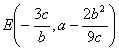
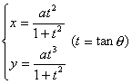
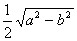
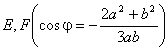
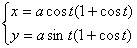
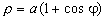
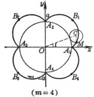
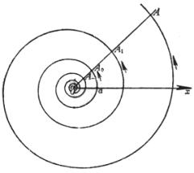
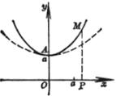

<b>§8&nbsp; </b><b>重要平面曲线表</b>

[三次曲线]

<table class=MsoNormalTable border=1 cellspacing=0 cellpadding=0
 style='border-collapse:collapse;border:none'>
 <tr style='height:7.0pt'>
  <td width=368 valign=top style='width:276.0pt;border:solid windowtext 1.0pt;
  border-left:none;padding:0mm 5.4pt 0mm 5.4pt;height:7.0pt'>
  
方&nbsp; 程&nbsp; 与&nbsp; 图&nbsp; 形

  </td>
  <td width=272 valign=top style='width:204.0pt;border-top:solid windowtext 1.0pt;
  border-left:none;border-bottom:solid windowtext 1.0pt;border-right:none;
  padding:0mm 5.4pt 0mm 5.4pt;height:7.0pt'>
  
特&nbsp;&nbsp; 征

  </td>
 </tr>
 <tr style='height:639.0pt'>
  <td width=368 valign=top style='width:276.0pt;border-top:none;border-left:
  none;border-bottom:solid windowtext 1.0pt;border-right:solid windowtext 1.0pt;
  padding:0mm 5.4pt 0mm 5.4pt;height:639.0pt'>
  
&nbsp; 

  
&nbsp; &nbsp;&nbsp;&nbsp;&nbsp;&nbsp;&nbsp;

  
&nbsp; &nbsp;

  
&nbsp; 

  
&nbsp;&nbsp; 

  
&nbsp;&nbsp;&nbsp; (<i>a </i>&gt;0 , <i>b</i>&lt;0
  ,Δ&gt;0)&nbsp;&nbsp;&nbsp;&nbsp;&nbsp;&nbsp; (<i>a </i>&gt;0 , <i>b</i>&lt;0
  ,Δ=0)

  
&nbsp;&nbsp;&nbsp;&nbsp;&nbsp;&nbsp;&nbsp;&nbsp;&nbsp;
  (<i>a</i>)&nbsp;&nbsp;&nbsp;&nbsp;&nbsp;&nbsp;&nbsp;&nbsp;&nbsp;&nbsp;&nbsp;&nbsp;
  &nbsp;&nbsp;&nbsp;&nbsp;&nbsp;&nbsp;(<i>b</i>)

  
&nbsp;&nbsp;&nbsp;&nbsp;&nbsp;&nbsp; 

  
&nbsp; 这些曲线都是关于直线对称的

  </td>
  <td width=272 valign=top style='width:204.0pt;border:none;border-bottom:solid windowtext 1.0pt;
  padding:0mm 5.4pt 0mm 5.4pt;height:639.0pt'>
  
曲线由两支组成

  
渐近线<i>y</i> = <i>a</i>与<i>x</i> = 0

  
曲线与<i>y</i> = <i>a</i>的交点

  
&nbsp;&nbsp;&nbsp;&nbsp;&nbsp;&nbsp;&nbsp;&nbsp;&nbsp;&nbsp;&nbsp;&nbsp;&nbsp; 

  
曲线与<i>x</i>轴的交点

  
&nbsp;&nbsp;&nbsp;&nbsp;&nbsp;&nbsp; 

  
极值点&nbsp; 

  
拐&nbsp; 点&nbsp; 

  
( <i>a </i>)

  
不连续点&nbsp; 

  
极 大 点&nbsp; 

  
渐 近 线&nbsp;&nbsp;&nbsp;&nbsp;&nbsp;&nbsp;&nbsp;&nbsp;&nbsp;&nbsp;&nbsp;&nbsp;&nbsp;&nbsp;
  

  
&nbsp;&nbsp;&nbsp;&nbsp;&nbsp;&nbsp;&nbsp;
  与

  
（<i>b</i>）

  
不连续点&nbsp;&nbsp;&nbsp;&nbsp; 

  
渐 近 线&nbsp;&nbsp;&nbsp;&nbsp;&nbsp;&nbsp; 

  
（<i>c</i>）

  
极 大 点&nbsp;&nbsp;&nbsp;&nbsp;&nbsp;&nbsp; 

  
拐&nbsp;&nbsp;&nbsp; 点&nbsp; 

  
&nbsp;&nbsp;&nbsp; 

  
在这两点的斜率分别为&nbsp;&nbsp;&nbsp;&nbsp;&nbsp;&nbsp;&nbsp;&nbsp; 

  
渐 近 线&nbsp;&nbsp;&nbsp;&nbsp;&nbsp;&nbsp; <i>y</i> = 0

  </td>
 </tr>
 <tr style='height:15.0pt'>
  <td width=368 valign=top style='width:276.0pt;border-top:none;border-left:
  none;border-bottom:solid windowtext 1.0pt;border-right:solid windowtext 1.0pt;
  padding:0mm 5.4pt 0mm 5.4pt;height:15.0pt'>
  
&nbsp;&nbsp;&nbsp;&nbsp;&nbsp;&nbsp;&nbsp;&nbsp;&nbsp;&nbsp;&nbsp;&nbsp;
  方&nbsp; 程&nbsp; 与&nbsp; 图&nbsp; 形

  </td>
  <td width=272 valign=top style='width:204.0pt;border:none;border-bottom:solid windowtext 1.0pt;
  padding:0mm 5.4pt 0mm 5.4pt;height:15.0pt'>
  
&nbsp;&nbsp;&nbsp;&nbsp;&nbsp;&nbsp;&nbsp;&nbsp;&nbsp;
  特&nbsp;&nbsp;&nbsp; 征

  </td>
 </tr>
 <tr style='height:725.25pt'>
  <td width=368 valign=top style='width:276.0pt;border-top:none;border-left:
  none;border-bottom:solid windowtext 1.0pt;border-right:solid windowtext 1.0pt;
  padding:0mm 5.4pt 0mm 5.4pt;height:725.25pt'>
  
&nbsp; 

  
&nbsp;&nbsp;&nbsp;&nbsp;&nbsp;&nbsp;&nbsp;&nbsp;
  

  
&nbsp;

  
&nbsp;

  
&nbsp;&nbsp;&nbsp;&nbsp; 

  
[注]  a, b为方程的两个根，并设

  </td>
  <td width=272 valign=top style='width:204.0pt;border:none;border-bottom:solid windowtext 1.0pt;
  padding:0mm 5.4pt 0mm 5.4pt;height:725.25pt'>
  
（<i>a</i>）

  
不连续点&nbsp;&nbsp;&nbsp;&nbsp; <i>x</i> = <i>a</i>，<i>x</i> = <i>b</i>

  
渐 近 线&nbsp;&nbsp;&nbsp;&nbsp;&nbsp;&nbsp; <i>y</i> = 0和<i>x</i> = <i>a</i>，<i>x</i> = <i>b</i>

  
（<i>b</i>）

  
不连续点&nbsp;&nbsp;&nbsp;&nbsp; <i>x</i> = <i>a</i>，<i>x</i> = <i>b</i>

  
极 大 点&nbsp;&nbsp;&nbsp;&nbsp;&nbsp;&nbsp; 

  
极 小 点

  
拐&nbsp;&nbsp;&nbsp; 点&nbsp; <i>C</i>

  
渐 近 线&nbsp;&nbsp;&nbsp;&nbsp;&nbsp;&nbsp; <i>y</i> = 0和<i>x</i> = <i>a</i>，<i>x</i> = <i>b</i>

  
( <i>c </i>)

  
不连续点&nbsp;&nbsp;&nbsp;&nbsp; <i>x</i> = <i>a</i>，<i>x</i> = <i>b</i>

  
极 大 点&nbsp;&nbsp;&nbsp;&nbsp;&nbsp;&nbsp; 

  
极 小 点

  
拐&nbsp;&nbsp;&nbsp; 点&nbsp; <i>C</i>

  
渐 近 线&nbsp;&nbsp;&nbsp;&nbsp;&nbsp;&nbsp; <i>y</i> = 0和<i>x</i> = <i>a</i>，<i>x</i> = <i>b</i>

  
（<i>d</i>）

  
不连续点&nbsp;&nbsp;&nbsp;&nbsp; 

  
极 大 点&nbsp;&nbsp;&nbsp;&nbsp;&nbsp;&nbsp; 

  
拐&nbsp;&nbsp;&nbsp; 点&nbsp; <i>C</i>

  
渐 近 线&nbsp;&nbsp;&nbsp;&nbsp;&nbsp;&nbsp; <i>y</i> = 0和

  
（<i>e</i>）

  
不连续点&nbsp;&nbsp;&nbsp;&nbsp; 

  
极 小 点

  
拐&nbsp;&nbsp;&nbsp; 点&nbsp; <i>C</i>

  
渐 近 线&nbsp;&nbsp;&nbsp;&nbsp;&nbsp;&nbsp; <i>y</i> = 0和

  
（<i>f</i>）

  
极 大 点&nbsp;&nbsp;&nbsp;&nbsp;&nbsp;&nbsp; 

  
极 小 点

  
拐&nbsp;&nbsp;&nbsp; 点&nbsp; <i>C</i>, <i>D</i>, <i>E</i>三点

  
渐 近 线&nbsp;&nbsp;&nbsp;&nbsp;&nbsp;&nbsp; <i>y</i> = 0

  </td>
 </tr>
</table>

上述三次曲线的图形，只列出<i>a</i>&gt;0的情况，对于<i>a</i>&lt;0时，除曲线（当<i>a</i>&gt;0时渐近线在<i>x</i>轴上方，当<i>a</i>&lt;0时，渐近线在<i>x</i>轴下方）外，一般作适当变化后，与<i>a</i>&gt;0时的曲线都是关于<i>x</i>轴对称的.例如<i>a</i>&lt;0时，两条曲线：与是关于<i>x</i>轴对称的，而后者<i>x</i>2系数.

[抛物型曲线]

<table class=MsoNormalTable border=1 cellspacing=0 cellpadding=0
 style='border-collapse:collapse;border:none'>
 <tr style='height:22.7pt'>
  <td width=328 valign=top style='width:246.0pt;border:solid windowtext 1.0pt;
  border-left:none;padding:0mm 5.4pt 0mm 5.4pt;height:22.7pt'>
  
&nbsp;&nbsp;&nbsp;&nbsp;&nbsp;&nbsp;&nbsp;&nbsp;&nbsp;
  方 程 与 图 形

  </td>
  <td width=304 valign=top style='width:228.0pt;border-top:solid windowtext 1.0pt;
  border-left:none;border-bottom:solid windowtext 1.0pt;border-right:none;
  padding:0mm 5.4pt 0mm 5.4pt;height:22.7pt'>
  
特&nbsp;&nbsp; 征

  </td>
 </tr>
 <tr style='height:593.25pt'>
  <td width=328 valign=top style='width:246.0pt;border-top:none;border-left:
  none;border-bottom:solid windowtext 1.0pt;border-right:solid windowtext 1.0pt;
  padding:0mm 5.4pt 0mm 5.4pt;height:593.25pt'>
  
&nbsp; 

  

  
&nbsp;

  
&nbsp;&nbsp;&nbsp;&nbsp;&nbsp;&nbsp;&nbsp;
  

  
&nbsp; 

  
&nbsp; 

  </td>
  <td width=304 valign=top style='width:228.0pt;border:none;border-bottom:solid windowtext 1.0pt;
  padding:0mm 5.4pt 0mm 5.4pt;height:593.25pt'>
  
<i>(a)&nbsp;&nbsp;&nbsp;&nbsp;
  </i><i>(a)</i><i>&nbsp;&nbsp; </i>，<i>n</i>为偶数：

  
<i>y</i>由变到

  
极值点&nbsp; 奇数个（1～<i>n</i>-1）

  
拐&nbsp; 点&nbsp;&nbsp;&nbsp; 偶数个（0～<i>n</i>-2）

  
<i>(b)&nbsp;&nbsp;&nbsp;&nbsp;
  </i><i>(b)</i><i>&nbsp;&nbsp;&nbsp;&nbsp; </i>，<i>n</i>为奇数

  
<i>y</i>由变到

  
极值点&nbsp; 偶数个（0～<i>n</i>-1）

  
拐&nbsp; 点&nbsp;&nbsp;&nbsp; 奇数个（1～<i>n</i>-2）

  
曲线与<i>x</i>轴的交点<i>A</i>1,
  <i>A</i>2,<i>A</i>3(或一个交点<i>A</i>1)为方程的实根与<i>y</i>轴的交点

  
极值点时&nbsp;&nbsp;&nbsp;&nbsp;&nbsp;&nbsp; <i>C</i>,<i>D</i><i></i>（<i>C</i>取正号，<i>D</i>取负号）

  
拐&nbsp; 点&nbsp;&nbsp;&nbsp; 它是曲线

  
&nbsp;&nbsp;&nbsp;&nbsp;&nbsp;&nbsp;&nbsp;
  的对称中心，该点的切线斜率为

  </td>
 </tr>
 <tr style='height:15.75pt'>
  <td width=328 valign=top style='width:246.0pt;border-top:none;border-left:
  none;border-bottom:solid windowtext 1.0pt;border-right:solid windowtext 1.0pt;
  padding:0mm 5.4pt 0mm 5.4pt;height:15.75pt'>
  
&nbsp;&nbsp;&nbsp;&nbsp; 方 程 与 图 形

  </td>
  <td width=304 valign=top style='width:228.0pt;border:none;border-bottom:solid windowtext 1.0pt;
  padding:0mm 5.4pt 0mm 5.4pt;height:15.75pt'>
  
&nbsp;&nbsp;&nbsp;&nbsp;&nbsp;&nbsp;&nbsp;&nbsp;&nbsp;&nbsp;&nbsp;&nbsp;
  特&nbsp;&nbsp; 征

  </td>
 </tr>
 <tr style='height:159.0pt'>
  <td width=328 valign=top style='width:246.0pt;border-top:none;border-left:
  none;border-bottom:solid windowtext 1.0pt;border-right:solid windowtext 1.0pt;
  padding:0mm 5.4pt 0mm 5.4pt;height:159.0pt'>
  

  
&nbsp;&nbsp;&nbsp;
  (a)&nbsp;&nbsp;&nbsp;&nbsp;&nbsp;&nbsp;&nbsp;&nbsp;&nbsp;&nbsp;&nbsp;&nbsp;&nbsp;&nbsp;
  (b)

  </td>
  <td width=304 valign=top style='width:228.0pt;border:none;border-bottom:solid windowtext 1.0pt;
  padding:0mm 5.4pt 0mm 5.4pt;height:159.0pt'>
  
(a)&nbsp; ，<i>n</i>为偶数：

  
顶点（同极值点）<i>O</i>(0, 0)

  
曲线关于<i>y</i>轴对称

  
(b)&nbsp; ，<i>n</i>为奇数：

  
拐点&nbsp;&nbsp;&nbsp;&nbsp;&nbsp; <i>O</i>(0, 0)

  
曲线关于原点对称

  </td>
 </tr>
</table>

（<i>m</i>, <i>n</i>为两个互素的整数）

<table class=MsoNormalTable border=1 cellspacing=0 cellpadding=0
 style='border-collapse:collapse;border:none'>
 <tr style='height:15.45pt'>
  <td width=88 valign=top style='width:66.0pt;border:solid windowtext 1.0pt;
  border-left:none;padding:0mm 5.4pt 0mm 5.4pt;height:15.45pt'>
  
&nbsp; 

  </td>
  <td width=120 valign=top style='width:90.0pt;border:solid windowtext 1.0pt;
  border-left:none;padding:0mm 5.4pt 0mm 5.4pt;height:15.45pt'>
  
<i>n</i>为偶数

  
<i>m</i>奇数

  </td>
  <td width=144 valign=top style='width:108.0pt;border:solid windowtext 1.0pt;
  border-left:none;padding:0mm 5.4pt 0mm 5.4pt;height:15.45pt'>
  
<i>n</i>为奇数

  
<i>m</i>偶数

  </td>
  <td width=160 valign=top style='width:120.0pt;border:solid windowtext 1.0pt;
  border-left:none;padding:0mm 5.4pt 0mm 5.4pt;height:15.45pt'>
  
<i>n</i>为奇数

  
<i>m</i>奇数

  </td>
  <td width=128 valign=top style='width:96.0pt;border-top:solid windowtext 1.0pt;
  border-left:none;border-bottom:solid windowtext 1.0pt;border-right:none;
  padding:0mm 5.4pt 0mm 5.4pt;height:15.45pt'>
  
相切情况

  </td>
 </tr>
 <tr style='height:107.25pt'>
  <td width=88 valign=top style='width:66.0pt;border-top:none;border-left:none;
  border-bottom:solid windowtext 1.0pt;border-right:solid windowtext 1.0pt;
  padding:0mm 5.4pt 0mm 5.4pt;height:107.25pt'>
  
<i>&nbsp; m</i>&gt;<i>n</i>

  
<i>&nbsp; m</i>&lt;<i>n</i>

  
对称情况

  </td>
  <td width=120 valign=top style='width:90.0pt;border-top:none;border-left:
  none;border-bottom:solid windowtext 1.0pt;border-right:solid windowtext 1.0pt;
  padding:0mm 5.4pt 0mm 5.4pt;height:107.25pt'>
  

  

  
关于<i>x</i>轴对称

  </td>
  <td width=144 valign=top style='width:108.0pt;border-top:none;border-left:
  none;border-bottom:solid windowtext 1.0pt;border-right:solid windowtext 1.0pt;
  padding:0mm 5.4pt 0mm 5.4pt;height:107.25pt'>
  

  

  
&nbsp;关于<i>y</i>轴对称

  </td>
  <td width=160 valign=top style='width:120.0pt;border-top:none;border-left:
  none;border-bottom:solid windowtext 1.0pt;border-right:solid windowtext 1.0pt;
  padding:0mm 5.4pt 0mm 5.4pt;height:107.25pt'>
  

  

  
&nbsp;&nbsp; 关于原点对称

  </td>
  <td width=128 valign=top style='width:96.0pt;border:none;border-bottom:solid windowtext 1.0pt;
  padding:0mm 5.4pt 0mm 5.4pt;height:107.25pt'>
  
在原点处与<i>x</i>轴相切

  
在原点处与<i>y</i>轴相切

  </td>
 </tr>
</table>

&nbsp;

<table class=MsoNormalTable border=1 cellspacing=0 cellpadding=0
 style='border-collapse:collapse;border:none'>
 <tr style='height:17.0pt'>
  <td width=290 valign=top style='width:217.5pt;border:solid windowtext 1.0pt;
  border-left:none;padding:0mm 5.4pt 0mm 5.4pt;height:17.0pt'>
  
方 程 与 图 形

  </td>
  <td width=342 valign=top style='width:256.5pt;border-top:solid windowtext 1.0pt;
  border-left:none;border-bottom:solid windowtext 1.0pt;border-right:none;
  padding:0mm 5.4pt 0mm 5.4pt;height:17.0pt'>
  
特&nbsp; 征

  </td>
 </tr>
 <tr style='height:71.25pt'>
  <td width=290 valign=top style='width:217.5pt;border-top:none;border-left:
  none;border-bottom:solid windowtext 1.0pt;border-right:solid windowtext 1.0pt;
  padding:0mm 5.4pt 0mm 5.4pt;height:71.25pt'>
  
[双曲型曲线]

  
&nbsp; 

  
&nbsp; 

  

  
&nbsp;

  
[半立方抛物线]

  
&nbsp; 

  
&nbsp;&nbsp;&nbsp;&nbsp; 

  
[箕舌线]

  
&nbsp; 

  

  
[笛卡儿叶形线]

  
&nbsp; 

  
或

  
&nbsp;&nbsp; 

  
[蔓叶线]

  
&nbsp; 

  
或

  
或

  
&nbsp;&nbsp;&nbsp;&nbsp;&nbsp; 

  
[环索线]

  
&nbsp; 

  
或

  
或

  
&nbsp;&nbsp; &nbsp;

  
[尼哥米德蚌线]

  
&nbsp; 

  
或

  
或&nbsp;&nbsp; （外支线取正号，内支线取负号）

  

  </td>
  <td width=342 valign=top style='width:256.5pt;border:none;border-bottom:solid windowtext 1.0pt;
  padding:0mm 5.4pt 0mm 5.4pt;height:71.25pt'>
  
<i>&nbsp;</i>(<i>a</i>)&nbsp;
  <i>n</i>为偶数：

  
&nbsp;&nbsp;&nbsp;&nbsp;&nbsp;&nbsp; 不连续点&nbsp;&nbsp;&nbsp;&nbsp; <i>O</i>（0, 0）

  
渐 近 线&nbsp;&nbsp;&nbsp;&nbsp;&nbsp;&nbsp; <i>y</i> = 0与<i>x</i> = 0

  
曲线关于<i>y</i>轴对称

  
&nbsp;(<i>b</i>)<i>&nbsp; n</i>为奇数：

  
曲线关于原点对称

  
(<i>a</i>)&nbsp;&nbsp;&nbsp; ，<i>n</i>为偶数，<i>m</i>为奇数：

  
不连续点&nbsp;&nbsp;&nbsp;&nbsp; <i>O</i>（0, 0）

  
渐 近 线&nbsp;&nbsp;&nbsp;&nbsp;&nbsp;&nbsp; <i>y</i> = 0与<i>x</i> = 0

  
曲线关于<i>x</i>对称

  
&nbsp;(<i>b</i>)&nbsp;&nbsp;&nbsp; ，<i>n</i>为奇数，<i>m</i>为偶数：

  
曲线关于<i>y</i>对称

  
&nbsp;(<i>c</i>)&nbsp;&nbsp;&nbsp; ，<i>n</i>为奇数，<i>m</i>为奇数：

  
&nbsp;曲线关于原点对称

  
尖点&nbsp;&nbsp;&nbsp;&nbsp;&nbsp; &nbsp; 在该点与<i>x</i>轴相切

  
曲率半径&nbsp;&nbsp;&nbsp;&nbsp; 

  
弧长&nbsp;&nbsp;&nbsp;&nbsp;&nbsp; 

  
极大点&nbsp; ，在该点的曲率半径为

  
拐&nbsp; 点&nbsp;&nbsp;&nbsp; ，在这两点的切线斜率分别为

  
渐 近 线&nbsp;&nbsp;&nbsp;&nbsp;&nbsp;&nbsp; 

  
曲线与渐近线之间的面积&nbsp;&nbsp;&nbsp;&nbsp; 

  
结&nbsp; 点&nbsp;&nbsp;&nbsp; ，在该点与<i>x</i>轴和y轴相切，曲率半径为

  
顶&nbsp; 点&nbsp;&nbsp;&nbsp; 

  
渐近线&nbsp; 

  
圈套所围成的面积

  
曲线与渐近线之间的面积&nbsp;&nbsp;&nbsp;&nbsp; 

  
曲线是使的点<i>M</i>的轨迹（<i>P</i>是直径为<i>a</i>的母圆与<i>OQ</i>的交点）

  
尖&nbsp; 点&nbsp;&nbsp;&nbsp; ，在该点曲线与<i>x</i>轴相切

  
渐近线&nbsp; 

  
曲线与渐近线之间的面积

  
曲线是使<i>PM</i>1 = <i>PM</i>2 = <i>OP</i>的点<i>M</i>1<i> </i>, <i>M</i>2的轨迹（<i>P</i>为<i>y</i>轴上一点，<i>M</i>1,<i>M</i>2在过<i>A</i>, <i>P</i>两点的射线上）

  
&nbsp;&nbsp;&nbsp;&nbsp;&nbsp;&nbsp; 顶&nbsp; 点&nbsp;&nbsp;&nbsp; <i>A</i>(<i>a</i>,
  0)

  
&nbsp;&nbsp;&nbsp;&nbsp;&nbsp;&nbsp; 结&nbsp; 点&nbsp;&nbsp;&nbsp; <i>O</i>(0,
  0)

  
&nbsp;&nbsp;&nbsp;&nbsp;&nbsp;&nbsp; 渐近线&nbsp; <i>x
  </i>= -<i>a</i>

  
&nbsp;&nbsp;&nbsp;&nbsp;&nbsp;&nbsp; 圈套所围成的面积

  
&nbsp;&nbsp;&nbsp;&nbsp;&nbsp;&nbsp;&nbsp;&nbsp;&nbsp;&nbsp;&nbsp;&nbsp;&nbsp;&nbsp;&nbsp;&nbsp;&nbsp;&nbsp;&nbsp;&nbsp; 

  
&nbsp;&nbsp;&nbsp;&nbsp;&nbsp;&nbsp; 曲线与渐近线之间的面积

  
&nbsp;&nbsp;&nbsp;&nbsp;&nbsp;&nbsp;&nbsp;&nbsp;&nbsp;&nbsp;&nbsp;&nbsp;&nbsp;&nbsp;&nbsp;&nbsp;&nbsp;&nbsp;&nbsp;&nbsp; 

  
曲线是使<i>OM</i>1
  = <i>OP</i> + <i>b</i>,<i>OM</i>2 = <i>OP</i> - <i>b</i>的点<i>M</i>1,<i>M</i>2的轨迹(分别称为外支线(右)和内支线(左))

  
&nbsp;&nbsp;&nbsp;&nbsp;&nbsp;&nbsp; 外支线

  
&nbsp;&nbsp;&nbsp;&nbsp;&nbsp;&nbsp;&nbsp;&nbsp;&nbsp;&nbsp;&nbsp;&nbsp;&nbsp; 顶&nbsp; 点&nbsp;&nbsp;&nbsp; <i>A</i>(<i>a</i>
  + <i>b</i>, 0)

  
&nbsp;&nbsp;&nbsp;&nbsp;&nbsp;&nbsp;&nbsp;&nbsp;&nbsp;&nbsp;&nbsp;&nbsp;&nbsp; 拐&nbsp; 点&nbsp;&nbsp;&nbsp; <i>B</i>,
  <i>C</i>，它们的横坐标等于方程<i>x</i>3
  – 3<i>a</i>2<i>x</i> + 2<i>a</i>(<i>a</i>2 – <i>b</i>2)
  = 0的最大根

  
内支线

  
顶&nbsp; 点&nbsp;&nbsp;&nbsp; <i>D</i>(<i>a</i> - <i>b</i>, 0)

  
拐&nbsp; 点（<i>a</i>&gt;<i>b</i>时）<i>E</i>, <i>F</i>，它们的横坐标等于方程<i>x</i>3 – 3<i>a</i>2<i>x</i> +
  2<i>a</i>(<i>a</i>2 – <i>b</i>2) = 0的第二个正根

  
尖&nbsp; 点（<i>a</i>=<i>b</i>时）&nbsp;&nbsp;&nbsp;&nbsp;&nbsp; <i>O</i>(0,
  0)

  
结&nbsp; 点（<i>a</i>&lt;<i>b</i>时）&nbsp;&nbsp;&nbsp;&nbsp;&nbsp; <i>O</i>(0, 0)

  
&nbsp;&nbsp;&nbsp;&nbsp;&nbsp;&nbsp; 内外支线的渐近线<i>x</i> = <i>a</i>

  </td>
 </tr>
</table>

&nbsp;[帕斯卡蜗线]

或&nbsp; &nbsp;&nbsp;&nbsp;&nbsp;&nbsp;&nbsp;&nbsp;&nbsp;&nbsp;&nbsp;&nbsp;&nbsp;&nbsp;&nbsp;&nbsp;&nbsp;&nbsp;&nbsp;&nbsp;&nbsp;&nbsp;&nbsp;&nbsp;&nbsp;&nbsp;&nbsp;

或&nbsp;&nbsp;&nbsp;&nbsp;&nbsp;&nbsp;&nbsp;&nbsp;&nbsp;&nbsp;&nbsp;&nbsp;&nbsp;&nbsp;&nbsp;&nbsp;&nbsp;&nbsp;&nbsp;&nbsp;&nbsp;&nbsp;&nbsp;&nbsp;
（为圆的直径）

&nbsp;&nbsp;&nbsp; 曲线是使<i>OM</i> = <i>OP</i> ± <i>b</i>的点<i>M</i>的轨迹（<i>P</i>点在直径为<i>a</i>的圆周上）

顶&nbsp; 点&nbsp;&nbsp;&nbsp;&nbsp;&nbsp;&nbsp;&nbsp;&nbsp;&nbsp;&nbsp; <i>Ak</i>,
<i>Bk</i>(<i>a</i> ± <i>b</i>, 0)(<i>k</i>=1, 2, 3, 4, 5)，<i>B</i>2与原点重合

结&nbsp; 点（<i>b</i>&lt;<i>a</i>时）<i>O</i>(0, 0)，在该点的切线的斜率为，该点的曲率半径为

尖&nbsp; 点（<i>b</i>=<i>a</i>时）<i>O</i>(0, 0)

孤立点（<i>b</i>&gt;<i>a</i>时）<i>O</i>(0, 0)

极值点&nbsp; 当<i>b</i>&lt;<i>a</i>时有4个，当<i>b</i>&sup3;<i>a</i>时有2个：当<i>b</i>从0变到&yen;时，所有极值点构成蔓叶线

拐点（<i>a</i>&lt;<i>b</i>&lt;2<i>a</i>时）

二重切线的切点（<i>b</i>&lt;2<i>a</i>时）：

&nbsp;&nbsp;&nbsp;&nbsp;&nbsp;&nbsp;&nbsp;&nbsp;&nbsp;&nbsp;&nbsp;&nbsp;&nbsp; 

这些切点在圆<i>r</i> = - <i>a</i>cos<i>j</i>上蜗线所围成的面积

&nbsp;&nbsp;&nbsp;&nbsp;&nbsp;&nbsp;&nbsp;&nbsp;&nbsp;&nbsp;&nbsp;&nbsp;&nbsp;&nbsp;&nbsp;&nbsp;&nbsp;&nbsp;&nbsp;&nbsp; 

（当<i>b</i>&lt;<i>a</i>时，内圆的面积计算了两次）

[注] 当<i>b</i>=<i>a</i>时，即为心脏线.

[卡西尼卵形线]

或

&nbsp;&nbsp;&nbsp;
曲线是使<i>MF</i>1×<i>MF</i>2 = <i>a</i>2的点<i>M</i>的轨迹（<i>F</i>1, <i>F</i>2为固定焦点，<i>F</i>1<i>F</i>2 = 2<i>c</i>，<i>a</i>为常数）.

&nbsp;&nbsp;&nbsp;&nbsp;&nbsp;&nbsp; &nbsp;顶&nbsp; 点&nbsp;&nbsp; 

&nbsp;&nbsp;&nbsp;&nbsp;&nbsp;&nbsp;&nbsp;&nbsp;&nbsp;&nbsp;&nbsp;&nbsp;&nbsp;&nbsp;&nbsp;&nbsp;&nbsp;&nbsp;&nbsp;&nbsp; 

&nbsp;&nbsp;&nbsp;&nbsp;&nbsp;&nbsp; &nbsp;极值点 

或

&nbsp;&nbsp;&nbsp;&nbsp;&nbsp;&nbsp; 当<i>a</i>从0变到时，所有极值点构成一个圆（半径为<i>c</i>）

&nbsp;&nbsp;&nbsp;
拐&nbsp;
点&nbsp;&nbsp;&nbsp;&nbsp;&nbsp;&nbsp; 

&nbsp;&nbsp;&nbsp;&nbsp;&nbsp;&nbsp;&nbsp;&nbsp;&nbsp;&nbsp;&nbsp;&nbsp;&nbsp; 

其中

&nbsp;&nbsp;&nbsp;&nbsp;&nbsp;&nbsp;&nbsp;&nbsp;&nbsp;&nbsp;&nbsp;&nbsp;&nbsp; 

或

&nbsp;&nbsp;&nbsp;&nbsp;&nbsp;&nbsp;&nbsp;&nbsp;&nbsp;&nbsp;&nbsp;&nbsp;&nbsp; 

&nbsp;&nbsp;&nbsp;&nbsp;&nbsp;&nbsp; &nbsp;当<i>a</i>从<i>c</i>变到时，所有拐点构成双纽线

[注]当<i>a</i>=<i>c</i>时，即为双纽线.

<table class=MsoNormalTable border=1 cellspacing=0 cellpadding=0
 style='border-collapse:collapse;border:none'>
 <tr style='height:69.0pt'>
  <td width=278 valign=top style='width:208.5pt;border:solid windowtext 1.0pt;
  border-left:none;padding:0mm 5.4pt 0mm 5.4pt;height:69.0pt'>
  
[心脏线]

  
&nbsp;
  

  
或

  
&nbsp;&nbsp;&nbsp;&nbsp;&nbsp;&nbsp; 

  
或

  
&nbsp;&nbsp;&nbsp;&nbsp;&nbsp;&nbsp; &nbsp; 

  
&nbsp;&nbsp;&nbsp;
  

  
[双纽线]

  
&nbsp;&nbsp;&nbsp;&nbsp;&nbsp;&nbsp; 

  
或

  
&nbsp;&nbsp;&nbsp;&nbsp;&nbsp;&nbsp; 

  

  
[普通旋轮线（摆线）]

  
&nbsp;
  

  
或

  
&nbsp;&nbsp;&nbsp;&nbsp;&nbsp;&nbsp; 

  

  
[长（或短）辐旋轮线（次摆线）]

  
&nbsp;
  

  

  
&nbsp;&nbsp;&nbsp;&nbsp;&nbsp;&nbsp;&nbsp;&nbsp;&nbsp;&nbsp;
  长轴(λ&gt;1)

  

  
&nbsp;&nbsp;&nbsp;&nbsp;&nbsp;&nbsp;&nbsp;&nbsp;&nbsp;&nbsp;
  短轴(λ&lt;1)

  
[圆外旋轮线（外摆线）]

  

  
（<i>a</i>为定圆的半径，<i>b</i>为动圆的半径，<i>t</i> = &ETH;<i>COx</i>）

  
&nbsp;&nbsp;
  

  
&nbsp;&nbsp;
  

  
&nbsp;

  </td>
  <td width=283 valign=top style='width:212.25pt;border-top:solid windowtext 1.0pt;
  border-left:none;border-bottom:solid windowtext 1.0pt;border-right:none;
  padding:0mm 5.4pt 0mm 5.4pt;height:69.0pt'>
  
（i）&nbsp;&nbsp;&nbsp;&nbsp;&nbsp;&nbsp;
  （i）&nbsp;&nbsp;&nbsp;&nbsp;&nbsp;&nbsp; 它是使<i>OM</i> = <i>OP</i> ± <i>a</i>的点<i>M</i>的轨迹（<i>a</i>为圆的直径，<i>P</i>为圆周上的一点）

  
（ii） 它是圆外旋轮线的特例（动圆与定圆的直径相等）

  
&nbsp;&nbsp;&nbsp;&nbsp;&nbsp;&nbsp; 尖&nbsp; 点&nbsp;&nbsp;&nbsp; <i>O</i>(0,
  0)

  
&nbsp;&nbsp;&nbsp;&nbsp;&nbsp;&nbsp; 顶&nbsp; 点&nbsp;&nbsp;&nbsp; <i>A</i>(2<i>a</i>,
  0)

  
&nbsp;&nbsp;&nbsp;&nbsp;&nbsp;&nbsp; 极值点&nbsp; 

  
&nbsp;&nbsp;&nbsp;&nbsp;&nbsp;&nbsp; 二重切线的切点&nbsp;&nbsp;&nbsp;&nbsp;&nbsp;&nbsp; 

  
&nbsp;&nbsp;&nbsp;&nbsp;&nbsp;&nbsp; 曲线长&nbsp; <i>L</i>
  = 8<i>a</i>

  
&nbsp;&nbsp;&nbsp;&nbsp;&nbsp;&nbsp; 面&nbsp; 积&nbsp;&nbsp;&nbsp; 

  
（i）&nbsp;&nbsp;&nbsp;&nbsp;&nbsp;&nbsp;&nbsp;&nbsp;&nbsp;&nbsp;
  （i）&nbsp;&nbsp;&nbsp;&nbsp;&nbsp;&nbsp;&nbsp;&nbsp;&nbsp;&nbsp;
  它是使<i>MF</i>1
  × <i>MF</i>2
  = <i>a</i>2的点<i>M</i>的轨迹（<i>OF</i>1 = <i>a</i>）

  
（ii）&nbsp;&nbsp;&nbsp;&nbsp;&nbsp;&nbsp;&nbsp;&nbsp;&nbsp;
  （ii）&nbsp;&nbsp;&nbsp;&nbsp;&nbsp;&nbsp;&nbsp;&nbsp;&nbsp;
  它是使<i>OM</i> = <i>PQ</i>的点<i>M</i>的轨迹（<i>P</i>, <i>Q</i>在圆心为<i>F</i>1，半径为的圆周上）

  
结&nbsp; 点&nbsp;&nbsp;&nbsp; （同拐点）<i>O</i>(0, 0)，在该点的切线的斜率为± 1

  
顶&nbsp; 点&nbsp;&nbsp;&nbsp; 

  
极值点&nbsp; 

  
曲率半径&nbsp;&nbsp;&nbsp;&nbsp; 

  
双纽面积&nbsp;&nbsp;&nbsp;&nbsp; <i>S</i>
  = 2<i>a</i>2

  
&nbsp;&nbsp;&nbsp;&nbsp;&nbsp;&nbsp; 曲线是一圆周沿<i>x</i>轴滚动而无滑动时，圆周上一点<i>M</i>所描成的轨迹（圆的半径为<i>a</i>）

  
&nbsp;&nbsp;&nbsp;&nbsp;&nbsp;&nbsp; 周&nbsp; 期&nbsp;&nbsp;&nbsp; <i>T</i>
  = 2<i>pa</i>

  
&nbsp;&nbsp;&nbsp;&nbsp;&nbsp;&nbsp; 极值点&nbsp;&nbsp;&nbsp;&nbsp;&nbsp;&nbsp; 

  
&nbsp;&nbsp;&nbsp;&nbsp;&nbsp;&nbsp; 曲率半径&nbsp;&nbsp;&nbsp;&nbsp; 

  
&nbsp;&nbsp;&nbsp;&nbsp;&nbsp;&nbsp; 渐屈线&nbsp; 为一旋轮线（图中虚线）

  
&nbsp;&nbsp;&nbsp;&nbsp;&nbsp;&nbsp; 拱&nbsp; 长&nbsp;&nbsp;&nbsp; 

  
&nbsp;&nbsp;&nbsp;&nbsp;&nbsp;&nbsp; 面&nbsp; 积&nbsp;&nbsp;&nbsp; 

  
&nbsp;&nbsp;&nbsp;&nbsp;&nbsp;&nbsp; 曲线是一圆周沿<i>x</i>轴滚动而无滑动对，圆外一点<i>M</i>（或圆内一点<i>N</i>）所描成的轨迹（圆的半径为<i>a</i>）

  
&nbsp;&nbsp;&nbsp;&nbsp;&nbsp;&nbsp; 周&nbsp; 期&nbsp;&nbsp;&nbsp; <i><u>T</u></i>
  = 2<i>pa</i>

  
&nbsp;&nbsp;&nbsp;&nbsp;&nbsp;&nbsp; 结&nbsp; 点&nbsp;&nbsp;&nbsp;&nbsp;&nbsp;&nbsp;  

  
&nbsp;&nbsp;&nbsp;&nbsp;&nbsp;&nbsp; 拐&nbsp; 点

  
&nbsp;&nbsp;&nbsp;&nbsp;&nbsp;&nbsp; 极大值点 

  
&nbsp;&nbsp;&nbsp;&nbsp;&nbsp;&nbsp; 极小值点&nbsp;&nbsp;&nbsp;&nbsp; 

  
曲率半径&nbsp;&nbsp;&nbsp;&nbsp; 

  
对应于极值点（l&lt;1时）处的曲率半径为

  
曲线是一圆周沿另一圆周外部滚动而无滑动时，圆周上一点<i>M</i>所描成的轨迹，曲线的形状由的值而定

  
（i）&nbsp;&nbsp;&nbsp;&nbsp;&nbsp;&nbsp;&nbsp;&nbsp;&nbsp;&nbsp;&nbsp;&nbsp;&nbsp;&nbsp;&nbsp;&nbsp;&nbsp;&nbsp;&nbsp;&nbsp;&nbsp;&nbsp;&nbsp;&nbsp;
  （i）&nbsp;&nbsp;&nbsp;&nbsp;&nbsp;&nbsp;&nbsp;&nbsp;&nbsp;&nbsp;
  当<i>m</i> = 1时，曲线是心脏线

  
（ii）&nbsp;&nbsp;&nbsp;&nbsp;&nbsp;&nbsp;&nbsp;&nbsp;&nbsp;&nbsp;&nbsp;&nbsp;&nbsp;&nbsp;&nbsp;&nbsp;&nbsp;&nbsp;&nbsp;&nbsp;&nbsp;&nbsp;&nbsp;
  （ii）&nbsp;&nbsp;&nbsp;&nbsp;&nbsp;&nbsp;&nbsp;&nbsp;&nbsp;
  当<i>m</i>为整数时，曲线由<i>m</i>支组成，动点<i>M</i>描完<i>m</i>支后（即动圆绕定圆一周），返回起始位置

  
（iii）&nbsp;&nbsp;&nbsp;&nbsp;&nbsp;&nbsp;&nbsp;&nbsp;&nbsp;&nbsp;&nbsp;&nbsp;&nbsp;&nbsp;&nbsp;&nbsp;&nbsp;&nbsp;&nbsp;&nbsp;&nbsp;
  （iii）&nbsp;&nbsp;&nbsp;&nbsp;&nbsp;&nbsp;&nbsp;
  当<i>m</i>为分数（，<i>g</i>, <i>h</i>为互素的整数）时，曲线由<i>g</i>支组成，动点<i>M</i>描完<i>g</i>支后（即动圆绕定圆<i>h</i>周），返回起始位置

  
（iv）&nbsp;&nbsp;&nbsp;&nbsp;&nbsp;&nbsp;&nbsp;&nbsp;&nbsp;&nbsp;&nbsp;&nbsp;&nbsp;&nbsp;&nbsp;&nbsp;&nbsp;&nbsp;&nbsp;&nbsp;&nbsp;
  （iv）&nbsp;&nbsp;&nbsp;&nbsp;&nbsp;&nbsp;&nbsp;
  当<i>m</i>为无理数时，有无穷多的分支，动点<i>M</i>不能返回起始位置

  
&nbsp;&nbsp;
  尖&nbsp; 点 

  
顶&nbsp; 点&nbsp;&nbsp;&nbsp; &nbsp;&nbsp;&nbsp;&nbsp;&nbsp;&nbsp; （式中<i>k</i>为整数，当<i>m</i>为整数时，；当时，；当<i>m</i>为无理数时，）

  
曲线长（一支）

  
曲率半径&nbsp;&nbsp;&nbsp;&nbsp; 

  
扇形<i>A</i>1<i>B</i>1<i>A</i>2<i>A</i>1的面积（不包括定圆的面积）

  
&nbsp;&nbsp;&nbsp;
  

  </td>
 </tr>
</table>

&nbsp;[圆内旋轮线（内摆线）]

（<i>a</i>为定圆半径，<i>b</i>为动圆半径，<i>t</i> = &ETH;<i>COx</i>）

&nbsp; 

&nbsp;&nbsp; 

曲线是一圆周沿另一圆周的内部滚动而无滑动时，圆周上一点<i>M</i>所描成的轨迹.

圆内旋轮线的尖点、顶点的坐标，弧长，曲率半径及面积公式都与圆外旋轮线一样，只须把“+<i>b</i>”换成“-<i>b</i>”.总是大于1，特别，当<i>m</i> = 4时，曲线有4只，称为星形线，其方程为

或

全曲线长<i>L</i> = 6<i>a</i> 

曲线所围成的面积&nbsp;&nbsp; 

[长（或短）辐圆外旋轮线（外次摆线）]

&nbsp; （<i>a</i>为定圆半径，<i>b</i>为动圆半径）

&nbsp;&nbsp;&nbsp;&nbsp;&nbsp;&nbsp; 

&nbsp;&nbsp;&nbsp;&nbsp;&nbsp;&nbsp; 曲线是一圆周沿另一圆周的外部滚动而无滑动时，圆周外部(或内部)一点<i>M</i>所描成的轨迹.

&nbsp;&nbsp;&nbsp;&nbsp;&nbsp;&nbsp; [长(或短)辐圆内旋轮线（内次摆线）]

（<i>a</i>为定圆半径，<i>b</i>为动圆半径）

&nbsp;&nbsp;&nbsp;&nbsp; 

&nbsp;&nbsp;&nbsp;&nbsp;&nbsp;&nbsp;&nbsp;&nbsp;&nbsp;&nbsp;&nbsp;&nbsp;&nbsp;&nbsp;&nbsp;&nbsp;&nbsp;&nbsp;&nbsp;
长辐&nbsp;&nbsp;&nbsp;&nbsp;&nbsp;&nbsp;&nbsp;&nbsp;&nbsp;&nbsp;&nbsp;&nbsp;&nbsp;&nbsp;&nbsp;&nbsp;&nbsp;
短辐

&nbsp;&nbsp;&nbsp;&nbsp;&nbsp;&nbsp; 曲线是一圆周沿另一圆周的内部滚动而无滑动时，圆周外部(或内部)一点<i>M</i>所描成的轨迹.特别，当<i>a</i>=2<i>b</i>时，长短辐圆内旋轮线是一个椭圆；当<i>a</i>=<i>b</i>时，是帕斯卡蜗线.

<table class=MsoNormalTable border=1 cellspacing=0 cellpadding=0
 style='border-collapse:collapse;border:none'>
 <tr>
  <td width=267 valign=top style='width:200.4pt;border-top:solid black 1.5pt;
  border-left:none;border-bottom:solid black 1.0pt;border-right:solid black 1.0pt;
  padding:0mm 5.4pt 0mm 5.4pt'>
  
方 程 与 图 形

  </td>
  <td width=375 valign=top style='width:280.9pt;border-top:solid black 1.5pt;
  border-left:none;border-bottom:solid black 1.0pt;border-right:none;
  padding:0mm 5.4pt 0mm 5.4pt'>
  
特&nbsp; 征

  </td>
 </tr>
 <tr>
  <td width=267 valign=top style='width:200.4pt;border:none;border-right:solid black 1.0pt;
  padding:0mm 5.4pt 0mm 5.4pt'>
  
[阿基米德螺线]

  
&nbsp;&nbsp; 

  
&nbsp; 

  </td>
  <td width=375 valign=top style='width:280.9pt;border:none;padding:0mm 5.4pt 0mm 5.4pt'>
  
&nbsp; 曲线为一动点以常速沿一射线运动，而这一射线又以定角速度绕极点<i>O</i>转动时，该动点所描成的轨迹.曲线由两支曲线组成，它们关于x轴对称.

  
&nbsp; （方程中,）

  
等距性&nbsp; 过极点的射线与曲线交于A0,A1,A2,L，它们是等间隔()的

  
弧&nbsp; 长

  
曲率半径&nbsp; 

  
扇形M1OM2的面积&nbsp; 

  </td>
 </tr>
 <tr>
  <td width=267 valign=top style='width:200.4pt;border-top:none;border-left:
  none;border-bottom:solid black 1.5pt;border-right:solid black 1.0pt;
  padding:0mm 5.4pt 0mm 5.4pt'>
  
[对数螺线（等角螺线）]

  
&nbsp; 

  

  </td>
  <td width=375 valign=top style='width:280.9pt;border:none;border-bottom:solid black 1.5pt;
  padding:0mm 5.4pt 0mm 5.4pt'>
  
&nbsp; 曲线与所有过极点的射线的交角都相等(a)(k=cota)，当时，曲线沿顺时针方向绕极点转动而趋于极点

  
等比性&nbsp; 过极点的射线与曲线交于L,A-1,A0,A1,L，则L，,OA0,OA1,L,各线段成等比级数（公比为）

  
弧长&nbsp; 

  
&nbsp;&nbsp;&nbsp;&nbsp;&nbsp;&nbsp; 

  
曲率半径&nbsp; 

  
[注]当时，即为一圆

  </td>
 </tr>
</table>

&nbsp;&nbsp;&nbsp;&nbsp;&nbsp;&nbsp; [双曲螺线(反螺线)]

&nbsp;&nbsp;&nbsp;&nbsp;&nbsp;&nbsp;&nbsp;&nbsp;&nbsp;&nbsp;&nbsp;&nbsp;&nbsp; 

&nbsp;&nbsp;&nbsp;&nbsp;&nbsp;&nbsp;&nbsp;&nbsp;&nbsp;&nbsp;&nbsp;&nbsp;&nbsp;&nbsp;

&nbsp;&nbsp;&nbsp;&nbsp;&nbsp;&nbsp; 渐近点&nbsp; 极点<i>O</i>（当时）

&nbsp;&nbsp;&nbsp;&nbsp;&nbsp;&nbsp; 渐近线&nbsp; <i>y</i>=<i>a</i>

&nbsp;&nbsp;&nbsp;&nbsp;&nbsp;&nbsp; 曲率半径&nbsp; 

&nbsp;&nbsp;&nbsp;&nbsp;&nbsp;&nbsp; 扇形<i>M</i>1<i>OM</i>2的面积&nbsp; 

&nbsp;&nbsp;&nbsp;&nbsp;&nbsp;&nbsp; 曲线由两支组成，它们关于<i>y</i>轴对称

&nbsp;&nbsp;&nbsp;&nbsp;&nbsp;&nbsp; [连锁螺线]

&nbsp;&nbsp;&nbsp;&nbsp;&nbsp;&nbsp;&nbsp;&nbsp;&nbsp;&nbsp;&nbsp;&nbsp;&nbsp; 

&nbsp;&nbsp;&nbsp;&nbsp;&nbsp;&nbsp;&nbsp;&nbsp;&nbsp;&nbsp;&nbsp;&nbsp;&nbsp;&nbsp;

&nbsp;&nbsp;&nbsp;&nbsp;&nbsp;&nbsp; 曲线是当<i>N</i>在<i>x</i>轴上移动时，使圆扇形<i>OMN</i>的面积保持一定的点<i>M</i>的轨迹

&nbsp;&nbsp;&nbsp;&nbsp;&nbsp;&nbsp; 渐近点&nbsp; 极点<i>O</i>（当时）

&nbsp;&nbsp;&nbsp;&nbsp;&nbsp;&nbsp; 渐近线&nbsp; <i>x</i>轴（当时）

<table class=MsoNormalTable border=1 cellspacing=0 cellpadding=0
 style='border-collapse:collapse;border:none'>
 <tr>
  <td width=288 valign=top style='width:216.0pt;border:solid windowtext 1.0pt;
  border-left:none;padding:0mm 5.4pt 0mm 5.4pt'>
  
方&nbsp; 程&nbsp; 与&nbsp; 图&nbsp; 形

  </td>
  <td width=336 valign=top style='width:252.0pt;border-top:solid windowtext 1.0pt;
  border-left:none;border-bottom:solid windowtext 1.0pt;border-right:none;
  padding:0mm 5.4pt 0mm 5.4pt'>
  
特&nbsp;&nbsp;&nbsp; 征

  </td>
 </tr>
 <tr>
  <td width=288 valign=top style='width:216.0pt;border:none;border-right:solid windowtext 1.0pt;
  padding:0mm 5.4pt 0mm 5.4pt'>
  
[圆的渐开线]

  
&nbsp; （<i>a</i>为圆的半径，<i>t</i>=<i>COx</i>）

  
&nbsp;&nbsp;&nbsp; 

  </td>
  <td width=336 valign=top style='width:252.0pt;border:none;padding:0mm 5.4pt 0mm 5.4pt'>
  
尖点&nbsp; <i>A</i>(<i>a</i>,,0)

  
与<i>x</i>轴的交点&nbsp; <i>B</i>(,0)

  
（式中<i>t</i>0为方程<i>t</i>=tan<i>t</i>的根）

  
弧长&nbsp; 

  
曲率半径&nbsp; 

  
曲率中心<i>C</i>在圆周上

  
曲线由两支组成，它们关于<i>x</i>轴对称

  </td>
 </tr>
 <tr>
  <td width=288 valign=top style='width:216.0pt;border-top:none;border-left:
  none;border-bottom:solid windowtext 1.0pt;border-right:solid windowtext 1.0pt;
  padding:0mm 5.4pt 0mm 5.4pt'>
  
[回旋曲线]

  
&nbsp; 

  
&nbsp; 

  </td>
  <td width=336 valign=top style='width:252.0pt;border:none;border-bottom:solid windowtext 1.0pt;
  padding:0mm 5.4pt 0mm 5.4pt'>
  
拐点&nbsp; <i>O</i>(0,0)

  
渐近点&nbsp; <i>A</i>()

  
&nbsp;&nbsp;&nbsp;&nbsp;&nbsp;&nbsp;&nbsp; <i>B</i>( )

  
弧长&nbsp; 

  
曲线关于原点对称

  </td>
 </tr>
 <tr style='height:14.25pt'>
  <td width=288 valign=top style='width:216.0pt;border-top:none;border-left:
  none;border-bottom:solid windowtext 1.0pt;border-right:solid windowtext 1.0pt;
  padding:0mm 5.4pt 0mm 5.4pt;height:14.25pt'>
  
&nbsp;&nbsp;&nbsp;&nbsp;&nbsp;&nbsp;&nbsp; 方&nbsp; 程&nbsp; 与&nbsp; 图&nbsp; 形

  </td>
  <td width=336 valign=top style='width:252.0pt;border:none;border-bottom:solid windowtext 1.0pt;
  padding:0mm 5.4pt 0mm 5.4pt;height:14.25pt'>
  
&nbsp;&nbsp;&nbsp;&nbsp;&nbsp;&nbsp;&nbsp;&nbsp;&nbsp;&nbsp;&nbsp;&nbsp;&nbsp;&nbsp;&nbsp;&nbsp;
  特&nbsp;&nbsp;&nbsp; 征

  </td>
 </tr>
 <tr style='height:210.75pt'>
  <td width=288 valign=top style='width:216.0pt;border:none;border-right:solid windowtext 1.0pt;
  padding:0mm 5.4pt 0mm 5.4pt;height:210.75pt'>
  
[悬链线]

  
&nbsp; 

  
&nbsp;&nbsp;&nbsp;&nbsp;&nbsp;&nbsp; 

  </td>
  <td width=336 valign=top style='width:252.0pt;border:none;padding:0mm 5.4pt 0mm 5.4pt;
  height:210.75pt'>
  
顶点&nbsp; <i>A</i>(0, <i>a</i>)

  
弧长&nbsp; 

  
曲边梯形<i>OAMP</i>的面积 

  
&nbsp;&nbsp;&nbsp;
  

  
曲率半径&nbsp; 

  
曲线关于<i>y</i>轴对称，位于抛物线<i>y</i>=<i>a</i>+（图中虚线）的上方

  
[注]&nbsp; 把一条柔软而不能伸长的重绳悬挂于

  
&nbsp;&nbsp;&nbsp;&nbsp; 两点，便得到悬链线的形状

  </td>
 </tr>
 <tr style='height:195.05pt'>
  <td width=288 valign=top style='width:216.0pt;border-top:none;border-left:
  none;border-bottom:solid windowtext 1.0pt;border-right:solid windowtext 1.0pt;
  padding:0mm 5.4pt 0mm 5.4pt;height:195.05pt'>
  
[曳物线]

  
<i>&nbsp; x</i>=<i>aA</i>rch

  
或

  
<i>&nbsp; x</i>=<i>a</i>ln

  
&nbsp;&nbsp;&nbsp;&nbsp;&nbsp;&nbsp; 

  </td>
  <td width=336 valign=top style='width:252.0pt;border:none;border-bottom:solid windowtext 1.0pt;
  padding:0mm 5.4pt 0mm 5.4pt;height:195.05pt'>
  
尖点&nbsp; <i>A</i>(0,<i>a</i>)，在该点与<i>y</i>轴相切

  
弧长&nbsp; <i></i>=<i>a</i>ln

  
曲率半径&nbsp; <i>R</i>=<i>a</i>cot

  
曲线关于<i>y</i>轴对称，是悬链线的渐开线，从顶点<i>A</i>开始展开，这一曲线的切线与<i>x</i>轴的交点到切点的距离为一常数.

  
[注] 把长度为<i>a</i>的柔软而不能伸长的绳子的

  
&nbsp;&nbsp;&nbsp;&nbsp; 一端系一质点<i>M</i>，另一端<i>P</i>沿轴<i>x</i>移动，

  
&nbsp;&nbsp;&nbsp;&nbsp; 则点<i>M</i>便描成曳物线形状

  </td>
 </tr>
</table>

&nbsp;&nbsp;&nbsp;&nbsp;&nbsp;&nbsp;&nbsp;&nbsp; [玫瑰线]

&nbsp;&nbsp;&nbsp;&nbsp;&nbsp;&nbsp;&nbsp;&nbsp;&nbsp;

&nbsp;&nbsp;&nbsp;&nbsp;&nbsp;&nbsp;&nbsp;&nbsp; 

&nbsp;&nbsp;&nbsp;&nbsp;&nbsp;&nbsp;&nbsp;&nbsp; 

&nbsp;

&nbsp;&nbsp;&nbsp;&nbsp;&nbsp;&nbsp;&nbsp;&nbsp;&nbsp;&nbsp;&nbsp;&nbsp;&nbsp;

&nbsp;

<table class=MsoNormalTable border=1 cellspacing=0 cellpadding=0
 style='border-collapse:collapse;border:none'>
 <tr style='height:18.0pt'>
  <td width=304 valign=top style='width:227.7pt;border:solid windowtext 1.0pt;
  border-left:none;padding:0mm 5.4pt 0mm 5.4pt;height:18.0pt'>
  
方&nbsp; 程&nbsp; 与&nbsp; 图&nbsp; 形

  </td>
  <td width=325 valign=top style='width:244.05pt;border-top:solid windowtext 1.0pt;
  border-left:none;border-bottom:solid windowtext 1.0pt;border-right:none;
  padding:0mm 5.4pt 0mm 5.4pt;height:18.0pt'>
  
特&nbsp;&nbsp;&nbsp; 征

  </td>
 </tr>
 <tr style='height:16.5pt'>
  <td width=304 valign=top style='width:227.7pt;border:none;border-right:solid windowtext 1.0pt;
  padding:0mm 5.4pt 0mm 5.4pt;height:16.5pt'>
  
[概率曲线]

  
<i>&nbsp; y</i>=<i>a</i>&nbsp;&nbsp; (<i>a</i>&gt;0, <i>k</i>&gt;0)

  

  </td>
  <td width=325 valign=top style='width:244.05pt;border:none;padding:0mm 5.4pt 0mm 5.4pt;
  height:16.5pt'>
  
顶点（同极大点）&nbsp; <i>A</i>(0, <i>a</i>)

  
拐点&nbsp; <i>B</i>,<i>C</i>

  
该点切线的斜率为

  
曲线与<i>x</i>轴间的面积

  
曲线关于<i>y</i>轴对称

  </td>
 </tr>
 <tr style='height:16.5pt'>
  <td width=304 valign=top style='width:227.7pt;border:none;border-right:solid windowtext 1.0pt;
  padding:0mm 5.4pt 0mm 5.4pt;height:16.5pt'>
  
[标准正态分布曲线（高斯曲线）]

  
<i>&nbsp; y</i>=

  

  </td>
  <td width=325 valign=top style='width:244.05pt;border:none;padding:0mm 5.4pt 0mm 5.4pt;
  height:16.5pt'>
  
顶点&nbsp; <i>A</i>(0,0.3989)

  
拐点&nbsp; <i>B</i>,<i>C</i>()

  
曲线与<i>x</i>轴间的面积为1

  
曲线关于<i>y</i>轴对称

  </td>
 </tr>
 <tr style='height:377.25pt'>
  <td width=304 valign=top style='width:227.7pt;border-top:none;border-left:
  none;border-bottom:solid windowtext 1.0pt;border-right:solid windowtext 1.0pt;
  padding:0mm 5.4pt 0mm 5.4pt;height:377.25pt'>
  
[一般正态分布曲线]

  
<i>&nbsp; y</i>=

  
&nbsp;

  
[阻尼振动曲线]

  
<i>&nbsp; y</i>=<i>A</i>&nbsp;&nbsp; (<i>A</i>&gt;0)

  

  </td>
  <td width=325 valign=top style='width:244.05pt;border:none;border-bottom:
  solid windowtext 1.0pt;padding:0mm 5.4pt 0mm 5.4pt;height:377.25pt'>
  
顶点（同极大点）

  
&nbsp;&nbsp;&nbsp;&nbsp;&nbsp; <i>A</i>(<i>m</i>,)

  
拐点&nbsp; <i>B</i>,<i>C</i>(<i>m</i>)

  
曲线与<i>x</i>轴间的面积为1

  
曲线关于直线<i>x</i>=<i>m</i>对称

  
与<i>x</i>轴的交点

  
&nbsp;&nbsp;&nbsp;&nbsp; <i>Bk</i>&nbsp; (<i>k</i>=1,2L)

  
与<i>y</i>轴的交点<i>C</i>(0,<i>A</i>sin0)

  
极值点&nbsp; <i>Ak</i>的横坐标为

  
&nbsp; （式中tan）

  
拐点&nbsp; <i>Dk</i>的横坐标为

  
&nbsp; （式中tan）

  
曲线与两条指数曲线

  
&nbsp;&nbsp;&nbsp;&nbsp; <i>y</i>=相切，切点

  
&nbsp;&nbsp;&nbsp; <i>Pk</i>

  </td>
 </tr>
</table>

&nbsp;

