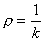
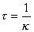
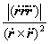

<b>§</b><b>9&nbsp; </b><b>空间曲线</b>

一、&nbsp;&nbsp;&nbsp; 一、&nbsp;&nbsp;&nbsp;&nbsp;&nbsp;&nbsp;&nbsp; 曲线的基本概念与公式

[曲线的方程与正向]

<table class=MsoNormalTable border=1 cellspacing=0 cellpadding=0
 style='border-collapse:collapse;border:none'>
 <tr>
  <td width=316 valign=top style='width:237.0pt;border:solid windowtext 1.0pt;
  border-left:none;padding:0mm 5.4pt 0mm 5.4pt'>
  
曲 线 方 程 的 形 式

  </td>
  <td width=308 valign=top style='width:231.0pt;border-top:solid windowtext 1.0pt;
  border-left:none;border-bottom:solid windowtext 1.0pt;border-right:none;
  padding:0mm 5.4pt 0mm 5.4pt'>
  
曲 线 的 正 向

  </td>
 </tr>
 <tr>
  <td width=316 valign=top style='width:237.0pt;border-top:none;border-left:
  none;border-bottom:solid windowtext 1.0pt;border-right:solid windowtext 1.0pt;
  padding:0mm 5.4pt 0mm 5.4pt'>
  
交面式

  
参数式或

  
（<i>t</i>为任意参数，<i>s</i>为曲线的弧长）

  
矢量式<b><i>r </i></b>= <b><i>r </i></b>( <i>t </i>)或<b><i>r </i></b>= <b><i>r </i></b>( <i>s </i>)

  
（<b><i>r </i></b>(<i>t</i>) = <i>x </i>(<i>t</i>)
  <b><i>i </i></b>+ <i>y </i>(<i>t</i>) <b><i>j </i></b>+ <i>z </i>(<i>t</i>) <b><i>k</i></b>,
  <i>t</i>, <i>s</i>同上）

  </td>
  <td width=308 valign=top style='width:231.0pt;border:none;border-bottom:solid windowtext 1.0pt;
  padding:0mm 5.4pt 0mm 5.4pt'>
  
&nbsp;&nbsp;&nbsp; <i>t</i>（或<i>s</i>）增加时，曲线上一点运动的方向

  </td>
 </tr>
</table>

<table cellspacing=0 cellpadding=0 hspace=0 vspace=0 align=left>
 <tr>
  <td valign=top align=left style='padding-top:0mm;padding-right:9.05pt;
  padding-bottom:0mm;padding-left:9.05pt'>
  

  

  
&nbsp;&nbsp;&nbsp;&nbsp;&nbsp;&nbsp;&nbsp;&nbsp;&nbsp;
  图&nbsp; 7.18

  

  </td>
 </tr>
</table>

&nbsp;&nbsp;&nbsp;&nbsp;&nbsp;&nbsp; [活动标架的三个单位矢量]&nbsp;
<b><i>t</i></b>为单位切线矢量，方向与曲线的正向一致；<b><i>n</i></b>为单位主法线矢量，它指向曲线的凹方；<b><i>b</i></b>为单位副法线矢量，<b><i>b</i></b>=<b><i>t</i></b><b><i>n</i></b>.<b><i>t</i></b>,<b><i>n</i></b>,<b><i>b</i></b>构成右手系（图7.18）.这三个矢量称为曲线在点<i>M</i>的活动标架（或叫动标三面形、伴随三面形，也叫活动标形）.

&nbsp;&nbsp;&nbsp;&nbsp;&nbsp;&nbsp; [活动标架所在直线和平面的方程]&nbsp;
设<i>M</i>为(<i>x</i>0,<i>y</i>0,<i>z</i>0)（图7.18）.

&nbsp;&nbsp;&nbsp;&nbsp;&nbsp;&nbsp; 1°&nbsp;&nbsp;&nbsp; 切线&nbsp;&nbsp;&nbsp;&nbsp;&nbsp; 过曲线上两点<i>N</i>,<i>M</i>的直线<i>NM</i>，当<i>N</i><i>M</i>时的极限位置.其方程为

&nbsp;&nbsp;&nbsp;&nbsp;&nbsp;&nbsp; 参数式&nbsp; （以<i>t</i>为参数）

式中表示在点<i>M</i>(<i>x</i>0,<i>y</i>0,<i>z</i>0)处的值，等等.参数<b><i>t</i></b>可以取为弧长<i>s</i>，这时用表示，等等.

&nbsp;&nbsp;&nbsp;&nbsp;&nbsp;&nbsp; 矢量式 <b><i>r</i></b>=<b><i>r</i></b>0+（以<i>t</i>为参数）

式中表示在点<i>M</i>(<i>x</i>0,<i>y</i>&shy;0,<i>z</i>0)处的值，为另一个参数.

&nbsp;&nbsp;&nbsp;&nbsp;&nbsp;&nbsp; 交面式

式中表示在<i>M</i>点的值，等等.

&nbsp;&nbsp;&nbsp;&nbsp;&nbsp;&nbsp; 2°&nbsp;&nbsp;&nbsp; 法面&nbsp;&nbsp;&nbsp;&nbsp;&nbsp; 与切线垂直的平面（通过<i>M</i>的法面上一切直线都称为曲线在<i>M</i>的法线）.其方程为

参数式 (<i>x</i>-<i>x</i>0)+(<i>y</i>-<i>y</i>0)+(<i>z</i>-<i>z</i>0)=0（以<i>t</i>为参数）

式中也可取弧长<i>s</i>为参数.

&nbsp;&nbsp;&nbsp;&nbsp;&nbsp;&nbsp; 矢量式&nbsp;&nbsp;&nbsp;&nbsp;&nbsp;&nbsp;&nbsp;&nbsp;&nbsp;&nbsp;&nbsp;&nbsp;
(<b><i>r</i></b>-<b><i>r</i></b>0) =0（以<i>t</i>为参数）

&nbsp;&nbsp;&nbsp;&nbsp;&nbsp;&nbsp; 交面式&nbsp;&nbsp;&nbsp;&nbsp;&nbsp;&nbsp;&nbsp;&nbsp;&nbsp;&nbsp;&nbsp;&nbsp;

&nbsp;&nbsp;&nbsp;&nbsp;&nbsp;&nbsp; 3°&nbsp;&nbsp;&nbsp; 密切面&nbsp; 通过曲线上三点<i>M</i>,<i>P</i>,<i>N</i>作一平面，当时，平面的极限位置（切线在密切面上）.其方程为

&nbsp;&nbsp;&nbsp;&nbsp;&nbsp;&nbsp; 参数式&nbsp;&nbsp;&nbsp;&nbsp;&nbsp;&nbsp;&nbsp;&nbsp;&nbsp;&nbsp;&nbsp;&nbsp;&nbsp;
（以<i>t</i>为参数）

式中表示在<i>M</i>点的值，等等，参数<i>t</i>也可取为弧长<i>s</i>.

&nbsp;&nbsp;&nbsp;&nbsp;&nbsp;&nbsp; 矢量式 ((<i>r</i>-<i>r</i>0))=0（以<i>t</i>为参数）

&nbsp;&nbsp;&nbsp;&nbsp;&nbsp;&nbsp; 4°&nbsp;&nbsp;&nbsp; 主法线&nbsp; 法面与密切面的交线.其方程为

参数式&nbsp; （以<i>t</i>为参数）

式中

<i>l</i>=,&nbsp;&nbsp; <i>m</i>=,  <i>n</i>=

（以<i>s</i>为参数）

表示在点<i>M</i>的值，等等.

矢量式&nbsp;&nbsp;&nbsp;&nbsp;&nbsp;&nbsp;&nbsp;&nbsp; <b><i>r</i></b>=<b><i>r</i></b>0+&nbsp;&nbsp;&nbsp;&nbsp;&nbsp;&nbsp;&nbsp;&nbsp;&nbsp;&nbsp;&nbsp;&nbsp;&nbsp;&nbsp;&nbsp;&nbsp;&nbsp; （以<i>t</i>为参数）

&nbsp;&nbsp;&nbsp;&nbsp;&nbsp;&nbsp;&nbsp; <b><i>r</i></b>=<b><i>r</i></b>0+&nbsp;&nbsp;&nbsp;&nbsp;&nbsp;&nbsp;&nbsp;&nbsp;&nbsp;&nbsp;&nbsp;&nbsp;&nbsp;&nbsp;&nbsp;&nbsp;&nbsp;&nbsp;&nbsp;&nbsp;&nbsp;&nbsp;&nbsp;&nbsp;&nbsp;&nbsp;&nbsp;&nbsp;&nbsp;&nbsp; （以<i>s</i>为参数）

式中为另一个参数.

&nbsp;&nbsp;&nbsp;&nbsp;&nbsp;&nbsp; 5°&nbsp;&nbsp;&nbsp; 副法线&nbsp; 垂直于密切面的直线.其方程为

参数式

（以<i>t</i>为参数）

式中<i>l</i>,<i>m</i>,<i>n</i>如(1)式定义.

&nbsp;&nbsp;&nbsp;&nbsp;&nbsp;&nbsp; 矢量式

<b><i>r</i></b>0=<b><i>r</i></b>0+&nbsp;&nbsp;&nbsp;&nbsp; （以<i>t</i>为参数）

&nbsp;&nbsp;&nbsp;&nbsp;&nbsp;&nbsp; 6°&nbsp;&nbsp;&nbsp; 从切面&nbsp; 通过切线与副法线的平面.其方程为

&nbsp;&nbsp;&nbsp;&nbsp;&nbsp;&nbsp; 参数式&nbsp;&nbsp;&nbsp;&nbsp;&nbsp;&nbsp;&nbsp;&nbsp;&nbsp;&nbsp;&nbsp;&nbsp;&nbsp;&nbsp;&nbsp;&nbsp;&nbsp;&nbsp;&nbsp;&nbsp;&nbsp;&nbsp; &nbsp;&nbsp;&nbsp;&nbsp;&nbsp;&nbsp;&nbsp;&nbsp;&nbsp;&nbsp; （以<i>t</i>为参数）

&nbsp;&nbsp;&nbsp;&nbsp;&nbsp;&nbsp;&nbsp;&nbsp;&nbsp;&nbsp;&nbsp;&nbsp; （以<i>s</i>为参数）

&nbsp;&nbsp;&nbsp;&nbsp;&nbsp;&nbsp; 矢量式

&nbsp;&nbsp;&nbsp;&nbsp;&nbsp;&nbsp;&nbsp;&nbsp;&nbsp;&nbsp;&nbsp; （以<i>t</i>为参数）

&nbsp;&nbsp;&nbsp;&nbsp;&nbsp;&nbsp;&nbsp;&nbsp;&nbsp;&nbsp;&nbsp;&nbsp;&nbsp;&nbsp;&nbsp;&nbsp;&nbsp; （以<i>s</i>为参数）

&nbsp;&nbsp;&nbsp;&nbsp;&nbsp;&nbsp; [曲率与挠率的定义与公式]

<table class=MsoNormalTable border=1 cellspacing=0 cellpadding=0
 style='border-collapse:collapse;border:none'>
 <tr>
  <td width=261 valign=top style='width:195.65pt;border:solid windowtext 1.0pt;
  border-left:none;padding:0mm 5.4pt 0mm 5.4pt'>
  
公 式 与 意 义

  </td>
  <td width=363 valign=top style='width:272.35pt;border-top:solid windowtext 1.0pt;
  border-left:none;border-bottom:solid windowtext 1.0pt;border-right:none;
  padding:0mm 5.4pt 0mm 5.4pt'>
  
图&nbsp;&nbsp;&nbsp; 形

  </td>
 </tr>
 <tr>
  <td width=261 valign=top style='width:195.65pt;border-top:none;border-left:
  none;border-bottom:solid windowtext 1.0pt;border-right:solid windowtext 1.0pt;
  padding:0mm 5.4pt 0mm 5.4pt'>
  
曲率

  

  
曲率半径

  

  
<i>&nbsp;&nbsp;&nbsp;&nbsp; k</i>表示包含点<i>M</i>的部分曲线偏离直线的程度，也是切线方向对于弧长的转动率

  </td>
  <td width=363 valign=top style='width:272.35pt;border:none;border-bottom:
  solid windowtext 1.0pt;padding:0mm 5.4pt 0mm 5.4pt'>
  
&nbsp;&nbsp;&nbsp;&nbsp;&nbsp;&nbsp;&nbsp;&nbsp; 

  </td>
 </tr>
 <tr>
  <td width=261 valign=top style='width:195.65pt;border-top:none;border-left:
  none;border-bottom:solid windowtext 1.0pt;border-right:solid windowtext 1.0pt;
  padding:0mm 5.4pt 0mm 5.4pt'>
  
挠率

  

  
挠率半径

  

  
表示包含点<i>M</i>的部分曲线偏离平面曲线的程度.=0的曲线是平面曲线.

  
&nbsp;&nbsp; 是曲线在点<i>M</i>挠率的绝对值，它等于副法线方向对于弧长的转动率.

  
&nbsp; 挠率的符号：当点<i>M</i>沿曲线的正向移动时，矢量与<b><i>n</i></b>反向，则取正号，反之取负号（图(<i>b</i>)）

  </td>
  <td width=363 valign=top style='width:272.35pt;border:none;border-bottom:
  solid windowtext 1.0pt;padding:0mm 5.4pt 0mm 5.4pt'>
  

  
(<i>a</i>)

  

  
(<i>b</i>)

  </td>
 </tr>
</table>

&nbsp;&nbsp;&nbsp;&nbsp;&nbsp;&nbsp; &nbsp; 表中分别表示<b><i>t</i>,<i>b</i></b>对<i>s</i>的导数.

&nbsp;&nbsp;&nbsp;&nbsp;&nbsp;&nbsp; [曲率与挠率的计算公式]

&nbsp;&nbsp;&nbsp;&nbsp;&nbsp;&nbsp; 1°&nbsp;&nbsp;&nbsp; 曲率

&nbsp;&nbsp;&nbsp;&nbsp;&nbsp;&nbsp; 参数式

<i>k</i>=（以<i>t</i>为参数）

<i>&nbsp;&nbsp;&nbsp;&nbsp;&nbsp;&nbsp;&nbsp;&nbsp;&nbsp;&nbsp;&nbsp;&nbsp;&nbsp;&nbsp;&nbsp;
k</i>=&nbsp;&nbsp;&nbsp;&nbsp;&nbsp;&nbsp; &nbsp;&nbsp;&nbsp;
&nbsp;&nbsp; &nbsp;&nbsp;&nbsp;（以<i>s</i>为参数）

&nbsp;&nbsp;&nbsp;&nbsp;&nbsp;&nbsp; 矢量式

<i>k</i>=或&nbsp;&nbsp;&nbsp;&nbsp;&nbsp; （以<i>t</i>为参数）

&nbsp;&nbsp;&nbsp;&nbsp;&nbsp;&nbsp;&nbsp;&nbsp;&nbsp;&nbsp;&nbsp;&nbsp;&nbsp; &nbsp;&nbsp;&nbsp;&nbsp;&nbsp;&nbsp;&nbsp;&nbsp;&nbsp;&nbsp;&nbsp;&nbsp;&nbsp;&nbsp;&nbsp;&nbsp;
<i>k</i>=&nbsp;&nbsp;&nbsp;&nbsp;&nbsp;&nbsp;&nbsp;&nbsp;&nbsp;&nbsp;&nbsp;&nbsp;&nbsp;&nbsp;&nbsp;&nbsp;&nbsp;&nbsp;&nbsp;&nbsp;&nbsp;&nbsp;&nbsp;&nbsp;&nbsp;&nbsp;&nbsp;&nbsp;&nbsp;&nbsp;&nbsp;&nbsp;&nbsp;&nbsp;&nbsp; （以<i>s</i>为参数）

&nbsp;&nbsp;&nbsp;&nbsp;&nbsp;&nbsp; 2°&nbsp;&nbsp;&nbsp; 挠率的绝对值

&nbsp;&nbsp;&nbsp;&nbsp;&nbsp;&nbsp; 参数式

&nbsp;&nbsp;&nbsp;&nbsp;&nbsp;&nbsp;&nbsp;&nbsp;&nbsp;&nbsp;&nbsp;&nbsp;&nbsp; &nbsp; （以<i>t</i>为参数）

&nbsp;&nbsp;&nbsp;&nbsp;&nbsp;&nbsp;&nbsp;&nbsp;&nbsp;&nbsp;&nbsp;&nbsp;&nbsp; &nbsp;&nbsp;&nbsp;&nbsp;&nbsp; （以<i>s</i>为参数）

矢量式

或&nbsp;&nbsp;&nbsp;
（以<i>t</i>为参数）

&nbsp;&nbsp;&nbsp;&nbsp;&nbsp;&nbsp;&nbsp;&nbsp;&nbsp;&nbsp;&nbsp;&nbsp;&nbsp; &nbsp;&nbsp;&nbsp;&nbsp;&nbsp;&nbsp;&nbsp;&nbsp;&nbsp;&nbsp;&nbsp; （以<i>s</i>为参数）

式中<i>s</i>为弧长，<b><i>t</i></b>为任意参数，“&cent;”表示对<i>s</i>求导,“×” 表示对<b><i>t</i></b>求导.

&nbsp;&nbsp;&nbsp;&nbsp;&nbsp;&nbsp; [雪列-弗莱纳公式（或基本公式）]

,&nbsp;&nbsp;&nbsp;&nbsp;&nbsp; ,&nbsp;&nbsp;&nbsp;&nbsp; 

式中<b><i>t</i></b>,<b><i>n</i></b>,<b><i>b</i></b>为活动标架的三个基本单位矢量，为曲率半径，为挠率半径.这组公式的特点就是基本矢量<b><i>t</i></b>,<b><i>n</i></b>,<b><i>b</i></b>关于弧长<i>s</i>的导数可以用<b><i>t</i></b>,<b><i>n</i></b>,<b><i>b</i></b>的线性组合来表达，它的系数组成一个反对称方阵：

&nbsp;&nbsp;&nbsp;&nbsp;&nbsp;&nbsp; 这组公式与=<b><i>t</i></b>合并起来描述了点<i>M</i>在曲线上移动时活动标架的运动规律.

&nbsp;&nbsp;&nbsp;&nbsp;&nbsp;&nbsp; 把活动标架看作一个刚体，就是当<i>M</i>沿曲线移动时，<i>M</i>的活动标架好象刚体那样绕<i>M</i>转动.这时把<i>s</i>看作时间，则根据运动学的原理可以得出活动标架的瞬时转动速度的表达式为

这表明转动矢量落在从法面上.这个瞬时转动矢量称为达布矢量.它仅分解为两个矢量<b><i>t</i></b>和<b><i>b</i></b>，因此活动标架的瞬时转动可以看作两个转动之和.一个转动对应于<b><i>t</i>,</b>按转动速度的定义，它绕着方向为<b><i>t</i></b>的轴转动；另一个绕着方向为<b><i>b</i></b>的轴转动.因此得到曲率与挠率的运动学意义：

&nbsp;&nbsp;&nbsp;&nbsp;&nbsp;&nbsp; 曲线的曲率等于活动标架绕着副法线的转动支量，挠率等于绕着切线的转动支量.

&nbsp;&nbsp;&nbsp;&nbsp;&nbsp;&nbsp; 最后，由可以验证，空间曲线的雪列-弗莱纳公式就是

&nbsp;&nbsp;&nbsp;&nbsp;&nbsp;&nbsp; 这就是雪列-弗莱纳公式的运动学意义.

[基本定理与自然方程]&nbsp;&nbsp;&nbsp; 在一闭区间<i>a</i><i>s</i><i>b</i>上给定任意两个连续函数<i>k</i>(<i>s</i>)和(<i>s</i>)，其中<i>k</i>(<i>s</i>)&gt;0，则除了空间的位置差别外，唯一地存在一条空间曲线，它以<i>s</i>为弧长，可<i>k</i>(<i>s</i>)为曲率，(<i>s</i>)为挠率.

方程组

<i>k</i>=<i>k</i>(<i>s</i>),&nbsp;&nbsp; =(<i>s</i>) 

称为空间曲线的自然方程.

