

二、&nbsp;&nbsp;&nbsp;&nbsp;&nbsp;&nbsp;&nbsp;
二、&nbsp;&nbsp;&nbsp; 螺旋线的方程与图形

[一般螺旋线]&nbsp;&nbsp;&nbsp;&nbsp;&nbsp; 与柱面母线的交角为定角()的空间曲线称为一般螺旋线（或定倾曲线）.这种曲线具有性质：

1°&nbsp;&nbsp;&nbsp; 曲率与挠率的比等于常数(<i>k</i>=tan).

2°&nbsp;&nbsp;&nbsp; 切线与一固定方向的交角为定角().

3°&nbsp;&nbsp;&nbsp; 主法线与一固定方向垂直.

4°&nbsp;&nbsp;&nbsp; 副法线与一固定方向的交角为定角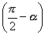.

<table cellspacing=0 cellpadding=0 hspace=0 vspace=0 align=left>
 <tr>
  <td valign=top align=left style='padding-top:0mm;padding-right:9.05pt;
  padding-bottom:0mm;padding-left:9.05pt'>
  

  
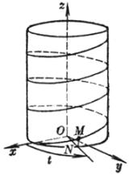

  
&nbsp;&nbsp;&nbsp; 图 7.19

  

  </td>
 </tr>
</table>

[圆柱螺旋线]&nbsp;&nbsp;&nbsp;&nbsp;&nbsp; 一动点绕一直线作等速转动，并沿这直线作等速移动，则称这个动点的轨迹为圆柱螺旋线（图7.19），其参数方程为

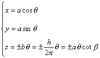

式中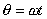，为角速度，<i>h</i>称为螺距，称为螺旋角，式中对右螺旋线取正号，对左螺旋线取负号，如果以弧长<i>s</i>为参数，其方程为

<table cellspacing=0 cellpadding=0 hspace=0 vspace=0 align=left>
 <tr>
  <td valign=top align=left style='padding-top:0mm;padding-right:9.05pt;
  padding-bottom:0mm;padding-left:9.05pt'>
  

  
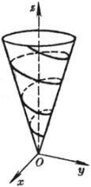

  
&nbsp;&nbsp;&nbsp; 图 7.20

  

  </td>
 </tr>
</table>

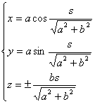

&nbsp;&nbsp;&nbsp; 曲率与挠率都是常数：<i>k</i>=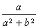,&nbsp;&nbsp;&nbsp;&nbsp;&nbsp;&nbsp; 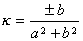

&nbsp;&nbsp;&nbsp;&nbsp;&nbsp;&nbsp; [圆锥螺旋线]&nbsp;&nbsp;&nbsp;&nbsp;&nbsp; 与一圆锥面母线的交角为定角的曲线称为圆锥螺旋线（图7.20），其方程为

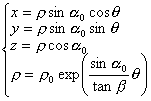

式中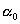为圆锥顶角的一半，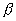为螺旋角，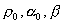都是常数.由于这种曲线投影到<i>Oxy</i>平面上是对数螺线，所以又称其为圆锥对数螺线.

