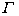

<b>§</b><b>10&nbsp;&nbsp;&nbsp; </b><b>螺旋面</b>

&nbsp;&nbsp;&nbsp;&nbsp;&nbsp;&nbsp; [一般螺旋面的方程] 已知空间曲线的参数方程为

绕<i>z</i>轴作螺旋运动而形成的曲面称为一般螺旋面，其方程为

<table cellspacing=0 cellpadding=0 hspace=0 vspace=0 align=left>
 <tr>
  <td valign=top align=left style='padding-top:0mm;padding-right:9.05pt;
  padding-bottom:0mm;padding-left:9.05pt'>
  

  

  
图 7.21

  

  </td>
 </tr>
</table>

式中<i>h</i>为螺距（或导程）.

&nbsp;&nbsp;&nbsp;&nbsp;&nbsp;&nbsp; [渐开线螺旋面]&nbsp;&nbsp;&nbsp;&nbsp;&nbsp;&nbsp;&nbsp;&nbsp; <i>Oxy</i>平面上一条已知渐开线绕<i>z</i>轴作螺旋运动而形成的曲面称为渐开线螺旋面（图7.21）其方程为

<table cellspacing=0 cellpadding=0 hspace=0 vspace=0 align=left>
 <tr>
  <td valign=top align=left style='padding-top:0mm;padding-right:9.05pt;
  padding-bottom:0mm;padding-left:9.05pt'>
  

  

  
图 7.22

  

  </td>
 </tr>
</table>

式中和是两个参数.“=常数”表示曲面上不同的螺旋线，它们有相同的螺距<i>h</i>，但有不同的螺旋角；“=常数”表示不同位置的渐开线.

&nbsp;&nbsp;&nbsp;&nbsp;&nbsp;&nbsp; [阿基米德螺旋面]&nbsp;&nbsp;&nbsp;&nbsp; 一条与<i>z</i>轴相交并与<i>Oxy</i>平面的交角为的直线作螺旋运动而形成的螺旋面称为阿基米德螺旋面（图7.22），其方程为

它与<i>Oxy</i>平面的交线为阿基米德螺线.

