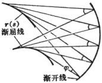

<b>§</b><b>11&nbsp;&nbsp;&nbsp; </b><b>可展曲面</b>

&nbsp;&nbsp;&nbsp;&nbsp;&nbsp;&nbsp; [单参数曲面族的包络面]

<table class=MsoNormalTable border=1 cellspacing=0 cellpadding=0
 style='border-collapse:collapse;border:none'>
 <tr>
  <td width=261 valign=top style='width:195.65pt;border:solid windowtext 1.0pt;
  border-left:none;padding:0mm 5.4pt 0mm 5.4pt'>
  
定&nbsp;&nbsp;&nbsp; 义

  </td>
  <td width=347 valign=top style='width:260.35pt;border-top:solid windowtext 1.0pt;
  border-left:none;border-bottom:solid windowtext 1.0pt;border-right:none;
  padding:0mm 5.4pt 0mm 5.4pt'>
  
方&nbsp;&nbsp;&nbsp; 程

  </td>
 </tr>
 <tr>
  <td width=261 valign=top style='width:195.65pt;border-top:none;border-left:
  none;border-bottom:solid windowtext 1.0pt;border-right:solid windowtext 1.0pt;
  padding:0mm 5.4pt 0mm 5.4pt'>
  
&nbsp; 包络面&nbsp; 与曲面族<i>S</i><i>λ</i>的所有曲面相切的曲面称为<i>S</i><i>λ</i>的包络面.

  
&nbsp; 脊&nbsp; 线&nbsp; 族<i>S</i><i>λ</i>中两个临近曲面的交线的极限位置称为<i>S</i><i>λ</i>的特征线，特征线的包络（如果存在）称为族<i>S</i><i>λ</i>的脊线

  </td>
  <td width=347 valign=top style='width:260.35pt;border:none;border-bottom:
  solid windowtext 1.0pt;padding:0mm 5.4pt 0mm 5.4pt'>
  

  

  </td>
 </tr>
</table>

&nbsp;&nbsp;&nbsp; [单参数平面族的包络面]

<table class=MsoNormalTable border=1 cellspacing=0 cellpadding=0
 style='border-collapse:collapse;border:none'>
 <tr>
  <td width=261 valign=top style='width:195.65pt;border:solid windowtext 1.0pt;
  border-left:none;padding:0mm 5.4pt 0mm 5.4pt'>
  
定 义 与 性 质

  </td>
  <td width=355 colspan=2 valign=top style='width:266.35pt;border-top:solid windowtext 1.0pt;
  border-left:none;border-bottom:solid windowtext 1.0pt;border-right:none;
  padding:0mm 5.4pt 0mm 5.4pt'>
  
方 程 与 图 形

  </td>
 </tr>
 <tr>
  <td width=261 valign=top style='width:195.65pt;border-top:none;border-left:
  none;border-bottom:solid windowtext 1.0pt;border-right:solid windowtext 1.0pt;
  padding:0mm 5.4pt 0mm 5.4pt'>
  
&nbsp; 可展曲面&nbsp; 单参数平面族的包络面称为族的可展曲面.包络面是空间曲线的切线所构成的曲面、锥面或柱面（图(<i>a</i>),(<i>b</i>),(<i>c</i>)）

  </td>
  <td width=355 colspan=2 valign=top style='width:266.35pt;border:none;
  border-bottom:solid windowtext 1.0pt;padding:0mm 5.4pt 0mm 5.4pt'>
  
单参数平面族方程为

  
<b><i>&nbsp; ra</i></b>(<i>λ</i>)+<i>p</i>(<i>λ</i>)=0（<i>λ</i>为参数）

  
其包络面满足方程组

  
&nbsp; 

  
式中为平面族的法矢量

  </td>
 </tr>
 <tr>
  <td width=616 colspan=3 valign=top style='width:462.0pt;border:none;
  border-bottom:solid windowtext 1.0pt;padding:0mm 5.4pt 0mm 5.4pt'>
  

  </td>
 </tr>
 <tr>
  <td width=272 colspan=2 valign=top style='width:204.0pt;border-top:none;
  border-left:none;border-bottom:solid windowtext 1.0pt;border-right:solid windowtext 1.0pt;
  padding:0mm 5.4pt 0mm 5.4pt'>
  
&nbsp; 脊&nbsp; 线&nbsp; 平面族中两个邻近平面的交线的极限位置称为族的特征线，特征线的包络（如果存在）称为族的脊线，它把包络面分为两叶，以脊线作为曲面的“尖锐的梭边”（图(<i>d</i>)）

  </td>
  <td width=344 valign=top style='width:258.0pt;border:none;border-bottom:solid windowtext 1.0pt;
  padding:0mm 5.4pt 0mm 5.4pt'>
  
&nbsp; 脊线满足方程组

  
&nbsp; 

  </td>
 </tr>
 <tr>
  <td width=616 colspan=3 valign=top style='width:462.0pt;border:none;
  border-bottom:solid windowtext 1.0pt;padding:0mm 5.4pt 0mm 5.4pt'>
  

  </td>
 </tr>
 <tr>
  <td width=261 style='width:195.75pt;border:none;padding:0mm 5.4pt 0mm 5.4pt'>
  
&nbsp;

  </td>
  <td width=11 style='width:8.25pt;border:none;padding:0mm 5.4pt 0mm 5.4pt'>
  
&nbsp;

  </td>
  <td width=344 style='width:258.0pt;border:none;padding:0mm 5.4pt 0mm 5.4pt'>
  
&nbsp;

  </td>
 </tr>
</table>

&nbsp;&nbsp;&nbsp; 例<b>&nbsp;&nbsp;&nbsp;&nbsp;&nbsp; 
</b>一条空间曲线<i>C</i>的法面的包络面称为<i>C</i>的配极可展曲面，它是曲率轴（即通过曲率中心并平行于副法线）的轨迹.脊线的方程为

<pre>&nbsp;&nbsp;&nbsp;&nbsp;&nbsp;&nbsp;&nbsp;&nbsp;&nbsp;&nbsp;&nbsp;&nbsp;&nbsp;&nbsp;&nbsp;&nbsp;&nbsp;&nbsp;&nbsp;&nbsp;&nbsp;&nbsp;&nbsp;&nbsp;&nbsp;&nbsp;&nbsp;&nbsp;&nbsp;&nbsp;&nbsp;&nbsp; </pre>

式中为曲线<i>C</i>的曲率半径，为曲线<i>C</i>的挠率半径，

[空间曲线的渐开线与渐屈线]

<table class=MsoNormalTable border=1 cellspacing=0 cellpadding=0
 style='border-collapse:collapse;border:none'>
 <tr>
  <td width=269 valign=top style='width:201.65pt;border:solid windowtext 1.0pt;
  border-left:none;padding:0mm 5.4pt 0mm 5.4pt'>
  
定义与性质

  </td>
  <td width=355 valign=top style='width:266.35pt;border-top:solid windowtext 1.0pt;
  border-left:none;border-bottom:solid windowtext 1.0pt;border-right:none;
  padding:0mm 5.4pt 0mm 5.4pt'>
  
方程与图形

  </td>
 </tr>
 <tr>
  <td width=269 valign=top style='width:201.65pt;border-top:none;border-left:
  none;border-bottom:solid windowtext 1.0pt;border-right:solid windowtext 1.0pt;
  padding:0mm 5.4pt 0mm 5.4pt'>
  
&nbsp; 渐开线&nbsp; 在一条空间曲线<b><i>r</i></b>(<i>s</i>)的可展曲面上与曲线<b><i>r</i></b>(<i>s</i>)正交的曲线称为<b><i>r</i></b>(<i>s</i>)的渐开线.

  
&nbsp; 沿<b><i>r</i></b>(<i>s</i>)的切线上两条渐开线之间的距离保持不变（右图）

  </td>
  <td width=355 valign=top style='width:266.35pt;border:none;border-bottom:
  solid windowtext 1.0pt;padding:0mm 5.4pt 0mm 5.4pt'>
  
&nbsp;&nbsp; （<i>c</i>为常数）

  
&nbsp;&nbsp;&nbsp;&nbsp;&nbsp; 

  </td>
 </tr>
 <tr>
  <td width=269 valign=top style='width:201.65pt;border-top:none;border-left:
  none;border-bottom:solid windowtext 1.0pt;border-right:solid windowtext 1.0pt;
  padding:0mm 5.4pt 0mm 5.4pt'>
  
&nbsp; 渐屈线&nbsp; 空间曲线<b><i>r</i></b>(<i>s</i>)对它的渐开线而言就是渐屈线，也就是渐开线的一族法线包络.

  
&nbsp; 渐屈线<i>C</i>1的一点<i>M</i>1落在<i>C</i>的对应点<i>M</i>的曲率轴上.（上页下图）

  
&nbsp; 如果这族法线组成可展曲面时，则在法面上旋转一个定角，所得到的法线仍然组成一个可展曲面（右图）

  </td>
  <td width=355 valign=top style='width:266.35pt;border:none;border-bottom:
  solid windowtext 1.0pt;padding:0mm 5.4pt 0mm 5.4pt'>
  
&nbsp; 

  
式中为曲率半径，为渐屈线的切线与主法线的交角

  
&nbsp;&nbsp;&nbsp;&nbsp;&nbsp;&nbsp;&nbsp; 

  </td>
 </tr>
</table>

&nbsp;

