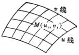
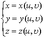
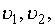
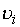
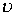
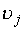

<b>§</b><b> 12 &nbsp;&nbsp; </b><b>一般曲面</b>

一、&nbsp;&nbsp;&nbsp; 一、曲面的方程与曲线的坐标

<table cellspacing=0 cellpadding=0 hspace=0 vspace=0 align=left>
 <tr>
  <td valign=top align=left style='padding-top:0mm;padding-right:9.05pt;
  padding-bottom:0mm;padding-left:9.05pt'>
  

  

  
&nbsp;&nbsp;&nbsp;&nbsp;&nbsp;&nbsp; 图 7.23

  

  </td>
 </tr>
</table>

曲面方程的形式有

&nbsp;&nbsp;&nbsp;&nbsp;&nbsp;&nbsp;&nbsp;&nbsp;&nbsp;&nbsp;&nbsp;&nbsp;&nbsp; 隐 式&nbsp;&nbsp;&nbsp;&nbsp; <i>F</i>(<i>x</i>,<i>y</i>,<i>z</i>)=0

&nbsp;&nbsp;&nbsp;&nbsp;&nbsp;&nbsp; 显 式&nbsp;&nbsp;&nbsp;&nbsp; <i>z</i>=<i>f</i>(<i>x</i>,<i>y</i>)

&nbsp;&nbsp;&nbsp;&nbsp;&nbsp;&nbsp; 参数式&nbsp;&nbsp;&nbsp;&nbsp;&nbsp;&nbsp;&nbsp;&nbsp; 

&nbsp;&nbsp;&nbsp;&nbsp;&nbsp;&nbsp; 矢量式&nbsp;&nbsp;&nbsp;&nbsp;&nbsp;&nbsp;&nbsp;&nbsp; <b><i>r</i></b>=<b><i>r</i>(</b><i>u</i>,<i></i>)

&nbsp;&nbsp;&nbsp;&nbsp;&nbsp;&nbsp;&nbsp;&nbsp;&nbsp;&nbsp;&nbsp;&nbsp;&nbsp; 或&nbsp;&nbsp;&nbsp;&nbsp;&nbsp;&nbsp;&nbsp;&nbsp;&nbsp; <b><i>r</i></b>=<i>x</i>(<i>u</i>,<i></i>)<b><i>i</i></b>+<i>y</i>(<i>u</i>,<i></i>)<b><i>j</i></b>+<i>z</i>(<i>u</i>,<i></i>)<b><i>k</i></b>

对于参数式或矢量式表示的曲面，如果取<i></i>为一系列数值L，而让<i>u</i>连续变动，则<b><i>r</i></b>(<i>u</i>,<i></i>)(<i>i</i>=1,2,L)表示一族曲线，称为<i>u</i>线（图7.23）；同样，如果取<i>u</i>为一系列数值<i>u</i>1,<i>u</i>2,L，而让<i></i>连续变动，则<b><i>r</i></b>(<i>ui</i>,<i></i>)(<i>i</i>=1,2,L)表示另一族连续曲线，称为<i></i>线.<i>u</i>线与<i></i>线在曲面上构成曲线网，称为坐标线或坐标网.于是<i>u</i>=<i>ui</i>,<i> </i>=<i></i>这个数对就可以确定曲面上一点<i>M</i>，这数对(<i>ui</i>,<i></i>)称为点<i>M</i>的曲线坐标（或高斯坐标）.

