
<pre style='margin-left:36.0pt;text-indent:-36.0pt'>二、&nbsp;&nbsp;&nbsp;&nbsp;&nbsp;&nbsp;&nbsp;&nbsp;&nbsp;&nbsp;&nbsp;&nbsp;&nbsp;&nbsp; &nbsp;二、&nbsp;&nbsp;&nbsp;&nbsp;&nbsp;&nbsp;&nbsp;&nbsp; 切面、法线与曲面的方向</pre>

[法线单位矢量]&nbsp; 通过曲面上一的<i>M</i>所有曲面曲线（即该曲面上的曲线），在点<i>M</i>的切线落在同一平面上（奇点除外），称这平面为曲面在点<i>M</i>的切面通过点<i>M</i>与切面垂直的直线称为曲面在点<i>M</i>的法线.

切面通过的矢量

<b><i>r</i></b><i>u</i>=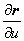和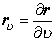

称为坐标矢量，它们分别是<i>u</i>线和<i></i>线在点<i>M</i>的切矢量（图7.24）

<table cellspacing=0 cellpadding=0 hspace=0 vspace=0 align=left>
 <tr>
  <td valign=top align=left style='padding-top:0mm;padding-right:9.05pt;
  padding-bottom:0mm;padding-left:9.05pt'>
  

  
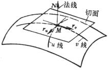

  
图 7.24

  

  </td>
 </tr>
</table>

曲面上点的法线单位矢量为

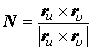

这里为了区别曲线的法线单位矢量和曲面的法线单位矢量，前者以<b><i>n</i></b>表示，后者以<b><i>N</i></b>表示.

[曲面的方向]&nbsp;&nbsp;&nbsp;&nbsp;&nbsp; 曲面的方向规定如下：朝<b><i>N</i></b>的正向那一面是曲面的正面（图7.24中看到的一面）；另一面为反面.

[曲面的切线方程与法线方程]

<table class=MsoNormalTable border=1 cellspacing=0 cellpadding=0
 style='border-collapse:collapse;border:none'>
 <tr>
  <td width=100 valign=top style='width:75.0pt;border:solid windowtext 1.0pt;
  border-left:none;padding:0mm 5.4pt 0mm 5.4pt'>
  
曲面方程

  </td>
  <td width=260 valign=top style='width:195.0pt;border:solid windowtext 1.0pt;
  border-left:none;padding:0mm 5.4pt 0mm 5.4pt'>
  
切面方程

  </td>
  <td width=256 valign=top style='width:192.0pt;border-top:solid windowtext 1.0pt;
  border-left:none;border-bottom:solid windowtext 1.0pt;border-right:none;
  padding:0mm 5.4pt 0mm 5.4pt'>
  
法线方程

  </td>
 </tr>
 <tr>
  <td width=100 valign=top style='width:75.0pt;border-top:none;border-left:
  none;border-bottom:solid windowtext 1.0pt;border-right:solid windowtext 1.0pt;
  padding:0mm 5.4pt 0mm 5.4pt'>
  
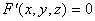

  
<i>z</i>=<i>f</i>(<i>x</i>,<i>y</i>)

  
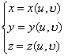

  
<b><i>r</i></b>=<b><i>r</i></b>(<i>u</i>,<i></i>)

  </td>
  <td width=260 valign=top style='width:195.0pt;border-top:none;border-left:
  none;border-bottom:solid windowtext 1.0pt;border-right:solid windowtext 1.0pt;
  padding:0mm 5.4pt 0mm 5.4pt'>
  
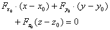

  
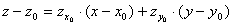

  
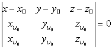

  
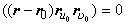

  
或(<b><i>r</i></b>-<b><i>r</i></b>0)<b><i>N</i></b>0=0

  </td>
  <td width=256 valign=top style='width:192.0pt;border:none;border-bottom:solid windowtext 1.0pt;
  padding:0mm 5.4pt 0mm 5.4pt'>
  
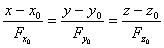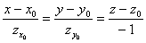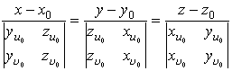

  
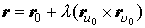

  
或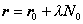

  
式中为参数

  </td>
 </tr>
</table>

表中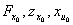分别表示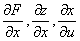在点<i>M</i>(<i>x</i>0,<i>y</i>0,<i>z</i>0)的值，<b><i>r</i></b>0是点<i>M</i>的矢径，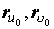分别表示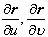在点<i>M</i>的值，<b><i>N</i></b>0为点<i>M</i>的法线单位矢量.

[曲面的奇点]&nbsp;&nbsp;&nbsp;&nbsp;&nbsp; 若曲面<i>F</i>(<i>x</i>,<i>y</i>,<i>z</i>)=0上一点<i>M</i>(<i>x</i>0,<i>y</i>0,<i>z</i>0)的三个偏导数同时等于零，即

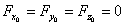

则称点<i>M</i>为该曲面的奇点.

