
<pre style='margin-left:36.0pt;text-indent:-36.0pt'>三、&nbsp;&nbsp;&nbsp;&nbsp;&nbsp;&nbsp;&nbsp;&nbsp;&nbsp;&nbsp;&nbsp;&nbsp;&nbsp;&nbsp; 三、&nbsp;&nbsp;&nbsp;&nbsp;&nbsp;&nbsp;&nbsp;&nbsp; 第一基本二次型与曲面的度量</pre>

[第一基本二次型与第一基本量]

<table class=MsoNormalTable border=1 cellspacing=0 cellpadding=0
 style='border-collapse:collapse;border:none'>
 <tr>
  <td width=136 valign=top style='width:102.0pt;border:solid windowtext 1.0pt;
  border-left:none;padding:0mm 5.4pt 0mm 5.4pt'>
  
曲面方程

  </td>
  <td width=488 valign=top style='width:366.0pt;border-top:solid windowtext 1.0pt;
  border-left:none;border-bottom:solid windowtext 1.0pt;border-right:none;
  padding:0mm 5.4pt 0mm 5.4pt'>
  
第一基本二次型与第一基本量

  </td>
 </tr>
 <tr>
  <td width=136 valign=top style='width:102.0pt;border-top:none;border-left:
  none;border-bottom:solid windowtext 1.0pt;border-right:solid windowtext 1.0pt;
  padding:0mm 5.4pt 0mm 5.4pt'>
  
<i>z</i>=<i>f</i>(<i>x</i>,<i>y</i>)

  
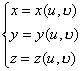

  
或

  
<b><i>r</i></b>=<b><i>r</i></b>(<i>u</i>,<i></i>)

  </td>
  <td width=488 valign=top style='width:366.0pt;border:none;border-bottom:solid windowtext 1.0pt;
  padding:0mm 5.4pt 0mm 5.4pt'>
  
&nbsp;&nbsp; d<i>s</i>2=<i>E</i>d<i>x</i>22<i>f</i>d<i>x</i>d<i>y</i>+<i>G</i>d<i>y</i>2

  
式中

  
&nbsp;&nbsp; <i>E</i>=1+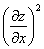

  
&nbsp;&nbsp; <i>F</i>=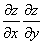

  
&nbsp;&nbsp; <i>G</i>=1+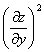

  
d<i>s</i>为点<i>M</i>(<i>x</i>,<i>y</i>,<i>z</i>)处的弧的微分，d<i>s</i>2称为第一基本二次型，<i>E</i>,<i>F</i>,<i>G</i>称为第一基本量

  
&nbsp;&nbsp; d<i>s</i>2=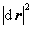=<i>E</i>d<i>u</i>2+2<i>F</i>d<i>u</i>d<i></i>+<i>G</i>d<i></i>2

  
式中

  
<i>E</i>=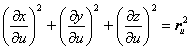

  
<i>F</i>=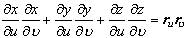

  
<i>G</i>=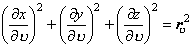

  
第一基本量<i>E</i>,<i>F</i>,<i>G</i>都在点<i>M</i>处取值.

  
曲面上每点（奇点除外）的第一基本二次型是正定的，即

  
<i>E</i>&gt;0,<i>G</i>&gt;0,<i>EG</i>-<i>F</i>2&gt;0

  </td>
 </tr>
</table>

[曲面上的弧长、面积、夹角等计算公式]

<table class=MsoNormalTable border=1 cellspacing=0 cellpadding=0
 style='border-collapse:collapse;border:none'>
 <tr>
  <td width=224 valign=top style='width:168.0pt;border:solid windowtext 1.0pt;
  border-left:none;padding:0mm 5.4pt 0mm 5.4pt'>
  
各量与图形

  </td>
  <td width=428 valign=top style='width:321.0pt;border-top:solid windowtext 1.0pt;
  border-left:none;border-bottom:solid windowtext 1.0pt;border-right:none;
  padding:0mm 5.4pt 0mm 5.4pt'>
  
计算公式

  </td>
 </tr>
 <tr>
  <td width=224 valign=top style='width:168.0pt;border:none;border-right:solid windowtext 1.0pt;
  padding:0mm 5.4pt 0mm 5.4pt'>
  
&nbsp; 曲面曲线的弧长<i>L</i> 
  &nbsp;&nbsp;&nbsp; 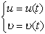 
  &nbsp; 曲面面积<i>S</i> 
  &nbsp;（由曲线围成） 
  &nbsp; 曲线夹角（两条曲线交于点<i>M</i>）

  
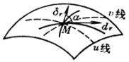

  </td>
  <td width=428 valign=top style='width:321.0pt;border:none;padding:0mm 5.4pt 0mm 5.4pt'>
  
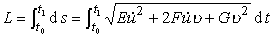 
   
   
  

  
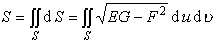 
   
   
  

  
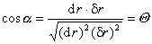

  </td>
 </tr>
 <tr>
  <td width=652 colspan=2 valign=top style='width:489.0pt;border:none;
  border-bottom:solid windowtext 1.0pt;padding:0mm 5.4pt 0mm 5.4pt'>
  
式中&nbsp;&nbsp;&nbsp;&nbsp;&nbsp;&nbsp;&nbsp;&nbsp;&nbsp; 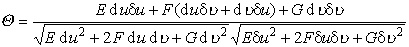 
  <i>E</i>，<i>F</i>，<i>G</i>为曲面的第一基本量（在点<i>M</i>取值）。坐标线<i>u</i>=常数和<i>v</i>=常数的交角决定于 
  &nbsp;&nbsp;&nbsp;&nbsp;&nbsp;&nbsp;&nbsp;&nbsp;&nbsp;&nbsp;&nbsp;&nbsp;&nbsp;&nbsp;&nbsp;&nbsp;&nbsp;&nbsp;&nbsp;&nbsp;&nbsp;&nbsp;&nbsp;&nbsp;&nbsp;&nbsp;&nbsp;&nbsp;
  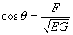 
  因此坐标线正交的充分必要条件是：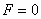

  </td>
 </tr>
</table>

&nbsp;&nbsp;&nbsp;&nbsp;&nbsp;&nbsp;&nbsp;&nbsp;&nbsp;&nbsp;&nbsp; [曲面的变形]&nbsp; 保持曲面曲线长度不变的变换称为曲面的变形。具有相同的第一基本二次型的两个曲面<i>S</i>，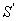称为贴合的或等距的。从<i>S</i>到和从到<i>S</i>的这种变换都称为等距变换。关于曲面的几何量经过等距变换不变者都称为等距不变量。

&nbsp;&nbsp;&nbsp;&nbsp;&nbsp;&nbsp;&nbsp;&nbsp;&nbsp;&nbsp;&nbsp; 等距变换的一种具体表现是把一个曲面连续弯曲而保持曲面曲线的长度不变，使这个曲面最后与另一个曲面相贴合；因此，等距变换又称为变形。

&nbsp;&nbsp;&nbsp;&nbsp;&nbsp;&nbsp;&nbsp;&nbsp;&nbsp;&nbsp;&nbsp; 从定义可以推出，两个曲面互为变形的充分必要条件是：经过适当地选择参数后，它们具有相同的第一基本二次型。

