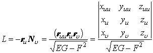
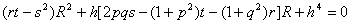
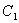

四、第二基本二次型曲面曲线的曲率

&nbsp;&nbsp; [第二基本二次型与第二基本量]

<table class=MsoNormalTable border=1 cellspacing=0 cellpadding=0
 style='border-collapse:collapse;border:none'>
 <tr>
  <td width=192 valign=top style='width:144.0pt;border:solid windowtext 1.0pt;
  border-left:none;padding:0mm 5.4pt 0mm 5.4pt'>
  
曲 面 方 程

  </td>
  <td width=416 valign=top style='width:312.0pt;border-top:solid windowtext 1.0pt;
  border-left:none;border-bottom:solid windowtext 1.0pt;border-right:none;
  padding:0mm 5.4pt 0mm 5.4pt'>
  
第二基本二次型与第二基本量

  </td>
 </tr>
 <tr style='height:17.25pt'>
  <td width=192 valign=top style='width:144.0pt;border-top:none;border-left:
  none;border-bottom:solid windowtext 1.0pt;border-right:solid windowtext 1.0pt;
  padding:0mm 5.4pt 0mm 5.4pt;height:17.25pt'>
  
&nbsp;

  </td>
  <td width=416 valign=top style='width:312.0pt;border:none;border-bottom:solid windowtext 1.0pt;
  padding:0mm 5.4pt 0mm 5.4pt;height:17.25pt'>
  
&nbsp;

  
式中

  

  </td>
 </tr>
 <tr style='height:21.0pt'>
  <td width=192 valign=top style='width:144.0pt;border-top:none;border-left:
  none;border-bottom:solid windowtext 1.0pt;border-right:solid windowtext 1.0pt;
  padding:0mm 5.4pt 0mm 5.4pt;height:21.0pt'>
  
&nbsp; 曲 面 方 程

  </td>
  <td width=416 style='width:312.0pt;border:none;border-bottom:solid windowtext 1.0pt;
  padding:0mm 5.4pt 0mm 5.4pt;height:21.0pt'>
  
第二基本二次型与第二基本量

  </td>
 </tr>
 <tr style='height:354.05pt'>
  <td width=192 valign=top style='width:144.0pt;border-top:none;border-left:
  none;border-bottom:solid windowtext 1.0pt;border-right:solid windowtext 1.0pt;
  padding:0mm 5.4pt 0mm 5.4pt;height:354.05pt'>
  
&nbsp; 

  
或

  
&nbsp; 

  </td>
  <td width=416 valign=top style='width:312.0pt;border:none;border-bottom:solid windowtext 1.0pt;
  padding:0mm 5.4pt 0mm 5.4pt;height:354.05pt'>
  
称为第二基本二次型，<i>L</i>，<i>M</i>，<i>N</i>称为第二基本量

  
&nbsp; 

  

  

  

  
式中偏导数等在点取值，<i>E</i>，<i>F</i>，<i>G</i>为第一基本量，<b><i>N</i></b>为曲面在点<i>M</i>的法线单位矢量。

  
&nbsp;&nbsp;&nbsp; 表示曲面上两个无限邻近点中，一点到另外一点的切面的距离的主要部分的两倍，它表明曲面与切面的离差的特征，也反映曲面在空间中的弯曲程度

  </td>
 </tr>
</table>

<table cellspacing=0 cellpadding=0 hspace=0 vspace=0 align=left>
 <tr>
  <td valign=top align=left style='padding-top:0mm;padding-right:9.0pt;
  padding-bottom:0mm;padding-left:9.0pt'>
  

  

  
图 7.25

  

  </td>
 </tr>
</table>

&nbsp;&nbsp;&nbsp;&nbsp;&nbsp;&nbsp; [主法截线（主方向、主曲率半径与脐点）]&nbsp;&nbsp; 通过曲面上一点<i>M</i>的法线的平面与曲面的交线（）都称为点<i>M</i>的法截线。所以通过曲面上一点的法截线有无穷多条，给定点<i>M</i>的一个切线方向就有一条确定的法截线。在点<i>M</i>的法截线中曲率最大和最小的两条分别记为，它们称为主法截线，在点<i>M</i>所对应的切线方向称为主方向，这两个方向互相垂直。的曲率半径（）称为主曲率半径，它们等于下列方程的两个根：

&nbsp;&nbsp;&nbsp;&nbsp;&nbsp;&nbsp; 对于曲面，方程为

<pre style='layout-grid-mode:char'>&nbsp;&nbsp; </pre>

式中<i>p</i>，<i>q</i>，<i>r</i>，<i>s</i>，<i>t</i>，<i>h</i>见上页表。

&nbsp;&nbsp;&nbsp;&nbsp;&nbsp;&nbsp; 对于曲面，方程为

式中<i>E</i>，<i>F</i>，<i>G</i>为曲面的第一基本量，<i>L</i>，<i>M</i>，<i>N</i>为曲面的第二基本量。

主曲率半径相等的点称为曲面的脐点，在脐点上

<pre>&nbsp;&nbsp;&nbsp;&nbsp;&nbsp;&nbsp;&nbsp;&nbsp;&nbsp;&nbsp;&nbsp;&nbsp;&nbsp;&nbsp;&nbsp;&nbsp;&nbsp;&nbsp;&nbsp;&nbsp;&nbsp;&nbsp;&nbsp;&nbsp;&nbsp;&nbsp;&nbsp; </pre>

&nbsp;&nbsp;&nbsp;&nbsp;&nbsp;&nbsp; [曲率线与罗德里克公式]&nbsp;
主方向是二次方程

<pre>&nbsp;&nbsp;&nbsp;&nbsp;&nbsp;&nbsp;&nbsp;&nbsp;&nbsp;&nbsp;&nbsp;&nbsp;&nbsp;&nbsp;&nbsp;&nbsp;&nbsp;&nbsp; </pre>

的两个根。满足这个微分方程的曲面曲线称为曲率线。曲率线上每点的切线方向都是主方向，曲率线构成曲面上一个正交曲线网，曲率线还有如下的一个特征：

&nbsp;&nbsp;&nbsp;&nbsp;&nbsp;&nbsp; 一条曲面曲线<i>C</i>是曲率线的充分必要条件是：沿<i>C</i>的曲面法线组成一个可展曲面，即当<i>C</i>上的点<i>M</i>变动时，曲面在<i>M</i>点的法线有包络线。

<pre>&nbsp;&nbsp;&nbsp; 这个特征也可表示为</pre><pre>&nbsp;&nbsp;&nbsp;&nbsp;&nbsp;&nbsp;&nbsp;&nbsp;&nbsp;&nbsp;&nbsp;&nbsp;&nbsp;&nbsp;&nbsp;&nbsp;&nbsp;&nbsp;&nbsp;&nbsp;&nbsp;&nbsp;&nbsp;&nbsp; </pre><pre>&nbsp;&nbsp;&nbsp;&nbsp;&nbsp;这个公式称为罗得里克公式。</pre>
