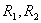

五、&nbsp;&nbsp;&nbsp;&nbsp;&nbsp;&nbsp;&nbsp;
五、&nbsp;&nbsp;&nbsp; 曲面曲线的曲率半径

&nbsp;&nbsp;&nbsp;&nbsp;&nbsp;&nbsp; [法截线的曲率半径与欧拉公式]&nbsp;
设

<pre>&nbsp;&nbsp;&nbsp;&nbsp;&nbsp;&nbsp;&nbsp;&nbsp;&nbsp;&nbsp;&nbsp;&nbsp;&nbsp;&nbsp;&nbsp;&nbsp;&nbsp;&nbsp;&nbsp;&nbsp;&nbsp;&nbsp;&nbsp;&nbsp;&nbsp;&nbsp;&nbsp;&nbsp;&nbsp;&nbsp;&nbsp;&nbsp;&nbsp;&nbsp;&nbsp; </pre>

右边为正时，表示法截线的法线单位矢量<b><i>n</i></b>与曲面的法线单位矢量<b><i>N</i></b>一致，则法截线的曲率半径为；右边为负时，表示<b><i>n</i></b>与<b><i>N</i></b>相反，则法截线的曲率半径为。

&nbsp;&nbsp;&nbsp;&nbsp;&nbsp;&nbsp; 若通过法截线的截平面与通过主法截线的截平面之间的夹角为，则

式中为主曲率半径，称为法曲率，这个等式称为欧拉公式。

<table cellspacing=0 cellpadding=0 hspace=0 vspace=0 width=244 height=261
 align=left>
 <tr>
  <td valign=top align=left height=261 style='padding-top:0mm;padding-right:
  9.05pt;padding-bottom:0mm;padding-left:9.05pt'>
  

  

  
图 7.26

  

  </td>
 </tr>
</table>

[任意平截线的曲率半径]&nbsp; 用通过点<i>M</i>的任意平面截曲面得截线<i>C</i>（图），它在点<i>M</i>的切线为<i>PQ</i>，曲线<i>C</i>的法线单位矢量为<b><i>n</i></b>，通过直线<i>PQ</i>和曲面的法线单位矢量<b><i>N</i></b>作意平面，截曲面得法截线。若矢量<b><i>N</i></b>与<b><i>n</i></b>夹角为，而的曲率半径为，则截线<i>C</i>的曲率半径为

<pre style='text-align:right' align=right>&nbsp;&nbsp;&nbsp;&nbsp;&nbsp;&nbsp;&nbsp;&nbsp;&nbsp;&nbsp;&nbsp;&nbsp;&nbsp;&nbsp;&nbsp;&nbsp;&nbsp;&nbsp;&nbsp;&nbsp;&nbsp;&nbsp;&nbsp;&nbsp;&nbsp;&nbsp;&nbsp;&nbsp;&nbsp;&nbsp;&nbsp;&nbsp;&nbsp;&nbsp;&nbsp;&nbsp;&nbsp;&nbsp;&nbsp; （1）</pre>

&nbsp; [曲面上任意曲线的曲率半径与梅尼埃定理]

&nbsp; 设曲面上任意曲线<i>B</i>上一点<i>M</i>的密切面与曲面交线为<i>C</i>，则曲面<i>B</i>的曲率半径等于截线<i>C</i>的曲率半径，于是从式（1）得到梅尼埃定理：曲面上任意曲线<i>B</i>的曲率半径等于在曲面法线上所截取的对应法截线的曲率半径在曲线<i>B</i>的主法线上的正射影。

