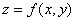

六、&nbsp;&nbsp;&nbsp;&nbsp;&nbsp;&nbsp;&nbsp;
六、&nbsp;&nbsp;&nbsp; 第三基本二次型与曲面的曲率

&nbsp;&nbsp;&nbsp;&nbsp;&nbsp;&nbsp; [第三基本二次型与第三基本量]

<pre style='layout-grid-mode:char'>&nbsp;&nbsp;&nbsp;&nbsp;&nbsp;&nbsp;&nbsp;&nbsp;&nbsp;&nbsp;&nbsp;&nbsp;&nbsp;&nbsp;&nbsp;&nbsp;&nbsp;&nbsp; </pre>

 
称为第三基本二次型，式中<i>N</i>为曲面的法线单位矢量，

<pre style='layout-grid-mode:char'>&nbsp;</pre><pre
style='layout-grid-mode:char'>&nbsp;&nbsp;&nbsp;&nbsp;&nbsp;&nbsp;&nbsp;&nbsp;&nbsp;&nbsp;&nbsp;&nbsp;&nbsp;&nbsp;&nbsp;&nbsp;&nbsp;&nbsp;&nbsp;&nbsp;&nbsp;&nbsp;&nbsp; </pre>

 
称为第三基本量。

&nbsp;&nbsp;&nbsp;&nbsp;&nbsp;&nbsp; [曲面的平均曲率与总曲率（或高斯曲率）]

<table class=MsoNormalTable border=1 cellspacing=0 cellpadding=0
 style='border-collapse:collapse;border:none'>
 <tr>
  <td width=139 valign=top style='width:104.4pt;border:solid windowtext 1.0pt;
  border-left:none;padding:0mm 5.4pt 0mm 5.4pt'>
  
&nbsp; 曲面方程

  </td>
  <td width=132 valign=top style='width:99.0pt;border:solid windowtext 1.0pt;
  border-left:none;padding:0mm 5.4pt 0mm 5.4pt'>
  
&nbsp;&nbsp; 曲率定义

  </td>
  <td width=297 valign=top style='width:222.6pt;border-top:solid windowtext 1.0pt;
  border-left:none;border-bottom:solid windowtext 1.0pt;border-right:none;
  padding:0mm 5.4pt 0mm 5.4pt'>
  
&nbsp;&nbsp;&nbsp;&nbsp;&nbsp;&nbsp;&nbsp;&nbsp;&nbsp;&nbsp;&nbsp;&nbsp;
  公式

  </td>
 </tr>
 <tr>
  <td width=139 valign=top style='width:104.4pt;border-top:none;border-left:
  none;border-bottom:solid windowtext 1.0pt;border-right:solid windowtext 1.0pt;
  padding:0mm 5.4pt 0mm 5.4pt'>
  

  </td>
  <td width=132 rowspan=2 valign=top style='width:99.0pt;border-top:none;
  border-left:none;border-bottom:solid windowtext 1.0pt;border-right:solid windowtext 1.0pt;
  padding:0mm 5.4pt 0mm 5.4pt'>
  
&nbsp;&nbsp;&nbsp; 主曲率的平均数称为曲率，记作H， 
   
  &nbsp;&nbsp;&nbsp; 主曲率的乘积称为总曲率（或高斯曲率），记作<i>K</i>， 
  

  </td>
  <td width=297 valign=top style='width:222.6pt;border:none;border-bottom:solid windowtext 1.0pt;
  padding:0mm 5.4pt 0mm 5.4pt'>
  

  </td>
 </tr>
 <tr>
  <td width=139 valign=top style='width:104.4pt;border-top:none;border-left:
  none;border-bottom:solid windowtext 1.0pt;border-right:solid windowtext 1.0pt;
  padding:0mm 5.4pt 0mm 5.4pt'>
  
&nbsp;

  </td>
  <td width=297 valign=top style='width:222.6pt;border:none;border-bottom:solid windowtext 1.0pt;
  padding:0mm 5.4pt 0mm 5.4pt'>
  
 
  式中<i>p</i>，<i>q</i>，<i>r</i>，<i>s</i>，<i>t</i>见前表

  </td>
 </tr>
</table>

&nbsp;&nbsp;&nbsp;&nbsp;&nbsp;&nbsp; 注：1、，<i>H</i>和<i>K</i>都是曲面上点的函数，与所取的曲线坐标<i>u</i>，<i></i>无关。

&nbsp;&nbsp;&nbsp;&nbsp;&nbsp;&nbsp; 2、的点称为椭圆点，这种点邻近的曲面在该点切面的同侧；的点称为双曲点，这种点邻近的曲面象马鞍形；的点称为抛物点，这种点邻近的曲面象半马鞍形。

&nbsp;&nbsp;&nbsp;&nbsp;&nbsp;&nbsp; 3、三个基本二次型有如下的线性关系：

<pre>&nbsp;&nbsp;&nbsp;&nbsp;&nbsp;&nbsp;&nbsp;&nbsp;&nbsp;&nbsp;&nbsp;&nbsp;&nbsp;&nbsp;&nbsp;&nbsp;&nbsp;&nbsp;&nbsp;&nbsp;&nbsp;&nbsp;&nbsp; </pre><pre>或</pre><pre>&nbsp;&nbsp;&nbsp;&nbsp;&nbsp;&nbsp;&nbsp;&nbsp;&nbsp;&nbsp;&nbsp; </pre>
