

七、&nbsp;&nbsp;&nbsp;&nbsp;&nbsp;&nbsp;&nbsp;
七、&nbsp;&nbsp;&nbsp; 渐近曲线、共轭曲线与极小曲面

&nbsp;&nbsp;&nbsp;&nbsp;&nbsp;&nbsp; [渐近曲线]&nbsp; 在曲面上一点的法曲率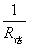等于零的方向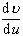称为渐近方向。假定一条曲面曲线<i>C</i>上所有点的切线方向都是渐近方向，则称<i>C</i>为曲面的一条渐近曲线。是渐近方向的条件是第二基本二次型等于零：

 
&nbsp;&nbsp;&nbsp;&nbsp;&nbsp;&nbsp;&nbsp;&nbsp;&nbsp;&nbsp;&nbsp;&nbsp; 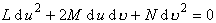 
或 
&nbsp;&nbsp;&nbsp;&nbsp;&nbsp;&nbsp;&nbsp;&nbsp;&nbsp;&nbsp;&nbsp;&nbsp; 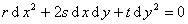 
这就是渐近曲线的微分方程。这种曲线有一个简单的几何特征：

&nbsp;&nbsp;&nbsp;&nbsp;&nbsp;&nbsp; 渐近曲线的密切面与曲面一致。

&nbsp;&nbsp;&nbsp;&nbsp;&nbsp;&nbsp; 由此可见，渐近曲线在其上一点与曲面构成二阶接触。

&nbsp;&nbsp;&nbsp;&nbsp;&nbsp;&nbsp; 此外还有爱涅勃定理：

&nbsp;&nbsp;&nbsp;&nbsp;&nbsp;&nbsp; 渐近曲线的挠率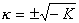，<i>K</i>为曲面的总曲率（时，无渐近曲线）。

&nbsp;&nbsp;&nbsp;&nbsp;&nbsp;&nbsp; [共轭曲线]&nbsp; 在曲面上一点的两个方向与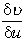满足

&nbsp;

<pre>&nbsp;&nbsp;&nbsp;&nbsp;&nbsp;&nbsp;&nbsp;&nbsp;&nbsp;&nbsp;&nbsp;&nbsp;&nbsp;&nbsp;&nbsp;&nbsp;&nbsp;&nbsp;&nbsp;&nbsp;&nbsp;&nbsp; 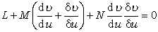</pre>

则称它们互为共轭方向。

&nbsp;&nbsp;&nbsp;&nbsp;&nbsp;&nbsp; 渐近方向是自己共轭的。

&nbsp;&nbsp;&nbsp;&nbsp;&nbsp;&nbsp; 曲面上一条曲线<i>C</i>的切面族的特征线的方向为<i>C</i>的切线的共轭方向。

&nbsp;&nbsp;&nbsp;&nbsp;&nbsp;&nbsp; 满足上面的微分方程的两族曲线构成的网称为共轭网。

&nbsp;&nbsp;&nbsp;&nbsp;&nbsp;&nbsp; [极小曲面]&nbsp; 平均曲率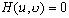的曲面称为极小曲面，它也可定义为张在已知边界上面积最小的曲面。一个曲面为极小曲面的充分必要条件是：渐近曲线构成正交网。

&nbsp;&nbsp;&nbsp;&nbsp;&nbsp;&nbsp; 注意：坐标线（<i>u</i>=常数和=常数）是共轭的充分必要条件是：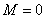；坐标线是曲率线的充分必要条件是：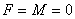；坐标线是渐近曲线的充分必要条件是：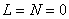。

